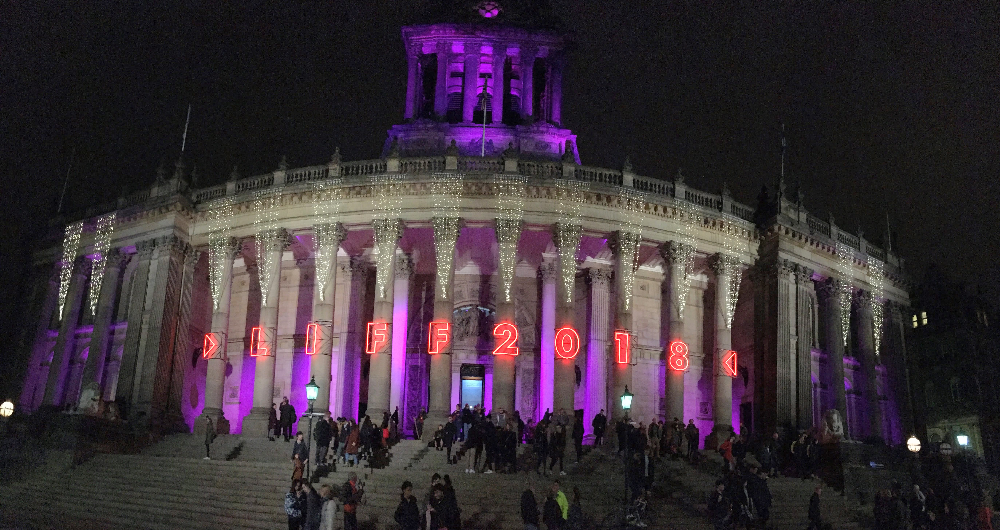

My favourite thing I've done in Leeds since moving here is going to the Leeds International Film Festival. Over two weeks, it shows a bunch of new films – that is, films that have probably already premiered at a famous festival you've probably heard of, but have not had an official release in the UK yet (and, in some cases, may never get one). There are probably more international films here than are showing at your local Cineworld right now, but I think the "International" is just there so it has a different acronym to the London Film Festival, tbh.

The main hub is the Town Hall, whose "beauty-of-building to comfort-of-seating ratio" is truly off the charts, and whose big bassy soundsystem in a large echoey hall is great for loud bombastic thrillers and rather difficult for mumbly realist dramas. Films also show at the Hyde Park Picturehouse (lovely, in a much homlier way), one of the big screens at the Vue (soulless, but best viewing experience), a small screen at the Everyman (good if you want to share an uncomfortable sofa with a stranger), and, for one weekend, the City Varieties music hall (again a very impressive venue).

My favourite part of the festival is that if a film says it starts at 5:30, then *it starts at 5:30*, and doesn't have any trailers beforehand. Think how many hours of my life I've saved the last two weeks not watching trailers! My second favourite part of the festival was after the first few days when it got to the point where I'd forgotten whatever I'd read about the films, and was just sitting down with not much more information that "I think this one is in Italian and has a guy in it, maybe?", which is an underrated way to watch films. My third favourite part was scuttling through town trying not to be late to my seventh film of the weekend. My fourth favourite part is that if you're willing and able go and see a very large number of films, it's incredibly cheap – I probably paid not much more than £3 per film on average. (This is actually a bit ridiculous, and I hope they put the prices up a bit for people like me in the future.)

As you enter each film, they give you a sheet of paper with the numbers 1 to 5 on it, which you tear at what your think the "star-rating" of the film should be, before handing it back at the end. Whichever film gets the highest ratings wins the audience award. Here are the films I saw, a brief comment about them, and the star-ratings I tore.

## The films

The main films in the festival are split into the strands "Cinema Versa" (documentaries), "Fanonmenon" (sci-fi, horror, etc), and "Official selection" (everything else), but I've just mixed them all together here.

**Sorry to Bother You** (Boots Riley) 🇺🇸 [Opening film]  
It has a comedy layer, a social and racial politics layer, and a horror layer, so one is inevitably tempted to compare it with *Get Out*, which it's not as good as. ★★★

(*Sorry to Bother You* was really sort of the "secondary opening film", later in the evening. The "main opening film", earlier on, was the premiere of *Fighting for a City*, a documentary about the Leeds boxer Josh Warrington. I didn't go to see this because I don't care about boxing, but if I'd realised that this was kind of the big "event" of the festival, I'd have gone along anyway.)

**All Is Well** / All Good / *Alles ist gut* (Eva Trobisch) 🇩🇪  
Janne's "Are you serious?" is the line of dialogue that will stick with me the most from this festival. I knew nothing about this before watching it, but it's very good, and apparently it's [coming to Netflix](https://www.netflix.com/title/81030855) soon. ★★★★

***El Ángel*** (Luis Ortega) 🇦🇷  
It's OK, but it's not *Carlos*. There were moments I was getting a little sleepy, but this was my fourth film of the day and the cinema was very warm. ★★★

**Arctic** (Joe Penna) 🇮🇸  
If I'm ever trapped in the Arctic, I want Mads Mikkelsen to look after me. ★★★

**Beautiful Boy** (Felix van Groeningen) 🇺🇸  
This is almost very good, but doesn't quite stick it. The (nondiagetic) music is far too much, the occasional line of dialogue is clunky and obvious, and there was really no need for a car chase in the third act. ★★★

**Birds of Passage** / *Pájaros de verano* (Ciro Guerra & Cristina Gallego) 🇨🇴  
Like *The Godfather* if *The Godfather* was set among the Wayuu people of northern Colombia during the drug wars of the late 60s–early 70s (and had more beautiful cinematography and greater interest in its female characters). ★★★★★

**Border** / *Gräns* (Ali Abbasi) 🇸🇪  
Odd, but in a good way. ★★★

**Burning** / 버닝 (Lee Chang-dong) 🇰🇷  
It has the simmering atmosphere, latent tension and moody cinematography of an old-fashioned film noir, although I occasionally wished it had the cut-to-the-chase snappiness too. I think there's a good chance this is a total masterpiece and that I only partly got it. ★★★★

**Capernaum** / *Capharnaüm* / كفرناحوم‎ (Nadine Labaki) 🇱🇧  
Astonishing acting from the kid, and very cute acting from the baby. Won the audience award, which no one could begrudge it, although of "this sort of film" I'd have narrowly preferred *Loveling*. ★★★

**Can You Ever Forgive Me?** (Marielle Heller) 🇺🇸  
This is well filmed, the story's interesting, and Melissa McCarthy and Richard E Grant are excellent. It didn't totally land for me at the time, but I now look back on it more fondly. Probably deserves a rewatch. ★★★

**Colette** (Wash Westmoreland) 🇬🇧🇺🇸  
Delightful and charming and witty, then very gently subversive. Plus there's a scene where Keira Knightley wears a suit. ★★★★ *[Later update: Somehow this didn't become a big hit. How come?]*

**Girl** (Lukas Dhont) 🇧🇪  
I'm not sure how this holds up analytically, but I was pulled in by the main character and desperately wanted things to be OK for her. ★★★

**The Guilty** / *Den skyldige* (Gustav Möller) 🇩🇰  
It's a man-on-the-phone thriller, which is the sort of thing I like. (This is not as good as *Locke*, because it's about conventional filmy things like murder and kidnapping, whereas *Locke* had the courage to be a thriller about pouring concrete.) ★★★

**Happy as Lazzaro** / *Lazzaro felice* (Alice Rohrwacher) 🇮🇹  
It's an amiable if rather old-fashioned drama for about the first 60%, and then there's a turn, and it becomes more interesting but also more slippery to keep hold of. ★★★

**Happy New Year, Colin Burstead** (Ben Wheatley) 🇬🇧  
The characters seem unpleasant, but by the end you realise Ben Wheatley is actually a big softie. (I don't typically enjoy post-film Q&As, but Wheatley was here and was good fun.) ★★★

**"I Do Not Care If We Go Down in History as Barbarians"** / *„Îmi este indiferent dacă în istorie vom intra ca barbari"* (Radu Jude) 🇷🇴  
Imagine Hannah Arendt's "Eichmann in Jerusalem" directed by Jean-Luc Godard. I'm not sure how much I enjoyed this at the time, but I've thought about it quite a lot since. ★★★

**I Feel Good** (Benoît Delépine & Gustave Kervern) 🇫🇷  
Just-about-passable French comedy. ★★

**In Fabric** (Peter Strickland) 🇬🇧  
Possibly the maddest film I've ever seen. ★★★★

**The Kindergarten Teacher** (Sara Colangelo) 🇺🇸  
A first half is rather precious and irritating, but Maggie Gyllenhaal saves it in the second half by being very good. ★★★

**Loveling** / *Benzinho* (Gustavo Pizzi) 🇧🇷  
Amiable and rather lovely drama/comedy about a Brazilian family. ★★★

**The Old Man & the Gun** (David Lowery) 🇺🇸  
Charming and feather-light, with the most romantic kiss in film this year. ★★★

**One Cut of the Dead** (Shin'ichirō Ueda) 🇯🇵  
In the opening shot, a zombie thriller is being filmed, when some actual zombies turn up! This opening shot lasts for 37 minutes. What happens next? You'll have to watch it to find out (and you must not read any more about this film before you do). ★★★★

**The Parting Glass** (Stephen Moyer) 🇺🇸  
A rare example of a film I wish I'd known more about before seeing it. After finding out (there was a Q&A with two of the producers after, one of whom was Anna Paquin) that it's very closely based on the real-life experiences of the writer, who also acts in the part of himself, the film seemed post-facto so much warmer and more moving than when I was watching it. ★★★

**Peterloo** (Mike Leigh) 🇬🇧  
It's an likeable character-based period comedy, but it also has the Peterloo massacre at the end. ★★★

**Pity** / *Oίκτος* (Babis Makridis) 🇬🇷  
I was expecting full-on Lanthimosian weirdness, so was a little disappointed to get a competently-done cringe-comedy. ★★★

**The Raft** (Marcus Lindeen) 🇸🇪  
In 1973, a raft carrying 11 strangers floated from Europe to America, in a sort of proto-reality-TV experiment, and this is what happened. ★★★★

**Roma** (Alfonso Cuarón) 🇲🇽  
There are many remarkable scenes, and it looks beautiful, and yet somehow I never really got into this. Sorry for my philistinism, but I think it would have been better in colour. ★★★

***Sauvage*** (Camille Vidal-Naquet) 🇫🇷  
There's the sweet, gentle personal bits, and then there's the eye-watering sex bits. ★★

**Suspiria** (Luca Guadagnino) 🇺🇸🇮🇹  
With a couple of exceptions (the first Volk dance scene; the use of Thom Yorke's "Unmade" near the end), this largely doesn't work -- it's too chilly and too leaden. ★★★

**Widows** (Steve McQueen) 🇺🇸  
There's lots good about this, but in the end I was a bit disappointed. The original miniseries was 5 hours long, and, squashed down to 2, there isn't really enough time for everyone. ★★★

**Utøya – July 22** / U – July 22 / *Utøya 22. juli* (Erik Poppe) 🇳🇴  
I'm a bit queasy about the idea of making a film about a fictionalized version of a real-life massacre. It's well-made and believably acted, but the ending did not sit well with me. ★★

**The Wild Pear Tree** / *Ahlat Ağacı* (Nuri Bilge Ceylan) 🇹🇷  
No film at this festival looked as gorgeous as the Turkish autumn looks here. Plus, despite being over three hours long, there's only one scene where I was bored (the religion discussion under the apple tree). But I'm not sure what it really all adds up to in the end. ★★★

**Shoplifters** / 万引き家族 (Hirokazu Kore-eda) 🇯🇵 [Closing film]  
Gentle, kind, funny, moving film about how the family you choose is more important than the family you're born with. For a film containing so much lawbreaking, it's surprisingly adorable. ★★★★

(I missed, but hope to catch up later with *The Image Book* and *Ray and Liz*.)

## Short films

The short film programme is quite a big part of the festival – filmmakers can submit their short films, and it's somewhat prestigious to be chosen to be shown at the festival, and more prestigious to win one of the many awards (internationa, British, Yorkshire, animation, queer, dance, etc). But, unless you're super-interested in this and want to see a whole bunch of shorts, it's difficult to know what to go to -- there are a bunch of 90-minute-ish sessions called, like, "International 6", "Animation 3", "British 2", or whatever. But they do have a special session late on in the festival where they show the award-winners, so I went to that.

[**Leeds Short Film Award: The Winners**](https://www.leedsfilm.com/news/leeds-short-film-awards-2018-the-winners/)  
My favourite was the surreal stop-motion animation [**Raymonde, or the Vertical Escape**](https://vimeo.com/300223370) / *Raymonde, ou l'évasion verticale* (Sarah Van Den Boom) 🇫🇷✏️. I also liked [**Afterword**](https://vimeo.com/300223370) (Boris Seewald) 🇩🇪💃.

## Retrospective: Time Frames

The film festival also has a "retrospectives" strand, showing old films. This year, these were on the theme of films that take place within 24 hours. (A few of the new films –  *Guilty*; *Happy New Year, Colin Burstead*; *Utøya* – where crowbarred into this strand too.) In hindsight, I regret my foolishness in not seeing more of these; it's sometimes a bit awkward to fit them in (they often didn't have the prime evening timeslots), but seeing old films on the big screen is always better than you think it's going to be. So I could have seen, for example, *12 Angry Men*, *Before Sunrise*, *Cléo from 5 to 7*, *Dog Day Afternoon*, *Knife in the Water*, *Magnolia*, *Reservoir Dogs*, *Run Lola Run* (which I've seen on the small screen before) and *Blackmail*, *Dazed and Confused*, *The Docks of New York*, La Haine, La Notte, *Wild Strawberries* (which I haven't).

**Daughters of the Dust** (Julie Dash, 1991) 🇺🇸  
An astonishing visual feast -- there's no other film that looks like this. ★★★★★

**Do the Right Thing** (Spike Lee, 1989) 🇺🇸  
On of the all-time greatest films -- and played really loudly in a busy cinema, it's even better. ★★★★★

## My awards

**Best film:**  
🥇 Birds of Passage  
🥈 Shoplifters  
🥉 Burning

**Best director:** Shin'ichirō Ueda, *One Cut of the Dead*

**Best actor:** Richard E Grant, *Can You Ever Forgive Me?*

**Best actress:** Aenne Schwarz, *All is Well*

**Best screenplay:** Colette (Richard Glatzer and Wash Westmoreland & Rebecca Lenkiewicz)

**Best doc:** The Raft
