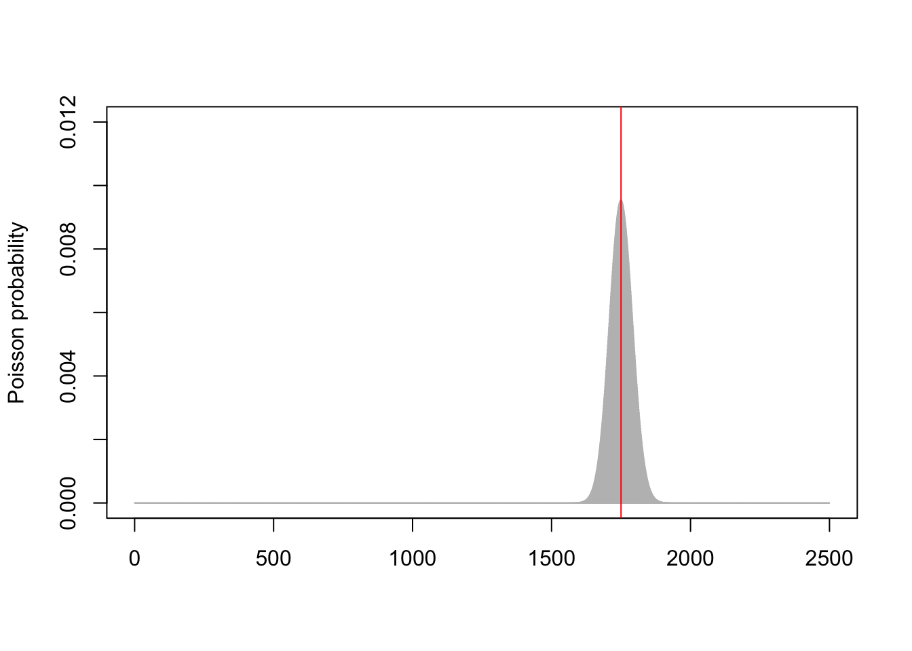
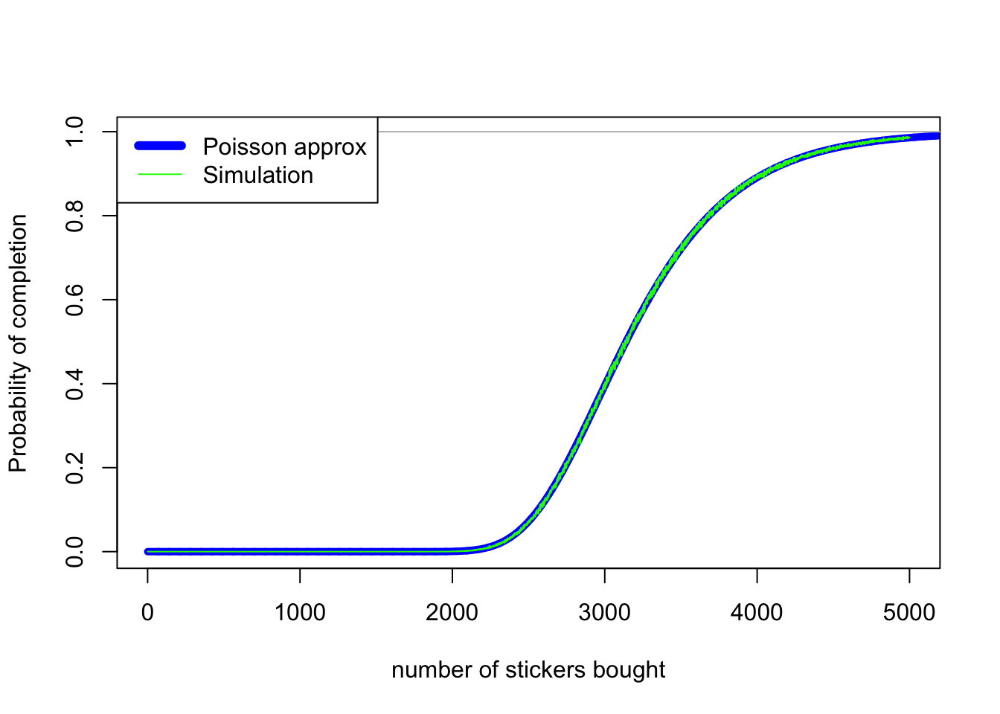

## What is Poissonization?

In this post I want to talk about a simple probability technique that I often find useful but that I was never really *taught*.

The technique is called *Poissonization*. The idea is this. Suppose you are trying to solve a problem that has to do with $n$ objects. If you’re happy with an approximate answer, then it can be easier to replace the exact number $n$ of objects with a *random* number $N$ of objects where $N$ has the Poisson distribution with mean $n$.

Recall that a Poisson$(n)$ random variable $N$ has distribution

$$ \mathbb P(N = x) = \mathrm{e}^{-n} \frac{n^x}{x!} . $$

This has mean $n$ and standard deviation $\sqrt{n}$; so the random number $N$ is typically close to $n$ when $n$ is large – probablys somewhere between $n - 2\sqrt{n}$ and $n+2\sqrt{n}$ or so. The picture below shows the Poisson(1750) distribution (grey curve) compared to the exact value of 1750 (red line).

One way to think about Poissonization is that instead of solving the problem with *exactly* $n$ objects, we instead get a (weighted) average of the answer for numbers of objects *around* $n$. So as long as $n$ is large and the answer is a fairly smooth function of $n$, we ought to have a fairly accurate approximation.

But why might this be useful? The big advantage is when we have a “multinomial” set up. Suppose we have $n$ objects, and each object is red with probability $0.6$ and blue with probability $0.4$. Then we know that the number of red objects follows a Binomial$(n, 0.6)$ distribution and the number of of blue objects follows a Binomial$(n, 0.4)$ distribution. But, annoyingly, these aren’t independent — if there happen to be more red objects than expected, then there must be fewer blue objects than expected to balance this out, and vice versa. This lack of independence can make problems awkward to solve — and the binomial distribution is already awkward enough to work with.

But once we have applied Poissonization, and have a Poisson$(n)$ random number of objects, things become much easier. Now the number of red objects is Poisson$(0.6n)$ and the number of blue objects is Poisson$(0.4n)$ — yes, the Poisson is often easier to deal with than the binomial. But, crucially, these are independent! Independent random variables are *much* easier to deal with!

## Football stickers

This has all got a bit abstract. Let’s take a concrete example.

<blockquote class="twitter-tweet">
<a href="https://twitter.com/Soccermatics?ref_src=twsrc%5Etfw">@Soccermatics</a> A World Cup 2019 Panini sticker album has 480 card spots. How big is the chance of getting at least one copy of each card when buying 350 random packages with 5 cards each (i.e. 1750 cards)? How many cards should I buy to reach a 90%+ chance? <a href="https://t.co/Mrt2Ea0pqN">https://t.co/Mrt2Ea0pqN</a>
&mdash; 🇺🇦 OddsMover 🇺🇦 (@OddsMover) <a href="https://twitter.com/OddsMover/status/1137266334000177152?ref_src=twsrc%5Etfw">June 8, 2019</a></blockquote> 

So we want to collect $m = 480$ unique stickers. If we buy $n$ total stickers (for example $n = 1750$), what’s the probability we get a full set of $m$ unique stickers?

This is known in probility theory as the [coupon collector problem](https://en.wikipedia.org/wiki/Coupon_collector%27s_problem). A famous (and fairly straightforward) result is that the average number stickers we need to buy to get a full set is

$$ \frac{m}{m} + \frac{m}{m-1} + \frac{m}{m-2} + \cdots + \frac{m}{2} + \frac{m}{1} = m \sum_{k = 1}^m \frac{1}{k} . $$

For $m = 480$ this is 3241 cards, or 548 packs of 5. A very rough approximation to this number is $m \log m = 2963$, while a much better approximation is $m \log m + \gamma m = m \log m + 0.577m = 3240$.

But that wasn’t the question asked here: the question was given a number $n$ of stickers, what’s the *probability* we get a full set. This is rather difficult to solve exactly – but Poissonization will make our job much easier. If rather than buying exactly $n$ cards we instead buy a Poisson$(n)$ random number of cards, then we will have Poisson$(n/m)$ copies of each sticker. The probability any particular sticker has been collected at least once is

$$ \mathbb P\big (\mathrm{Po}(\tfrac nm) \geq 1 \big) = 1 - \mathbb P\big (\mathrm{Po}(\tfrac nm)= 0 \big) = 1 - \mathrm{e}^{-n/m} . $$

And, crucially, these are all independent. So the probability we have at least 1 of all $m$ of the stickers is just multiplying this by itself $m$ times:

$$ \mathbb P\big (\mathrm{Po}(\tfrac nm) \geq 1 \big)^m = (1 - \mathrm{e}^{-n/m})^m . $$

With $m = 480$, we can see that this approximation (thick smooth blue line) is surprisingly accurate, when compared to simulations (thin wiggly green line):

The bad news for Mr OddsMover is that the probability of getting a full set with 1750 cards (350 packs) is roughly

$$ (1 - \mathrm{e}^{-1750/480})^{480} = 0.003\% . $$

To get a 90% chance of success, Mr OddsMover can invert this formula, to discover he needs

$$ -480 \log(1 - 0.90^{1/480}) = 4044 $$

cards, or 809 packs.

### Proving a theorem

We saw earlier that the average number of stickers needed is roughly $m \log m$, or more accurately $m \log m + 0.577m$. Let’s say we take $n = m \log m + cm$ stickers for some value $c$. What’s the probability we get a full set, as a function of $c$?

With our approximation above, and taking $n = m \log m + cm$, we have

$$ \begin{align}
\mathbb P(\text{full set}) &= (1 - \mathrm{e}^{-n/m})^{m} \\
  &= (1 - \mathrm{e}^{-(m \log m + cm)/m})^{m}  \\
  &= (1 - \mathrm{e}^{-\log m - c})^{m} \\
  &= \left(1 - \frac{\mathrm{e}^{-c}}{m} \right)^m \\
  &\to \mathrm{e}^{-\mathrm{e}^{-c}} .
\end{align} $$

So the probability of getting a full set is roughly $\mathrm{e}^{-\mathrm{e}^{-c}}$. This is, in fact, the exact asymptotic answer. (I knew this as a result of [Erdős and Rényi](https://old.renyi.hu/~p_erdos/1961-09.pdf), but [Wikipedia tells me](https://en.wikipedia.org/wiki/Coupon_collector%27s_problem#Extensions_and_generalizations) that Laplace knew it.)
