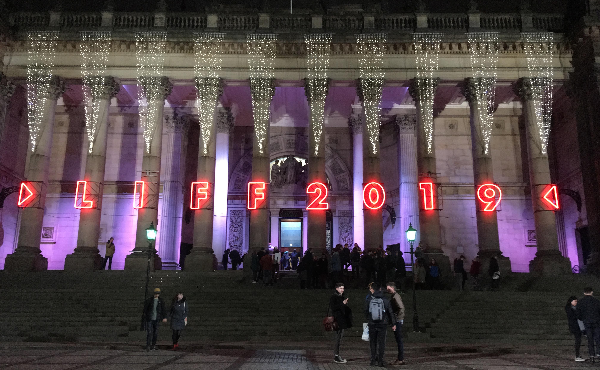

The past couple of weeks I've been at the [Leeds International Film Festival](https://www.leedsfilm.com) for the second time – see [this blogpost](liff2018.html) for my thoughts from LIFF 2018. This time, I've tried to correct my only minor error from last year: I've bought more tickets to more films! And, this time, I've included plenty of the old films too, not just the new ones – this turned out to be an extremely good plan. Once again, one of the highlights of the year for me.

However, one of my strongest memories of LIFF 2019 is not going to be any of the films but rather my back. Somehow, around lunchtime of the first day of the festival, I ... I don't know, did something weird to my back? Weird, and extremely stiff, and very painful. And the absolute worst thing for it was to sit down for a long period of time – which is kind of the only thing one does at a film festival. I managed to make it to the opening film, *Rocks*, albeit without either being able to put on socks or do up my shoelaces, before giving up on the second film of the night (*I Lost My Body*, which I did catch up on later in the festival). I bravely managed to keep up most of my planned schedule, but I cried off a few of the very long films – *A Hidden Life* (176 minutes), *The Irishman* (210 minutes), *Heimat Is a Space in Time* (218 minutes) – worried that I might end up stuck in my seat forever.

Like last time, the stars are whatever I tore in the Audience Award voting sheets (and, like last time, ★★★**+** means "I gave this ★★★, but only because I am a stingy marker, and it probably deserves ★★★★ really.")

## The films

**Rocks** (Sarah Gavron) 🇬🇧 [Opening film]  
Teenage girls from East London are the real heroes we need. The little brother with the frog is an early favourite for this year's The Kid From *Capernaum* Award for cutest youngster. ★★★**+**

**Atlantics** / *Atlantique* (Mati Diop) 🇸🇳🇫🇷  
It takes a little while to get going (or maybe for me to get into it), but once it does it's very good – deep and spooky. Excellent score by Fatima Al Qadiri. ★★★★

**Beanpole** / Дылда (Kantemir Balagov) 🇷🇺  
Relentlessly grim film set in postwar Leningrad. I think this might be very good if you have the mood and the patience for it, but I did not. ★★

**Calm With Horses** (Nick Rowland) 🇮🇪  
100 minutes of consistent low-level dread, which is the kind of film I like! Good score by Blanck Mass. ★★★★

**The Candidate** / The Realm / *El reino* (Rodrigo Sorogoyen) 🇪🇸  
Spanish political corruption drama. Doesn't really work, although the ending is good. ★★

**The Cordillera of Dreams** / *La cordillera de los sueños* (Patricio Guzmán) 🇨🇱  
Sequel to the sequel to *Nostalgia for the Light*; another quiet but unflinching film about the ancient geography and recent political history of Chile. (Those of us crawling our way through Duolingo Spanish will appreciate that Guzmán, as narrator, speaks very slowly and clearly.) ★★★★

**Days of the Bagnold Summer** (Simon Bird) 🇬🇧  
Likeable and pleasantly low-key drama, with lots of affection for its characters. I even liked the dog. ★★★**+**

**Door Lock** / 도어락 (Kwon Lee) 🇰🇷  
“Women daily receive so many small attempts at control from men that a generalised fear is the rational response” is an excellent theme for a paranoia-thriller, but “there's a dude under your bed who wants to saw off your limbs” rather too literal a realisation. ★★

**Family Romance, LLC** (Werner Herzog) 🇯🇵🇩🇪  
Gentle drama about a company that rents out surrogate family members. Playing in the realist style – unfussy direction, drawn-from-real-life storyline, non-professional actors – but it's weird the festival put this in the documentary strand. ★★★**+**

**Genesis** / *Genèse* (Philippe Lesage) 🇨🇦  
I'm probably being unfair on this, which was mostly perfectly fine, but at the advertised end time it kicked into a brand new and boring storyline unrelated to anything else that went on before, stayed with it for far too long, and squandered any goodwill it had built up. More walkouts than any other film this LIFF – although that may have been due to said inaccurate length and people needing to get elsewhere. ★★

**Greener Grass** (Jocelyn DeBoer & Dawn Luebbe) 🇺🇸  
A very LIFF-y sort of film: a sort of bizarre postmodern Stepford Wives parody. Too self-consciously wacky for my taste, but probably went down a storm with the audience. Adapted from a short film; may have worked better at that length. ★★

**House of Hummingbird** / 벌새 (Kim Bora) 🇰🇷  
I sort of liked this, but it was pretty long and slow, and reports suggest I wasn't the only one fighting to stay awake. Would probably work better for a South Korean audience for whom the Seongsu bridge disaster was an important historical/cultural event. ★★

**The Lighthouse** (Robert Eggers) 🇺🇸🇨🇦  
My back was particularly painful this day, so I was on quite a lot of painkillers. The set-up of the Town Hall is not good for narrow aspect ratio films, films with mumbly dialogue, or people sitting just behind a 6'3" mathematician with a bad back who needs to sit bolt-upright in their seat. I didn't really understand what was going on, I was interrupted twice by someone sitting behind me who couldn't see, I was in a lot of pain ... all in all, one of the craziest – and perhaps greatest! – filmgoing experiences I've had. I gave this ★★★★★ on the audience award sheet, but maybe it should have been ★, I honestly don't know.

**I Lost My Body** / *J'ai perdu mon corps* (Jérémy Clapin) 🇫🇷  
Charming animation about a hand that becomes detached from it's body; more lovely and less macabre than that makes it sound.  ★★★**+**

**The Invisible Life of Eurídice Gusmão** / Invisible Life / *A Vida Invisível de Eurídice Gusmão* (Karim Aïnouz) 🇧🇷  
Chronicle of two sisters who spend most of their twenties separated from each other. Ferrante-esque, I thought; melodrama in the best sense of the word. 2 hours 20; I wished it were longer. ★★★★

**The Irishman** (Martin Scorsese) 🇺🇸  
Caught up with this at the cinema but outside the festival. Consistently interesting, with excellent performances from De Niro, Pesci and, perhaps most of all, Pacino. It is undeniably long, though: a number of people here checked their phones during the film (I'm sure the LIFF attendees wouldn't have done this), but if I were watching at home on Netflix when it comes out in a few weeks' time I might well have done the same. ★★★**+**

**Judy & Punch** (Mirrah Foulkes) 🇦🇺  
A post-modern, feminist retelling of Punch & Judy sound like the sort of thing I'd like, but any randomly chosen 10 minutes of *Shrek* is more cleverly done than this. ★★

**Let There Be Light** / *Nech je svetlo* (Marko Škop) 🇸🇰  
Uncomfortable film about the quiet but difficult-to-stop rise of a far-right group in a small town. Effective sense of dread, but this has stuck with me less than most other films I saw fortnight. ★★★

**Marriage Story** (Noah Baumbach) 🇺🇸  
The most melancholic and painful film of the festival – but somehow the funniest too. Scarlett Johansson and Adam Driver are terrific, as is Laura Dern. My favourite bit was Driver singing "Being Alive". ★★★★★

**The Nightingale** (Jennifer Kent) 🇦🇺  
It’s very well made, and Aisling Franciosi and Baykali Ganambarr are really good in it. But there are so, so many gruelling, horrible scenes that I find it difficult recommend. ★★★**+**

**Oleg** / *Oļegs* (Juris Kursietis) 🇱🇻🇧🇪  
Relentless, tough but never miserabilist immigrant drama. Andrzej is a great screen villain. Best film about a Latvian butcher who moves to Belgium I’ve seen all year. ★★★

**One Last Deal** / *Tuntematon mestari* (Klaus Härö) 🇫🇮  
Gentle, likeable and utterly predictable film about a loveable small-town art dealer on the eve of retirement, who ... you already know what the whole story's going to be, right? A charming way to spend Sunday afternoon. ★★★**+**

**Ordinary Love** (Lisa Barros D’Sa & Glenn Leyburn) 🇬🇧  
A useful reminder that Liam Neeson can be a really great actor. (We all already knew that Lesley Manville is, of course.) ★★★**+**

**The Personal History of David Copperfield** (Armando Ianucci) 🇬🇧  
A late addition to the programme, but perfect Sunday lunchtime fare: brisk, funny, and extremely charming adaptation. Donkeys! ★★★★

**Portrait of a Lady on Fire** / *Portrait de la jeune fille en feu* (Céline Sciamma) 🇫🇷  
This is, of course, really good. But because I only thought it was "really good" and I wasn't totally 100% head-over-heels for it, I slightly feel that I'm missing out compared to everyone else. Like a portrait, the setting is very beautiful, the characters are well-drawn, and everything is positioned in just the right place, but also like a portrait, perhaps the action is sometimes a little static? ★★★★

**The Report** (Scott Z Burns) 🇺🇸  
I appreciated this in a "like *Spotlight*, but not quite as good" way. Touch-and-go on the "Would I have preferred to just have watched a documentary about this?" test. ★★★

**Shooting the Mafia** (Kim Longinotto) 🇮🇹🇮🇪🇬🇧🇺🇸  
Documentary about the work – and interesting personal life – of the Sicilian photographer Letizia Battaglia, and, through that, the history of the Mafia. Definitely made me more interested in the subject; occasionally felt a bit padded out with too much B-roll and overwrought music. ★★★**+**

**Synonyms** / *Synonymes* (Nadiv Lapid) 🇫🇷🇮🇱  
Interesting drama about an Israeli man who moves to Paris then commits to only using the French language, never Hebrew. More playful than that makes it sound. I appreciated this (although the atmosphere in the cinema felt like other people were bored?). That said, it's another one I haven't thought about much since. ★★★

**The Two Popes** (Fernando Meirelles) 🇬🇧🇮🇹🇦🇷  
Fairly middle-of-the-road fictionalised drama, notable for (a) Hopkins and Pryce being excellent looky-likeys, and (b) a somewhat farce-ish Fanta-and-pizza communion scene that I found surprisingly moving. ★★★

**The Whistlers** / *La Gomera* (Corneliu Porumboiu) 🇷🇴🇪🇸  
Entertaining, twisty little thriller. Can I defend this as being a great work of art? I cannot. Could I explain the storyline 15 minutes after leaving the cinema? I could not. Did I have a really fun time? I did! ★★★★

**The Wild Goose Lake** / 南方車站的聚會 (Diao Yinan) 🇨🇳  
Dark and grimy Chinese noir. Atmospheric, but hasn't stuck with me. ★★★

**The Wolf's Call** / *Le Chant du loup* (Antonin Baudry) 🇫🇷  
Totally ridiculous French thriller set on a submarine, but I was not totally un-entertained. My favourite scene is of course when our hero uses Fourier analysis as a topic for flirtation with the incredibly beautiful bookshop owner. ★★

**Jojo Rabbit** (Taika Waititi) 🇺🇸🇩🇪 [Closing film]  
I was hoping to be one of the cool people who think this film is toothless and clumsy, but I regret to announce that I'm in fact a normie who thought it was funny and good. ★★★**+**

I missed, but hope to catch up later with: *A Dog Called Money*, *The Cave* (the Syrian documentary; there were two films called *The Cave* at the festival, confusingly), *A Hidden Life*, *Waves*.

## Short films

Like last year, I went to see a programme of the winners of the short film awards. (I liked that they put another "thing you can go to if you don't know what short film presentations to go to" in the form of an "Audience Award" session, but it clashed with my schedule.)

[**Leeds Short Film Awards: The Winners**](https://www.leedsfilm.com/whats-on/leeds-short-film-awards-the-winners/)  
My favourite was [**The Strangers' Case**](https://vimeo.com/390205314) (Peter Trifunovic) 💮🇬🇧, a modern staging of the speech from *Sir Thomas More*, probably written by William Shakespeare. I also liked [**Olla**](https://vimeo.com/300223370) (Ariane Labed) 🌍🇫🇷, a half-hour drama about an Eastern European woman who migrates to France, which I could easily see being remade at feature length.

## Retrospective: Mother Cutter

This year, the retrospective strand of old films ran under the title "Mother Cutter: Women Who Shaped Film", and featured films that were edited by women. For me, this strand was an absolute triumph, completely the stand-out of the festival. I thought this was terrific for two reasons. First, the films chosen were extremely my sort of thing: the "would come high up in the *Sight & Sound* poll" kind of film; a middle road that might be insufficiently modern or blockbustery for a wide popular audience but which the truest of film snobs would have already seen in the cinema – but I like these films, and haven't seen them in the cinema (or at all) yet! Second, is the theme itself. We can dearly wish it were otherwise, but for the first 50 years or more of cinema, say up to the late 60s at least, women had very few opportunities to direct films, and consequently it's difficult to argue there are many female-directed masterpieces from that era. (Embarassingly, the best argument might be the work of the Nazi propagandist Leni Riefenstahl.) So a programme of films directed by women, however well intention, has to rely entirely on recent films or "forgotten curiosities" rather than outright masterpieces. But it turns out – and I had no idea of this a few weeks ago – women have been absolutely vital role in so, so many of the greatest films ever made: not from the director's chair, but from the cutting room. With the exception of Thelma Schoonmaker's work with Martin Scorsese, I didn't know any of these films were edited by women, so the strand was a total revelation to me.

So, yes, this was great. I'm very glad a went to see so many of these, I only regret that scheduling prevented me from getting to more: *Beau Travail* (edited by Nelly Quettier), *Dancer in the Dark* (Molly Malene Stensgaard), *Fanny and Alexander* (Sylvia Ingemarsson), *Le Trou* (Marguerite Renoir & Geneviève Vaury), *Mad Max: Fury Road* (Margaret Sixel), *Man with a Movie Camera* (Yelizaveta Svilova), *Mirror* (Lyudmila Feiginova), and more!

**All About Eve** (Joseph L. Mankiewicz, edited by Barbara McLean, 1950) 🇺🇸  
The acting and writing are just superb throughout. ★★★★★

**Army of Shadows** / *L'Armée des ombres (Jean-Pierre Melville, Françoise Bonnot, 1969) 🇫🇷  
Tough but realistic film about the French resistance during World War II. Lino Ventura is excellent in the lead role. ★★★★★

**Bonnie and Clyde** (Arthur Penn, Dede Allen, 1967) 🇺🇸  
Doing crimes is sexy and cool. ★★★★★

**Breathless** / *À bout de souffle* (Jean-Luc Godard, Cécile Decugis, 1960) 🇫🇷  
It's still completely clear why it changed the world. Increasingly, I find that the true centre of the film is not in it's stylistic innovations, brilliant through they are, but the long naturalistic scene in the apartment. ★★★★★

**Lawrence of Arabia** (David Lean, Anne V. Coates, 1962) 🇬🇧  
Astonishing desert vistas, astounding cinematography, huge casts; it's amazing the film got made at all. (Although, if we are honest, some of the day-for-night photography is a little bit ropey.) Brilliantly memorable score. And, since we're concentrating on the editing, I should say that [this](https://www.youtube.com/watch?v=HlUFxO0wxVQ) is the greatest cut in cinema. It's four hours long, and the only time I was bored was in the intermission. ★★★★★

***Ordet*** (Carl Theodor Dreyer, Edith Schlüssel, 1955) 🇩🇰  
I fully admit that this is universally considered one of the greatest films of all times and a deeply and profoundly spiritual masterpiece. But I found it stagey, logy, dull, and occasionally a bit ridiculous. Nonetheless, there were moments when I *wished* I was able to give into it more than I could. ★★

**Raging Bull** (Martin Scorsese, Thelma Schoonmaker, 1980) 🇺🇸  
Boxing movie; Robert De Niro; excellent, of course. (In the echoey Town Hall with its super-bassy sound systems, the sound effects on the punches were almost *too* much.) ★★★★

**Rome, Open City** / *Roma città aperta* (Roberto Rosselini, Jolanda Benvenuti, 1945) 🇮🇹  
Searing Neorealist film set in Nazi-occupied Rome. Amazing that they filmed this only six months after the Nazis left. Saw this back-to-back with *Army of Shadows* as a double bill of two superb films about ordinary people fighting back against fascism. (The official credited editor is a man, but the programme says that it was actually Jolanda Benvenuti, who had a long colloboration with Rosselini after this, at the editing bay.) ★★★★★

**Shoah** (Claude Lanzmann, Ziva Postec, 1985) 🇫🇷🇵🇱  
I didn't actually see this at the festival – I saw it in the cinema a couple of years ago. But I just wanted to note that I think everyone should try to see *Shoah* in the cinema once in their life, if they can. ★★★★★
 
**The Wizard of Oz** (Victor Fleming, Blanche Sewell, 1939) 🇺🇸  
Always and forever a perfect film. ★★★★★

## My awards

**Special award:** The programmers of the "Mother Cutter" retrospective strand

**Best film:**  
🥇 Marriage Story  
🥈 The Whistlers  
🥉 Portrait of a Lady on Fire

**Best director:** Robert Eggers, *The Lighthoue*

**Best actor:** Dev Patel, *The Peronal History of David Copperfield*

**Best actress:** Scarlett Johansson, *Marriage Story*

**Best screenplay:** The Invisible Life of Eurídice Gusmão (Murilo Hauser and Inés Bortagaray & Karim Aïnouz)

**Best doc:** The Cordillera of Dreams

**Best short:** The Strangers' Case

