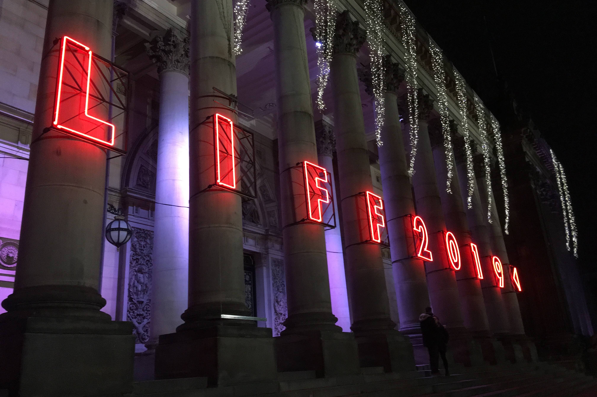

The past couple of weeks I've been at the [Leeds International Film Festival](https://www.leedsfilm.com) for the second time – see [this blogpost](liff2018.html) for my thoughts from LIFF 2018. This time, I've tried to correct my only minor error from last year: I've bought more tickets to more films! And, this time, I've included plenty of the old films too, not just the new ones – this turned out to be an extremely good plan.

However, one of my strongest memories of LIFF 2019 is not going to be any of the films but rather my back. Somehow, around lunchtime of the first day of the festival, I ... I don't know, did something weird to my back? Weird, and extremely stiff, and very painful. And the absolute worst thing for it was to sit down for a long period of time – which is kind of the only thing one does at a film festival. I managed to make it to the opening film, *Rocks*, albeit without either being able to put on socks or do up my shoelaces, before giving up on the second film of the night (*I Lost My Body*, which I did catch up on later in the festival). I bravely managed to keep up most of my planned schedule, but I cried off a few of the very long films – *A Hidden Life* (176 minutes), *The Irishman* (210 minutes), *Heimat Is a Space in Time* (218 minutes) – worried that I might end up stuck in my seat forever.

Like last time, the stars are whatever I tore in the Audience Award voting sheets (and, like last time, ★★★**+** means "I gave this ★★★, but only because I am a stingy marker, and it probably deserves ★★★★ really.")

## The films

**Rocks** (Sarah Gavron) 🇬🇧 [Opening film]  
Teenage girls from East London are the real heroes we need. The little brother with the frog is an early favourite for this year's The Kid From *Capernaum* Award for cutest youngster. ★★★**+**

**Atlantics** / *Atlanqiue* (Mati Diop) 🇸🇳🇫🇷  
It takes a little while to get going (or maybe for me to get into it), but once it does it's very good – deep and spooky. Excellent score by Fatima Al Qadiri. ★★★★

**Beanpole** / Дылда (Kantemir Balagov) 🇷🇺  
Relentlessly grim film set in postwar Leningrad. I think this might be very good if you have the mood and the patience for it, but I did not. ★★

**Calm With Horses** (Nick Rowland) 🇮🇪  
100 minutes of consistent low-level dread, which is the kind of film I like! Good score by Blanck Mass. ★★★★

**The Candidate** / The Realm / *El reino* (Rodrigo Sorogoyen) 🇪🇸  
Spanish political corruption drama. Doesn't really work, although the ending is good. ★★

**Days of the Bagnold Summer** (Simon Bird) 🇬🇧  
Likeable and pleasantly low-key drama, with lots of affection for its characters. I even liked the dog. ★★★**+**

**Genesis** / *Genèse* (Philippe Lesage) 🇨🇦  
I'm probably being unfair on this, which was mostly perfectly fine, but at the advertised end time it kicked into a brand new and boring storyline unrelated to anything else that went on before, stayed with it for far too long, and squandered any goodwill it had built up. More walkouts than any other film this LIFF – although that may have been due to said inaccurate length and people needing to get elsewhere. ★★

**House of Hummingbird** / 벌새 (Kim Bora) 🇰🇷  
I sort of liked this, but it was pretty long and slow, and reports suggest I wasn't the only one fighting to stay awake. Would probably work better for a South Korean audience for whom the Seongsu bridge disaster was an important historical/cultural event. ★★

**The Invisible Life of Eurídice Gusmão** / Invisible Life / *A Vida Invisível de Eurídice Gusmão* (Karim Aïnouz) 🇧🇷  
Chronicle of two sisters who spend most of their twenties separated from each other. Ferrante-esque, I thought; melodrama in the best sense of the word. 2 hours 20; I wished it were longer. ★★★★

**The Irishman** (Martin Scorsese) 🇺🇸  
Caught up with this at the cinema but outside the festival. Consistently interesting, with excellent performances from De Niro, Pesci and, perhaps most of all, Pacino. It is undeniably long, though: a number of people here checked their phones during the film (I'm sure the LIFF attendees wouldn't have done this), but if I were watching at home on Netflix when it comes out in a few weeks' time I might well have done the same. ★★★**+**

**Judy & Punch** (Mirrah Foulkes) 🇦🇺  
A post-modern, feminist retelling of Punch & Judy sound like the sort of thing I'd like, but any randomly chosen 10 minutes of *Shrek* is more cleverly done than this. ★★

**Let There Be Light** / *Nech je svetlo* (Marko Škop) 🇸🇰  
Uncomfortable film about the quiet but difficult to stop rise of a far right group in a small town. Good sense of dread, but this has stuck with me less than most other films I saw fortnight. ★★★

**Marriage Story** (Noah Baumbach) 🇺🇸  
The most melancholic and painful film of the festival – but somehow the funniest too. Scarlett Johansson and Adam Driver are terrific, as is Laura Dern. My favourite bit was Driver singing "Being Alive". ★★★★★

**The Nightingale** (Jennifer Kent) 🇦🇺  
It’s very well made, and Aisling Franciosi and Baykali Ganambarr are really good in it. But there are so, so many gruelling, horrible scenes that I find it difficult recommend. ★★★**+**

**Oleg** / *Oļegs* (Juris Kursietis) 🇱🇻🇧🇪  
Tough and relentless but never miserabilist immigrant drama. Andrzej is a great screen villain. Best film about a Latvian butcher who moves to Belgium I’ve seen all year. ★★★

**One Last Deal** / *Tuntematon mestari* (Klaus Härö) 🇫🇮  
Gentle, likeable and utterly predictable film about a loveable small-town art dealer on the eve of retirement, who ... you already know what the whole story's going to be, right? A charming way to spend Sunday afternoon. ★★★**+**

**Ordinary Love** (Lisa Barros D’Sa & Glenn Leyburn) 🇬🇧  
A useful reminder that Liam Neeson can be a really great actor. (We all already knew that Lesley Manville is, of course.) ★★★**+**

**Portrait of a Lady on Fire** / *Portrait de la jeune fille en feu* (Céline Sciamma) 🇫🇷  
This is, of course, really good. But because I only thought it was "really good" and I wasn't totally 100% head-over-heels for it, I slightly feel that I'm missing out compared to everyone else. Like a portrait, the setting is very beautiful, the characters are well-drawn, and everything is positioned in just the right place, but also like a portrait, perhaps the action is sometimes a little static? ★★★★

**The Report** (Scott Z Burns) 🇺🇸  
I appreciated this in a "like *Spotlight*, but not quite as good" way. Touch-and-go on the "Would I have preferred to just have watched a documentary about this?" test. ★★★

**Synonyms** / *Synonymes* (Nadiv Lapid) 🇫🇷🇮🇱  
Interesting drama about an Israeli man who moves to Paris then tries to only use the French language, never Hebrew. More playful than that makes it sound. I appreciated this (although the atmosphere in the cinema felt like other people were bored?). That said, it's another one I haven't thought about much since. ★★★

**The Two Popes** (Fernando Meirelles) 🇬🇧🇮🇹🇦🇷  
Fairly middle-of-the-road fictionalised drama, notable for (a) Hopkins and Pryce being excellent looky-likeys, and (b) a somewhat farce-ish Fanta-and-pizza communion scene I found surprisingly movine. communion (Fanta and pizza) scene surprisingly moving. ★★★

**The Whistlers** / *La Gomera* (Corneliu Porumboiu) 🇷🇴🇪🇸  
Entertaining, twisty little thriller. Can I defend this as being a great work of art? I cannot. Could I explain the storyline 15 minutes after leaving the cinema? I could not. Did I have a really fun time? I did! ★★★★

**The Wild Goose Lake** / 南方車站的聚會 (Diao Yinan) 🇨🇳  
Dark and grimy Chinese noir. Atmospheric, but hasn't stuck with me. ★★★

**Jojo Rabbit** (Taika Waititi) 🇺🇸🇩🇪 [Closing film]  
I was hoping to be one of the cool people who think this film is toothless and clumsy, but I regret to announce that I'm in fact a normie who thought it was funny and good. ★★★**+**

I missed, but hope to catch up later with: *A Dog Called Money*, *A Hidden Life*, *Waves*

## Short films

The short film programme is quite a big part of the festival – filmmakers can submit their short films, and it's somewhat prestigious to be chosen to be shown at the festival, and more prestigious to win one of the many awards (internationa, British, Yorkshire, animation, queer, dance, etc). But, unless you're super-interested in this and want to see a whole bunch of shorts, it's difficult to know what to go to -- there are a bunch of 90-minute-ish sessions called, like, "International 6", "Animation 3", "British 2", or whatever. But they do have a special session late on in the festival where they show the award-winners, so I went to that.

[**Leeds Short Film Award: The Winners**](https://www.leedsfilm.com/news/leeds-short-film-awards-2018-the-winners/)  
My favourite was the surreal stop-motion animation [**Raymonde, or the Vertical Escape**](https://vimeo.com/300223370) / *Raymonde, ou l'évasion verticale* (Sarah Van Den Boom) 🇫🇷✏️. I also liked [**Afterword**](https://vimeo.com/300223370) (Boris Seewald) 🇩🇪💃.

## Retrospective: Time Frames

The film festival also has a "retrospectives" strand, showing old films. This year, these were on the theme of films that take place within 24 hours. (A few of the new films –  *Guilty*; *Happy New Year, Colin Burstead*; *Utøya* – were crowbarred into this strand too.) In hindsight, I regret my foolishness in not seeing more of these; it's sometimes a bit awkward to fit them in (they often didn't have the prime evening timeslots), but seeing old films on the big screen is always better than you think it's going to be. So I could have seen, for example, *12 Angry Men*, *Before Sunrise*, *Cléo from 5 to 7*, *Dog Day Afternoon*, *Knife in the Water*, *Magnolia*, *Reservoir Dogs*, *Run Lola Run* (all of which I've seen on the small screen before) and *Blackmail*, *Dazed and Confused*, *The Docks of New York*, La Haine, La Notte, *Wild Strawberries* (which I haven't).

**Daughters of the Dust** (Julie Dash, 1991) 🇺🇸  
An astonishing visual feast -- there's no other film that looks like this. ★★★★★

**Do the Right Thing** (Spike Lee, 1989) 🇺🇸  
On of the all-time greatest films -- and played really loudly in a busy cinema, it's even better. ★★★★★

## My awards

**Special award:** The programmers of the "Mother-Cutter" retrospective strand

**Best film:**  
🥇 Marriage Story  
🥈 The Whistlers
🥉 Portrait of a Lady on Fire

**Best director:** Robert Eggers, *The Lighthoue*

**Best actor:** Dev Patel, *The Peronal History of David Copperfield*

**Best actress:** Scarlett Johansson, *Marriage Story*

**Best screenplay:** The Invisible Life of Eurídice Gusmão (Murilo Hauser and Inés Bortagaray & Karim Aïnouz)

**Best doc:** Shooting the Mafia

**Best short:** The Strangers' Case
