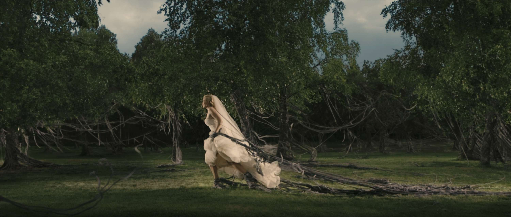

### 10 films

**At Berkeley** (Frederick Wiseman)  
It's a fairly gentle, unhurried four-hour-long documentary about the University of California at Berkeley, but it's implicitly the fiercest defence of the University-as-institution I know.

**The Act of Killing** (Joshua Oppenheimer)  
You wonder if, with its artistic approach, the film is letting the perpatrators off too easily, but then the final scene back on the rooftop is astonishing.

**Call Me By Your Name** (Luca Guadagnino)  
Would make the list on the strength of the Michael Stuhlbarg speech alone.

**Carol** (Todd Haynes)  
The best Christmas film of all time.

**For Sama** / من أجل سما (Waad Al-Kateab & Edward Watts)  
It's horrific and upsetting, but also a deeply, profoundly optimistic film.

**Four Lions** (Christopher Morris)  
A geniune comedic tragedy. The best thing Chris Morris has done.

**her** (Spike Jonze)  
Scarlett Johansson's voice was dubbed into this very late in post-production, I understand, and it's still one of the great performances of the decade.

**Melancholia** (Lars von Trier)  
Is it a film about depression, or is it just a film about the Earth being hit by a big planet?

**Phantom Thread** (Paul Thomas Anderson)  
The decade's lushest costume drama, swooniest romance, most giffable comedy, scariest ghost story, most twisted psychological thriller, and best film.

**Tower** (Keith Maitland)  
It's a careful and thoughtful documentary, but also a beautiful art film, and also a nail-biting thriller.

I regret not being able to include: *Beast*, *Black Swan*, *Cold War*, *First Reformed*, *The Grand Budapest Hotel*, *Lady Bird*, *Lady Macbeth*, *The Lobster*, *Marriage Story*, *The Social Network*.

Plus: if *Apocalypse Now: The Final Cut* counts as a new film, then it's top of the list.

### 10 albums

<iframe style="border-radius:12px" src="https://open.spotify.com/embed/playlist/3Z00arn2YPz52obF76gYzS?utm_source=generator" width="100%" height="380" frameBorder="0" allowfullscreen="" allow="autoplay; clipboard-write; encrypted-media; fullscreen; picture-in-picture"></iframe>

**Atoms for Peace – Amok**  
Thom Yorke's solo work and side-projects are really good, and even the hardcore Radiohead fans under-appreciate them.

**Björk – Vulnicura**  
On the list on the basis of the first half, which is one of the all-time great half-albums.

**Bonobo – Black Sands**  
This is great, but it was perhaps even better live, where the brass and wind played a more forward role.

**Kate Bush – 50 Words for Snow**  
Among her many dazzling talents, Kate Bush remains an underrated pianist.

**Camille – Ilo Veyou**  
Quiet and delicate, but lovely.

**PJ Harvey – Let England Shake**  
It might not quite have her best songs, but this is PJ Harvey's most complete artistic statement.

**Metronomy – The English Riviera**  
My friend L was always a fan of this, but I never really got it until, years later, a cafe I was working in played the whole album front-to-back, and then it seemed obviously brilliant.

**Kanye West – My Beautiful Dark Twisted Fantasy**  
The crowning masterpiece of Kanye's genius period.

**Kanye West – Yeezus**  
The best album there has been – and, it increasingly seems, that there ever will be – in Kanye's post-genius period.

The first nine on the list were easy to pick, but it's difficult to decide on the tenth. For my joker pick I'll either go for **Dirty Projectors – Dirty Projectors** and **Amber Coffman – City of No Reply** considered as a conceptual double-album about both sides of a breakup, or the **Hamilton** soundtrack.

### 5 books

**Behind the Beautiful Forevers** by Katharine Boo  
Beautifully written journalism. (I've always been a bit distrustful of the "nonfiction novel" genre, but the afterword to this convinces me it's fully legit.)

**The Devil and Sherlock Holmes**: *Tales of Murder, Madness, and Obsession* by David Grann  
The collected *New Yorker* articles. I remember reading this on a transatlantic flight while the rest of the plane was sleeping and I should have been asleep too, but the book was too good.

**Iphigenia in Forest Hills**: *Anatomy of a Murder Trial* by Janet Malcolm  
Reading Janet Malcolm is like having your brain cleaned out with a stiff brush.

**The Passage of Power** (*The Years of Lyndon Johnson*, volume 4) by Robert A Caro  
On Lyndon Johnson from 1960 to the first few months of his presidency. Such great setpieces: the 1960 convention, the Cuban missile crisis, and, most of all, [the Kennedy assassination](https://www.newyorker.com/magazine/2012/04/02/the-transition).

**The Psychopath Test**: *A Journey Through the Madness Industry* by Jon Ronson  
I'm not totally sure every part of this hangs together and the "Adam Curtis explains the book's thesis" scene seemed artificial – yet there was no book I had as much fun reading this decade. (Despite not having listened to it myself, I still feel fairly confident in recommending the audiobook over the paper book for this one.)

If a fiction book had made this list, it would have been *How Should a Person Be?* by Sheila Heti or *The Tiger's Wife* by Téa Obreht.

### 5 TV programmes

**Mad Men**  
It wasn't *always* great (see, for example, all the Don Draper backstory flashbacks), and I suppose that nearly half of it was *last* decade, but it was a TV series genuinely made for grown-ups who are willing to pay attention.

**The Returned** / *Les Revenants*, season 1  
The French back-from-the-dead series. The first season felt so complete that, weirdly, I've never felt any desire to watch the second.

**Happy Valley**  
The writing in this is just so good.

**Fleabag**  
Is it possible, in the well-deserved raves for the second series, the first series has now become underrated?

**Killing Eve**, series 1  
The later series are bad, but I went back and checked, and the first series really was as good as we thought at the time.

