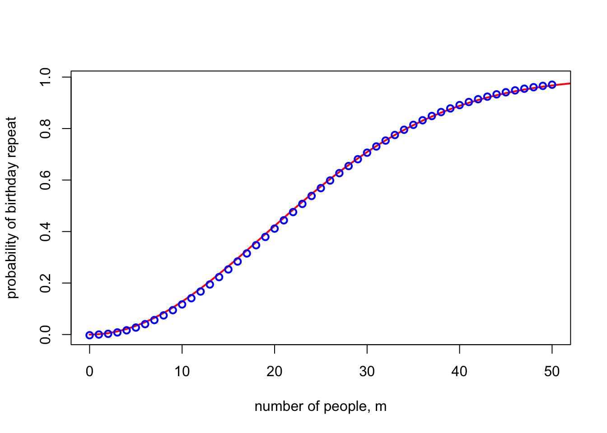
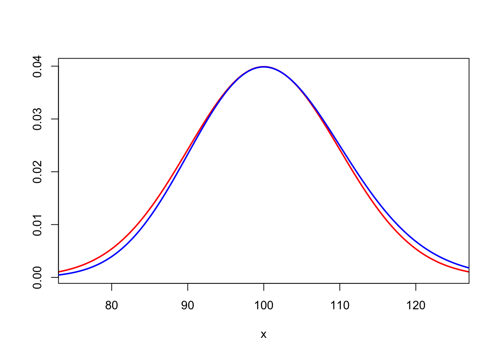

Quick quiz. Evaluate this limit:

$$ \lim_{n \to \infty} \bigg(\Big(1 + \frac{x}{\sqrt{n}}\Big)^{n} \, \mathrm{e}^{-x \sqrt n} \bigg). $$

(See if you can get this right before scrolling down.)

I came across this limit twice in the last week. The first time, I evaluated it wrong, which was a little bit embarassing. Then the second time, I also got it wrong again in exactly the same way. So I thought I'd write about this funny limit and where I came across it.

## The limit

The first part of the expression

$$ L = \lim_{n \to \infty} \bigg(\Big(1 + \frac{x}{\sqrt{n}}\Big)^{n} \, \mathrm{e}^{-x \sqrt n} \bigg) $$

looks a bit like the famous "compound interest" limit

$$ I = \lim_{n \to \infty} \Big(1 + \frac{x}{n}\Big)^{n} = \mathrm{e}^x.$$

We can prove this by taking logs of the limit: we get

$$ \log I = \lim_{n \to \infty} \bigg(n \log \Big(1 + \frac{x}{n} \Big) \bigg) .$$

Using the Taylor series

$$ \log(1 + y) = y + O(y^2) , $$

we get

$$ \log I = \lim_{n \to \infty} \bigg(n \left( \frac{x}{n} + O(n^{-2}) \right) \bigg) = \lim_{n\to\infty} \big(x + O(n^{-1})\big) = x , $$

since the $O(n^{-1})$ error term vanishes in the limit. And if the log of the limit is $\log I = x$ then the limit is indeed $\mathrm{e}^x$.

So looking at the funny limit,

$$ L = \lim_{n \to \infty} \bigg(\Big(1 + \frac{x}{\sqrt{n}}\Big)^{n} \, \mathrm{e}^{-x \sqrt n} \bigg) , $$

I thought that the first bit in brackets would be roughly

$$ \bigg(\Big(1 + \frac{x}{\sqrt{n}}\Big)^{\sqrt{n}}\bigg)^{\sqrt{n}} \approx \mathrm{e}^{x \sqrt{n}} , $$

which would cancel with the second bit $\mathrm{e}^{-x \sqrt n}$, so the limit would just be 1.

I was not correct.

We can see this properly by doing the "take logs and use the Taylor series" thing again. We get

$$ \begin{align*}
\log L &= \lim_{n \to \infty} \bigg( n \log \Big(1 + \frac{x}{\sqrt{n}}\Big) - x \sqrt{n} \bigg) \\
  &= \lim_{n \to \infty} \bigg( n \Big( \frac{x}{\sqrt{n}} + O(n^{-1}) \Big) - x \sqrt{n} \bigg) \\
  &= \lim_{n \to \infty} \big( x \sqrt{n} + O(1)  - x \sqrt{n} \big) \\
  &= \lim_{n \to \infty} O(1) .
\end{align*} $$

The problem here, of course, is that the $O(1)$ "error term" does not vanish as $n$ gets large, so we don't get that the log of the limit is 0. Rather, we have to take the Taylor expansion for log out to one more term:

$$ \log(1 + y) = y - \frac{y^2}{2} + O(y^3) . $$

We then have

$$ \begin{align*}
\log L &= \lim_{n \to \infty} \bigg( n \log \Big(1 + \frac{x}{\sqrt{n}}\Big) - x \sqrt{n} \bigg) \\
  &= \lim_{n \to \infty} \bigg( n \Big( \frac{x}{\sqrt{n}} - \frac{x^2}{2n} +  O(n^{-3/2}) \Big) - x \sqrt{n} \bigg) \\
  &= \lim_{n \to \infty} \Big( x \sqrt{n} -\frac{x^2}{2} + O(n^{-1/2})  - x \sqrt{n} \Big) \\
  &= \lim_{n \to \infty} \Big( {-\frac{x^2}{2}} + O(n^{-1/2}) \Big) \\
  &= - \frac{x^2}{2} .
\end{align*} $$

Hence the log of the limit is $\log L = -x^2/2$, so the limit is $L = \mathrm{e}^{-x^2/2}$. That's the answer to the quiz at the top of this post, and this is what I got wrong twice in one week.

So, how did I come across this limit?

## Application 1: Birthday problem

The first place I saw this limit was thinking about approximations for the birthday problem. Here, there are $n$ (probably 365) days of the year and $m$ people in a room, presumed to have birthdays chosen uniformly at random from the $n$ days. What is the probability that at least two people share a birthday?

One way to approach this is by ["Poissonisation"](poissonisation.html), a technique I wrote about in [this blogpost](poissonisation.html) a while ago. The idea is that rather than having exactly $m$ people in the room, we instead assume there is a random number of people, where that random number follows a Poisson distribution with mean $m$. Then the number of people with any given birthday is Poisson with mean $m/n$. We have no shared birthday if each day of the year has only 0 or 1 birthday; so

$$ \begin{align*}
\mathbb{P}(\text{no birthday repeats})
  &= \mathbb P \Big(\mathrm{Po}\Big(\frac{m}{n}\Big) = 0 \text{ or } 1\Big)^n \\
  &= \Big(\mathrm{e}^{-m/n} + \frac{m}{n}\mathrm{e}^{-m/n}\Big)^n \\
  &= \Big(1 + \frac{m}{n}\Big)^n \, \mathrm{e}^{-m} .
\end{align*} $$

The point at which you start to see a reasonable chance of getting a repeat is when $m$, the number of people, is of the order $m \sim \sqrt{n}$, the square root of the number of days. This is because the number of *pairs* of people will be of order $m^2 \sim n$, each of which has a $1/n$ chance of being a match, so we might reasonably expect to see one.

So I was wondering what the birthday repeat (or, rather, birthday non-repeat) probability is when $m$ is some multiple of $\sqrt{n}$, say $m =x\sqrt{n}$. Substituting this into the previous expression, we get

$$ \mathbb{P}(\text{no birthday repeats})
  = \bigg(1 + \frac{x \sqrt{n}}{n}\bigg)^n \, \mathrm{e}^{-x \sqrt{n}} 
  = \Big(1 + \frac{x}{\sqrt{n}}\Big)^n \, \mathrm{e}^{-x \sqrt{n}} . $$
  
To get an approximation, we can look at the limit $n \to \infty$. But this is exactly the funny limit from the start of this post! The answer is that the probability there is no shared birthday is roughly $\mathrm{e}^{-x^2/2}$, and the chance there *is* a shared birthday is roughly $1 - \mathrm{e}^{-x^2/2}$.

This approximation suggests you need $x = \sqrt{2 \log 2} \approx 1.177$ to get a repeat probability of 50:50. For $n = 365$, this approximation is $m = 1.177\times\sqrt{365} \approx 22.5$ people; the true number to get above a 50% probability of a match is 23. Indeed, the graph below shows the exact probability of match (blue dots) compared to the $1 - \mathrm{e}^{-x^2/2}$ approximation. Pretty good!

(I later realised that this is not actually the easiest way to derive this approximation. Better is to say that the number of birthday pairs is $\binom{m}{2} \approx \frac{m^2}{2}$, each of which has a probability $1/n$ of being a match. If these were independent -- which they're not, but for the sake of an approximation let's pretend they are -- then the probability of no match would be

$$ \Big(1 - \frac{1}{n}\Big)^{m^2/2} \approx \mathrm{e}^{-m^2/2n} . $$

At $m = x \sqrt{n}$ this gives the same $\mathrm{e}^{-x^2/2}$.)

## Application 2: Stirling's formula

The second time I saw this was when thinking about Stirling's formula. Stirling's formula is an estimate of the factorial:

$$ n! \sim \sqrt{2\pi n} \, \mathrm{e}^{-n} \, n^n . $$

(The $\sim$ here means "asymptotic equivalence": the ratio of the two sides tends to 1.)

It's quite easy to show that $n!$ is asymptotically equivalent to $C \sqrt{n} \, \mathrm{e}^{-n} \, n^n$ for *some* constant $C$, but it's rather difficult to find the value of that constant $C$. When I learned this back in the olden days, we were shown you had to consider the integral

$$ J_n = \int_{0}^{\pi/2} (\cos \theta)^n \, \mathrm{d}\theta $$

for some reason -- or rather the limit of the ratio of consecutive values of $J_n$. If you messed about with this limit-ratio in one way you could work out that the value was 1 and if you messed about with it in some other way you could get the value $2\pi/C^2$, and hence $C = \sqrt{2\pi}$. But this method was totally impossible to remember, and even impossibler to motivate. Like, how is some standard mortal mathematician meant to know that considering the ratio of weird trigonometric integrals is magically going to solve the problem?!

But the other day I saw, from [this expository note by Keith Conrad (PDF)](https://kconrad.math.uconn.edu/blurbs/analysis/stirling.pdf), a beautiful and much more intuitive way to prove Stirling's formula.

It starts with the famous "Gamma function" representation of the factorial:

$$ n! = \int_{0}^\infty x^n \,\mathrm{e}^{-x} \, \mathrm{d} x . $$

Now, I think it's perfectly possible for a standard mortal mathematician to notice that the integrand here, $x^n \,\mathrm{e}^{-x}$ looks quite a lot like (a scaled version of) the probability density function of a normal distribution with mean $n$ and variance $n$. Why might one notice this? I can think of at least three reasons.

First, you can just draw a picture. In red is (a scaled version) of $x^{100} \, \mathrm{e}^{-x}$ in blue and the PDF of a normal $\mathrm{N}(100, 100)$ random variable in red. Very similar!

Second, a tiny bit of basic calculus will show that the integrand has a single maximum at $x = n$ and has points of inflection at $x = n \pm \sqrt{n}$. This is exactly what you'd see in the PDF of normal $\mathrm{N}(n, n)$.

Third, the integrand is (up to scaling) exactly the PDF of a Gamma distribution with shape parameter $n+1$ and rate 1. Another way to say this is that it's the sum of $n + 1$ IID exponential distributions with rate $1$. By the central limit theorem, we'd expect this to be approximated by a normal $\mathrm{N}(n+1, n+1)$, which, for $n$ large, is near enough $\mathrm{N}(n, n)$.

OK, so once we've convinced ourselves the integrand looks like the PDF of a normal distribution with mean $n$ and variance $n$, there's an entirely natural step to take. Whenever we deal with a normal distribution, we like to "standardise" it, by subtracting the mean and dividing by the standard deviation (the square root of the variance). Here, that suggests we should change variables and standardise to

$$ y = \frac{x - n}{\sqrt{n}}, $$

so $x = \sqrt{n}y + n$.

Substituting this into the integral -- using $\mathrm{d}x = \sqrt{n}\, \mathrm{d} y$ and remembering to change the lower limit of integration -- we get

$$ \begin{align*}
n! &= \int_{-\sqrt{n}}^\infty \big(\sqrt{n}y + n \big)^n \, \mathrm{e}^{-\sqrt{n}y - n} \, \sqrt{n} \, \mathrm{d} y \\
  &= \sqrt{n} \, \mathrm{e}^{-n} \, n^n \int_{-\sqrt{n}}^\infty \bigg(1 + \frac{y}{\sqrt{n}}\bigg)^n \, \mathrm{e}^{-y\sqrt{n}} \, \mathrm{d}y .
\end{align*} $$

The terms $\sqrt{n} \, \mathrm{e}^{-n} \, n^n$ that we factored out of the integral are already all the "non-constant" bits of Stirling's formula. All that remains to deal with is the asymptotic value of the integral

$$ \int_{-\sqrt{n}}^\infty \bigg(1 + \frac{y}{\sqrt{n}}\bigg)^n \, \mathrm{e}^{-y\sqrt{n}} \, \mathrm{d}y . $$

But the integrand here is exactly the funny limit we've been dealing in this blogpost! As $n \to \infty$, the integrand will tend to the limit $\mathrm{e}^{-y^2 / 2}$, while the lower limit of integration $-\sqrt{n}$ goes to $- \infty$. So we end up with the famous Gaussian integral 

$$ \int_{-\sqrt{n}}^\infty \bigg(1 + \frac{y}{\sqrt{n}}\bigg)^n \, \mathrm{e}^{-y\sqrt{n}} \, \mathrm{d}y \to \int_{-\infty}^{\infty} \mathrm{e}^{-y^2/2} \, \mathrm{d}y = \sqrt{2\pi} , $$

and the proof of Stirling's formula is complete!

(Technically, to properly formally prove the convergence of the integral, you need to use the dominated convergence theorem. This isn't conceptually difficult -- you can use the limit $\mathrm{e}^{-y^2/2}$ itself for negative $y$ and the $n = 1$ value $(1 + y) \mathrm{e}^{-y}$ for positive $y$ -- but is admittedly a little bit fiddly. See [Conrad's note](https://kconrad.math.uconn.edu/blurbs/analysis/stirling.pdf) for details.)

I've checked with a bunch of colleagues, and no one has mentioned knowing this proof of Stirling's formula, but I think it's delightful.
