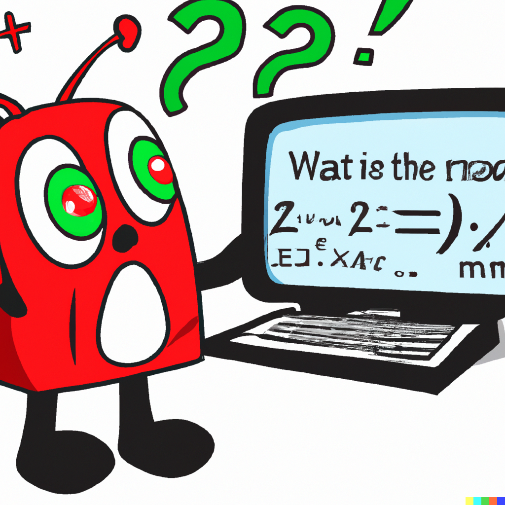

{:refdef: style="text-align: center;"}
{: width="640" }
{: refdef}

This morning, I went to a two-hour session at the university with the slightly cumbersome title [Assessment Matters: Artificial Intelligence and Assessment – Challenges and Opportunities](https://teachingexcellence.leeds.ac.uk/events/assessment-matters-artificial-intelligence-and-assessment-challenges-and-opportunities/). Four speakers gave 10-to-15-minute talks on aspects of AI and teaching, the organiser made some comments, and we had some smaller-group discussion time. (I also had a very useful chat with a maths colleague on the walk back.) What follows is a slightly neatened-up version of the notes I made; a mixture of the thoughts of the speakers, other attendees, and myself.

(Since this wasn't a public event, I think I'll observe the Chatham House rule and not name people who made comments.)

* As a self-selecting audience (of about 90, online and in-person), it's perhaps not surprising that "AI is going to change a lot of stuff, very quickly; this is good, it's a useful tool for learning, but we will encounter some organisational difficulties" was something close to a unanimous view in the room. And my view too. But I think "Big deal! AI is just fancy autocomplete" and "AI is a very bad thing for education and must be stopped" represent quite a large proportion of colleagues who don't sign up to a voluntary AI-in-education meeting, and it would have been better for the intellectual diversity of the event if we'd had some of them around.
* As far as the majority of people in the meeting were concerned, at the moment, "AI", in education terms, means "ChatGPT" (to the annoyance of one more technically experienced member of my discussion group). I expect this may change when the new ["Copilot"](https://www.theverge.com/2023/3/17/23644501/microsoft-copilot-ai-office-documents-microsoft-365-report) is added to Microsoft Office.
* Speaker: "The biggest innovation in ChatGPT was not its qualities as a language model but its usability."
* There was a general feeling that the kids are all learning the best AI-cheating tips from TikTok while we stuck-in-the-mud academics are already falling hopelessly behind. This is actually the opposite to my experience – my nerdy maths colleagues are all rather interested in this, but when I mention ChatGPT or related things with students, they rarely have any idea what I'm talking about.
* A speaker commented that "Students cheat on essays using AI" might be less common than "Essay mills get vastly more productive – so cheaper and better – using AI, and students cheat using essay mills."
* Many attendees thought [our policy on proof-reading](https://www.leeds.ac.uk/secretariat/documents/proof_reading_policy.pdf) is already confused and bad. Do we need a wholesale redesign of our academic integrity policies, not merely an AI add-on?
* One speaker spoke of experiments with "AI detection software" which showed good results, even when simple techniques were used to try and defeat the detection software. But there was widespread scepticism in the room – the consensus was that AI detection is a losing battle and it would be a waste to invest time and effort into something that will only be helpful in the very short term. (My comment was: Even if detection software *does* work, are we really going to expel students on the grounds of "the TurnItIn algorithm says there's a 99% chance an AI wrote this"? That's quite different from finding a textbook where the same eight paragraphs appear word-for-word in a student's essay.)
* The speaker who seemed to know the most about how language models actually work talked about how questions involving counting, calculation and logical deduction very often defeat the language-model AIs, so he will be increasing the proportion of coursework questions that involve those skills. A questioner (representative a fairly common view in the room, I think) put it to the speaker that the language models will surely get better at these soon. The speaker didn't think so; he predicts they will get "wider not deeper" -- better at non-English languages, better at formats that aren't just text, but not fundamentally change the way it "thinks". After the past couple of years, I am very reluctant to say "AI won't be able to do *X*", but he's the expert, and I've made a small corresponding update to my priors here.
* ChatGPT has a habit of creating references that don't actually exist; actually checking out references will be an important part of marking.
* Audience question: "If a student asks me, 'Can I use ChatGPT when writing my essay?', what should I answer?" I didn't hear any good and clear answers to that question, neither as a matter of university policy nor as a matter of good educational advice.
* The session was on "Artificial Intelligence and Assessment", but it's not *assessment* I'm most concerned about, personally. In maths, most of our modules have the majority of their marks coming from an in-person proctored exam, and many of our report/dissertation modules have some sort of brief oral exam, so these assessments seem pretty AI-proof. One speaker dismissed proctored exams and oral exams pretty much out of hand as "not inclusive". This strikes me as far too simplistic: first, inclusivity is more complicated than an "inclusive"/"not inclusive" binary; second, many people – say, those who struggle to find uninterupted quiet period of times at home, who find it tiring to read off computer screens, who find writing physically difficult, etc – might find a proctored or oral exam more inclusive than other methods. More preferable, I suggest, is understanding the trade-offs of different assessment methods and, to the extent possible, using a range of assessment methods. If money and exam-hall space were no object, I would like my exams to have a more generous time limits -- I'd be happy for students to take, say, five hours over my currently-120-minute exam, if they want all that time; in addition, this would mean students who take their exam elsewhere with extended time could be included in the same hall with everyone else. But I'm getting off-topic now...
* Speaker: "Most students don't want to cheat" -- rather, students cheat when they're not clear what's required, don't get clear feedback, don't have realistic deadlines, etc. Thus, the speaker suggests, high quality teaching is the best defence against any cheating, including AI cheating. But, I wonder: will students consider that using ChatGPT *is* cheating?

This was a university-wide event, but on the walk back, a maths colleague and I had some more maths-centric discussion:
* We found it helpful to think of these new AIs as a third level of AI. Level 1 is the calculator; Level 2 is computer-algebra systems, like [Wolfram Alpha](https://www.wolframalpha.com/); Level 3 is the new AIs, like ChatGPT. It may be helpful to think about how we use (and don't use) those other proto-AIs when decided what to change now.
* We are used to a certain amount of "useful hypocrisy", when it comes to "Level 1 and 2 AIs". If I need to know what 19×23 is, I type it into a calculator (or RStudio, or Google), but we expect schoolchildren to learn how to do this; if I need to know the integral of sin2 *x* from 0 to *π*/4, I use Wolfram Alpha. but we expect our students to learn it. The justification is, Yes, the computer can solve *this* problem, but eventually you'll want to solve problems the computer can't solve, and unless you've had practice on easier problems, you won't be able to do this.
* My colleague: "It's all very well to teach students to be adept users of AIs, as an important workplace skill; but, as a maths department, we also want to teach students the skills to make better AIs in the future." (Although I would note that we no longer need humans to teach computers to play chess -- the computers now teach themselves.)
* We like in-person proctored exams.

_**Previously:** [ChatGPT takes MATH1710](chatgpt.html)_

*[Picture: DALL-E, "A fun cartoon of a cute anthropomorphic computer trying to answer a difficult math exam."]*
