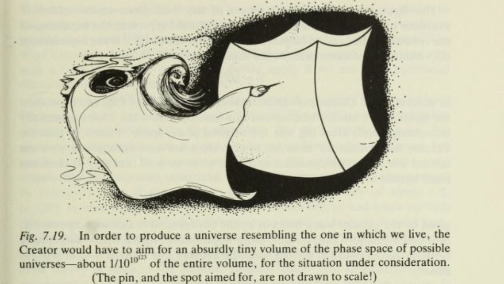

As I was walking home from work this evening, some guy was trying to engage random pedestrians in conversations. They were all ignoring him and walking straight past. But as I prepare to do the same, I think I hear him say: "Excuse me! Excuse me! What does Roger Penrose study?"

I'm taken aback. I stop and take my earphones out. "I'm sorry, what was that?"

"Do you know what subject Professor Roger Penrose studies?" he asks in a broad Brummie accent.

"Well," I say, a little confused, "he's, like, a mathematical physicist."

"That's right!" The guy is excited. "Professor Roger Penrose studies mathematics and physics at... Do you know where Professor Roger Penrose studies?"

"Hmm, I'm not really sure. It might be Oxford?"

"Yes! Professor Roger Penrose studies mathematics and physics at the University of Oxford! Now, in his book, Professor Roger Penrose proves that..." He pauses for a moment. "Well, do you know what scientific notation is, where we write numbers as powers of ten?"

"Yes. Yes I do"

"Great! Wait, you're smiling and laughing... Hang on, you're not, like, a mathematics lecturer or something, are you?"

"Well, yes I am, actually."

"Well, there you go! There you go!" The guy cannot believe his luck!

Anyway, it turns out he wants to talk – at some length – about Penrose's argument, in *The Emperor's New Mind*, that the entropy of the universe is roughly 10123, and that this means the existence of our universe is extremely unlikely, and, eventutally, winding around to trying to convince me to convert to Islam. I thank him for his time but politely decline. But, still, this must surely be the best return he's got on the "What does Roger Penrose study?" opener that he's got all day.

I'm reminded this is not the first time a stranger has wanted to talk to me about Roger Penrose and the mathematical contents of his book.

Once, on arriving in America, I was taking a taxi to my hotel. "What are you visiting for?" the cabdriver asks. "I'm here for a conference at the university," I say. "What subject?" he asks. I always feel a bit awkward when I have to answer: "Mathematics." The cabdriver is not deterred. "Great!" he says. "I've been been reading *The Emperor's New Mind*, but I'm a bit confused about the definition of a Turing machine. I wonder if you might help explain it to me?"
