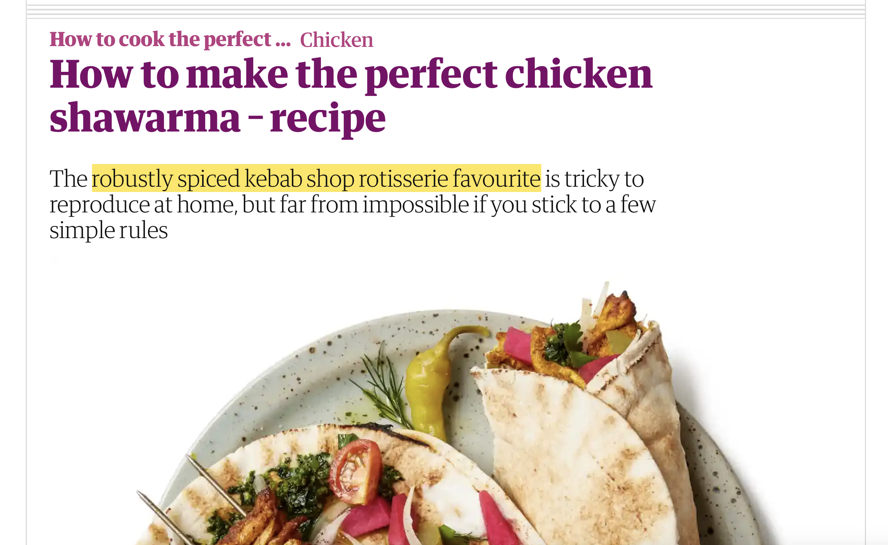

Here are two things I enjoy:

First is Felicity Cloake’s [“How to cook the perfect…”](https://www.theguardian.com/food/series/how-to-cook-the-perfect----) series in the *Guardian*. Cloake goes through multiple different recipes for something, rigorously testing them out and selecting the best bits from each, doing the sort of research and refinement that one senses most recipe book writers don’t actually bother to do. Plus, it’s matched with genuine sense of fun and a bouncy prose style that often evades the American science-nerd food-hack bros with which the series shares some superficial similarities.

Second is the journalistic concept of the “elegant variation” or the “second mention”. This is when, after introducing some person, place or object, the writer the later replaces the straightforward noun by a more complicated description. Take [this example](https://www.independent.co.uk/travel/news-and-advice/venice-tourist-tax-fees-italy-overtourism-b2409844.html) from the *Independent* a few days ago:

> Day-trippers visiting Venice will be charged €5 to enter the historic centre from next year under long-awaited plans to tackle overtourism in the Italian city that finally look set to be adopted. A ticketing system will also be introduced to limit the numbers pouring into the famous canal-strewn tourist hotspot.

Here, “Venice” gets called “the Italian city” on second reference, then “the famous canal-strewn tourist hotspot” on the third. This can be done for various reasons: to concisely introduce extra information, to avoid awkward repetition, as a sort of journo insider joke, or just as plain bad writing. I enjoy the Twitter accounts [@secondmentions](https://twitter.com/secondmentions) and [@knobblymonsters](https://twitter.com/knobblymonsters) that collect some of the best examples – [see my own submissions here](https://twitter.com/search?q=from%3Ampaldridge%20secondmentions&f=live). (“Knobbly monsters” are another name for these, being itself, of course, an elegant variation on “crocodiles” – other names are “elongated yellow fruits” or “popular orange vegetables”, after … well, you can work it out.)

But in an exciting collision of my interests, whoever writes the subheads for the “How to cook the perfect…” series is quite the connoisseur of the second mention too. Here are some of my favourites. (If you like, turn this into a quiz by guessing what food the second mention is referring to, before checking the link to see if you’re right.)

* [“this much-loved layer bake”](https://www.theguardian.com/food/2023/aug/09/how-to-make-the-perfect-vegan-moussaka-recipe-felicity-cloake)
* [“this salty-sweet, deliciously oily yet crisp and fluffy Italian-French repast”](https://www.theguardian.com/food/2023/jun/21/how-to-make-the-perfect-pissaladiere-recipe-felicity-cloake)
* [“this lavish twist on everyday cheese on toast”](https://www.theguardian.com/food/2023/jun/14/how-to-make-the-perfect-crab-rarebit-recipe-felicity-cloake)
* [“the ‘mad jumble of vegetables over pasta’”](https://www.theguardian.com/food/2023/may/03/how-to-make-the-perfect-pasta-primavera-recipe-felicity-cloake)
* [“this former store-cupboard favourite”](https://www.theguardian.com/food/2023/jan/04/how-to-make-the-perfect-carrot-and-coriander-soup-recipe-felicity-cloake)
* [“this French showstopper”](https://www.theguardian.com/food/2022/dec/18/how-to-make-the-perfect-chocolate-roulade-recipe-felicity-cloake)
* [“the north Indian spicy aubergine mash that can never be anything less than delicious”](https://www.theguardian.com/food/2022/sep/28/how-to-make-the-perfect-baingan-bharta-aubergine-dip-recipe-felicity-cloake)
* [“this thrifty Tuscan soup”](https://www.theguardian.com/food/2022/aug/24/how-to-make-the-perfect-pappa-al-pomodoro-tuscan-tomato-and-bread-soup-recipe); not to be confused with [“this traditional, thrifty, Tuscan soup”](https://www.theguardian.com/food/2022/oct/12/how-to-make-the-perfect-ribollita-soup-recipe-felicity-cloake)
* [“the robustly spiced kebab shop rotisserie favourite”](https://www.theguardian.com/food/2022/aug/17/how-to-make-the-perfect-chicken-shawarma-recipe-felicity-cloake)
* [“this berry jelly”](https://www.theguardian.com/food/2022/jul/27/how-to-make-the-perfect-raspberry-jelly-felicity-cloake)
* [“this Swedish teatime treat”](https://www.theguardian.com/food/2022/apr/13/how-to-make-the-perfect-cardamom-buns-recipe-felicity-cloake)
* [“this salty-sour staple of south-east Asia”](https://www.theguardian.com/food/2022/feb/02/how-to-make-the-perfect-pork-or-chicken-duck-or-tofu-larb-recipe)
* [“this substantial seasonal soup”](https://www.theguardian.com/food/2021/oct/27/how-to-make-the-perfect-pumpkin-soup-recipe)
* [“the much-loved choc-chip biccie in trouble-free format”](https://www.theguardian.com/food/2021/sep/15/how-to-make-the-perfect-gluten-free-chocolate-chip-cookies-recipe)
* [“this characteristically Southern belle of a dish”](https://www.theguardian.com/food/2021/sep/08/how-to-make-the-perfect-creamed-corn-recipe-felicity-cloake)
* [“these moreish Hispanic doughnut-tubes”](https://www.theguardian.com/food/2021/jun/30/how-to-make-churros-recipe)
* [“the favourite school pudding”](https://www.theguardian.com/food/2021/apr/14/how-to-make-perfect-pineapple-upside-down-cake-recipe-felicity-cloake)
* [“this punchy Portuguese soup-stew of potatoes, greens and chorizo”](https://www.theguardian.com/food/2021/mar/10/how-to-make-the-perfect-caldo-verde-recipe-felicity-cloake)
* [“this shellfish winter warmer from western France”](https://www.theguardian.com/food/2021/feb/03/how-to-make-the-perfect-mouclade-mussels-recipe-felicity-cloake)
* [“these boozy little classics”](https://www.theguardian.com/food/2020/mar/04/how-to-cook-the-perfect-rum-babas-recipe)
* [“this delightfully gooey, cheesy mash”](https://www.theguardian.com/food/2020/feb/05/how-to-cook-the-perfect-aligot-felicity-cloake)
* [“these fancily named cheese puffs”](https://www.theguardian.com/food/2019/dec/18/how-make-perfect-gougeres-cheese-puffs-felicity-cloake-recipe)
* [“these Mexican morsels”](https://www.theguardian.com/food/2019/nov/20/how-to-cook-the-perfect-quesadilla-recipe-felicity-cloake)
* [“this quintessentially British pie that sings of autumn”](https://www.theguardian.com/food/2019/oct/02/how-to-cook-the-perfect-apple-and-blackberry-pie-recipe-felicity-cloake)
* [“this gently spiced, luxuriant and defiantly rich Indian dish”](https://www.theguardian.com/food/2019/jun/26/dal-makhani-recipe-the-perfect-felicity-cloake)
* [“this sumptuous mess of creamy sweet onions studded with bacon and slumped into a shortcrust case”](https://www.theguardian.com/food/2019/may/15/perfect-french-onion-tart-recipe-felicity-cloake)
* [“this retro classic”](https://www.theguardian.com/food/2019/apr/17/how-to-make-the-perfect-profiteroles-recipe-felicity-cloake)
* [“this incredibly comforting dish”](https://www.theguardian.com/food/2019/mar/20/perfect-colcannon-recipe-potatoes-cabbage-felicity-cloake)
* [“the classic French childhood treat”](https://www.theguardian.com/lifeandstyle/2018/jul/25/french-dessert-iles-flottantes-creme-anglaise-custard-meringue-recipe)
* [“this much maligned retro recipe”](https://www.theguardian.com/lifeandstyle/2018/may/30/peach-melba-recipe-felicity-cloake)
* [“this domestic classic”](https://www.theguardian.com/lifeandstyle/2018/apr/19/the-perfect-shepherds-pie-recipe-felicity-cloake)
* [“this suety, syrupy pudding”](https://www.theguardian.com/lifeandstyle/2018/jan/25/the-perfect-sussex-pond-pudding-felicity-cloake)
* [“this winter warmer”](https://www.theguardian.com/lifeandstyle/2018/jan/04/how-make-perfect-broccoli-stilton-soup-cheese-shallots-stock-cream)
* [“simple, quick and spicy supper”](https://www.theguardian.com/lifeandstyle/2017/oct/05/how-to-cook-the-perfect-penne-allarrabbiata)
* [“this picnic staple”](https://www.theguardian.com/lifeandstyle/2017/jul/20/how-to-make-the-perfect-vegetarian-scotch-eggs)
* [“the once-unfancied brassica”](https://www.theguardian.com/lifeandstyle/wordofmouth/2017/apr/13/how-to-cook-perfect-roasted-cauliflower-felicity-cloake)
* [“this much-loved, very British cake”](https://www.theguardian.com/lifeandstyle/wordofmouth/2017/mar/23/how-to-bake-the-perfect-swiss-roll-felicity-cloake)
* [“this giant of French classical cooking”](https://www.theguardian.com/lifeandstyle/wordofmouth/2017/mar/09/how-to-cook-the-perfect-boeuf-bourguignon)
* [“this traditional northern treat”](https://www.theguardian.com/lifeandstyle/wordofmouth/2017/feb/23/how-to-make-the-perfect-eccles-cakes)
* [“the Swiss cheese fantasia”](https://www.theguardian.com/lifeandstyle/wordofmouth/2017/feb/09/how-to-make-the-perfect-fondue)
* [“this gloriously dense and squidgy cake”](https://www.theguardian.com/lifeandstyle/wordofmouth/2017/feb/02/how-to-cook-the-perfect-sticky-orange-cake)
* [“these crisp golden packages”](https://www.theguardian.com/lifeandstyle/2017/jan/26/how-to-make-the-perfect-spring-rolls)
* [“this stalwart sauce”](https://www.theguardian.com/lifeandstyle/2017/jan/05/how-to-make-the-perfect-blue-cheese-dip)
* [“the salty half-shell favourites”](https://www.theguardian.com/lifeandstyle/2016/dec/01/how-to-cook-perfect-oysters-rockefeller)
* [“this 70s favourite”](https://www.theguardian.com/lifeandstyle/wordofmouth/2016/nov/24/how-to-cook-the-perfect-beef-stroganoff)
* [“this quintessentially British treat”](https://www.theguardian.com/lifeandstyle/2016/oct/27/how-to-make-the-perfect-jaffa-cakes)
* [“this creole/cajun classic”](https://www.theguardian.com/lifeandstyle/2016/oct/20/how-to-cook-the-perfect-jambalaya)
* [“this crimson cake”](https://www.theguardian.com/lifeandstyle/wordofmouth/2016/aug/11/how-to-cook-the-perfect-red-velvet-cake)
* [“this Middle Eastern staple”](https://www.theguardian.com/lifeandstyle/wordofmouth/2016/jul/13/how-to-cook-the-perfect-pitta-bread)
* [“this intensively savoury potato snack”](https://www.theguardian.com/lifeandstyle/wordofmouth/2016/feb/18/how-to-cook-perfect-aloo-tikki)
* [“this distinctive flavoursome loaf”](https://www.theguardian.com/lifeandstyle/wordofmouth/2016/jan/28/how-to-make-the-perfect-rye-bread)
* [“this peculiarly British tea-time confection”](https://www.theguardian.com/lifeandstyle/2016/jan/14/how-to-make-the-perfect-battenberg-cake)
* [“this moreish Indian snack”](https://www.theguardian.com/lifeandstyle/wordofmouth/2015/nov/26/how-to-make-the-perfect-samosas)
* [“the classic sandwich-filler”](https://www.theguardian.com/lifeandstyle/2015/sep/16/how-to-make-the-perfect-egg-mayonnaise-sandwich)
* [“this classic sweet and sour Sicilian vegetable dish”](https://www.theguardian.com/lifeandstyle/2015/jul/29/how-to-cook-perfect-caponata-felicity-cloake)
* [“this American Super Bowl classic”](https://www.theguardian.com/lifeandstyle/2015/jul/08/how-to-cook-perfect-buffalo-wings-recipe)
* [“this dense, fudgy, butterscotch treat”](https://www.theguardian.com/lifeandstyle/2015/jun/24/how-make-perfect-blondies-felicity-cloake)
* [“this gently jiggling French fancy”](https://www.theguardian.com/lifeandstyle/wordofmouth/2015/may/07/how-to-cook-perfect-creme-caramel-recipe); not to be confused with [“this wobbly French dessert”](https://www.theguardian.com/lifeandstyle/wordofmouth/2013/aug/29/how-to-cook-perfect-cherry-clafoutis)
* [“this feast-day favourite”](https://www.theguardian.com/lifeandstyle/2015/mar/26/how-to-cook-the-perfect-sinmel-cake)
* [“these light and lacy confections”](https://www.theguardian.com/lifeandstyle/wordofmouth/2014/oct/09/how-to-bake-perfect-florentines-recipe)
* [“this student staple”](https://www.theguardian.com/lifeandstyle/wordofmouth/2013/oct/17/how-to-make-perfect-nachos)
* [“this homely American classic”](https://www.theguardian.com/lifeandstyle/wordofmouth/2013/oct/10/how-make-perfect-plum-cobbler)
* [“this Cantonese creation”](https://www.theguardian.com/lifeandstyle/wordofmouth/2013/oct/02/how-to-make-perfect-singapore-noodles)
* [“this meaty Middle Eastern delight”](https://www.theguardian.com/lifeandstyle/wordofmouth/2013/jul/03/how-to-make-perfect-kofte)
* [“this Derbyshire favourite”](https://www.theguardian.com/lifeandstyle/wordofmouth/2013/apr/17/how-make-perfect-bakewell-tart)
* [“this most famous of all Moroccan dishes”](https://www.theguardian.com/lifeandstyle/wordofmouth/2013/mar/13/how-make-perfect-chicken-tagine)
* [“this johnny-come-lately”](https://www.theguardian.com/lifeandstyle/wordofmouth/2012/aug/30/how-to-cook-perfect-banana-bread)
* [“this 'decadent' dish”](https://www.theguardian.com/lifeandstyle/wordofmouth/2012/jun/07/how-cook-perfect-chicken-kiev)
* [“this all-time British classic”](https://www.theguardian.com/lifeandstyle/wordofmouth/2012/may/31/how-to-cook-the-perfect-scotch-egg)
* [“this vibrant pudding”](https://www.theguardian.com/lifeandstyle/wordofmouth/2011/jul/06/how-cook-perfect-summer-pudding)
* [“this mainstay of the American barbecue canon”](https://www.theguardian.com/lifeandstyle/wordofmouth/2011/jun/30/how-cook-perfect-barbecue-ribs)
* [“this classic of the picnic basket”](https://www.theguardian.com/lifeandstyle/wordofmouth/2011/may/26/how-to-cook-perfect-quiche-lorraine)

Bonus technically-not-quite-a-second-mention: [“splaying the tuber”](https://www.theguardian.com/lifeandstyle/wordofmouth/2010/mar/15/best-mashed-potato-method).
