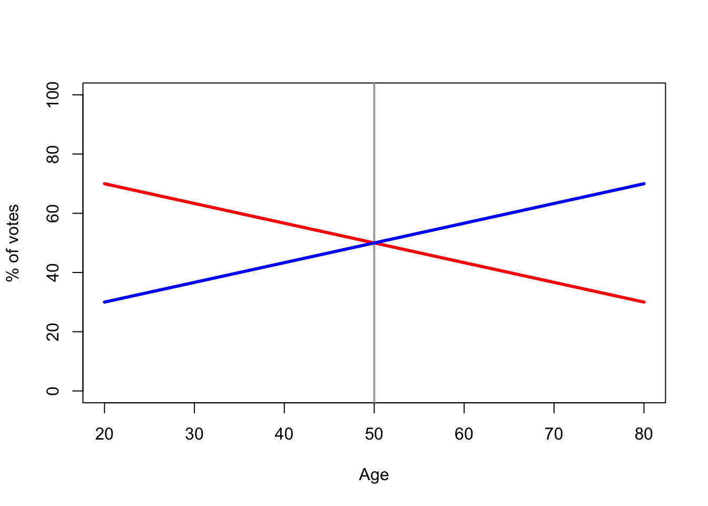
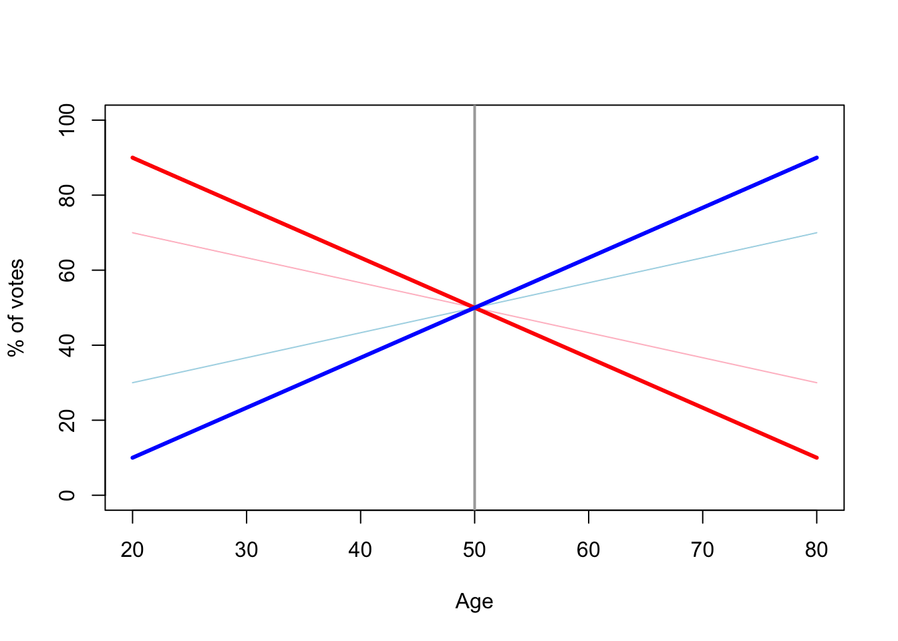
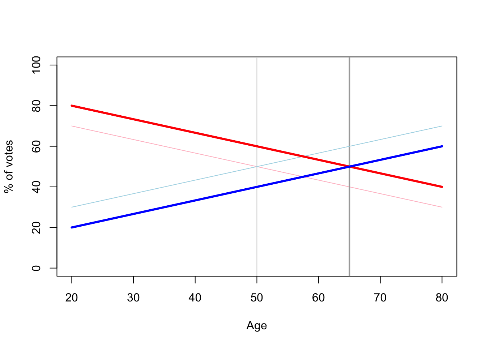
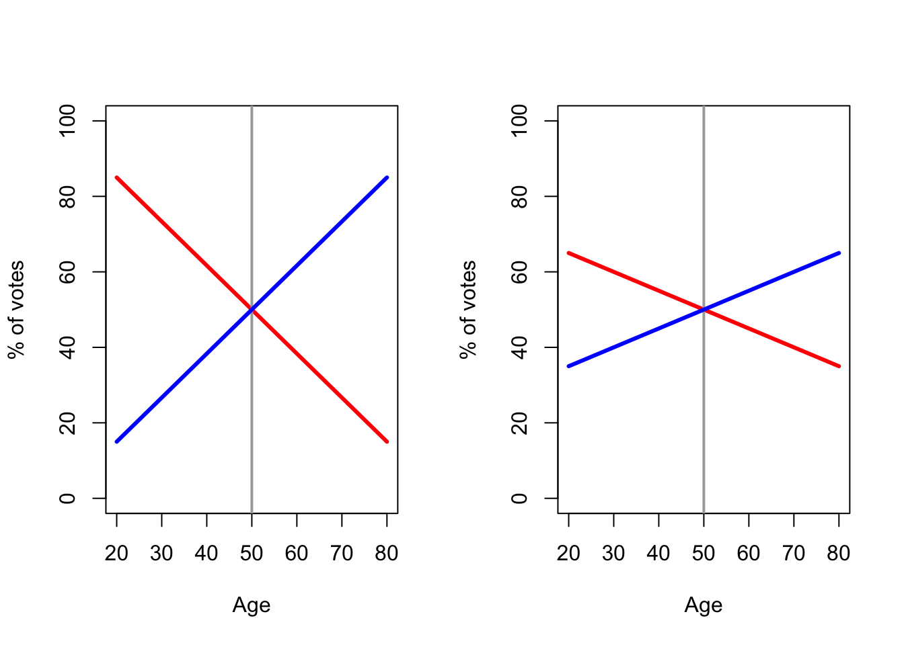
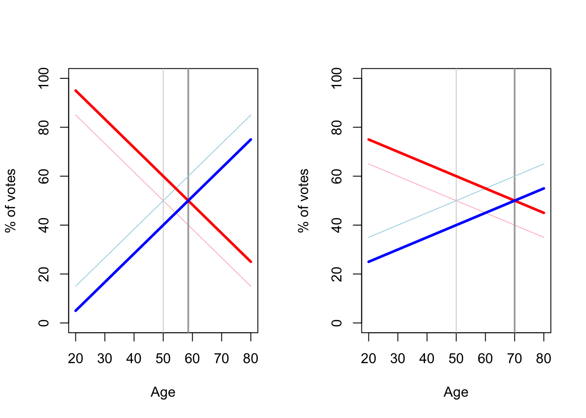

There's an election statistic going around that annoys me. It's some version of this:

<blockquote class="twitter-tweet">
The Conservative-Labour crossover age is now 71 years old according to Deltapoll data.  71! <a href="https://t.co/RFgoGcNTay">pic.twitter.com/RFgoGcNTay</a>
&mdash; Matthew Price (@MatthewPrice01) <a href="https://twitter.com/MatthewPrice01/status/1802947402434740341?ref_src=twsrc%5Etfw">June 18, 2024</a></blockquote> 

Commentators are noticing that the "crossover age" -- that is, the age at which people become more likely to vote Conservative than Labour -- has risen a lot this year compared to previous elections.

I have two complaints about this statistic. First, it doesn't prove what people think it proves. Second, it proves *the exact opposite* to what people think it proves.

I should say what I believe people think this statistic proves. I believe that when they say the crossover age has risen, they think that this shows that age is becoming an ever stronger predictor of how people vote: the Conservative party are gaining votes among the elderly (eg. with the pension "triple lock plus") at the cost of losing votes among the young (eg. with compulsory national service).

My first complaint is that the crossover age, by itself, has nothing to say about this. Consider a pretend country, maybe not that dissimilar to our own, where the Red party does a bit better with young people and the Blue party does a bit better with old people.

Here, the crossover age is 50. Below 50, the Red party is more popular; above 50 the Blue party is more popular.

Now suppose age becomes a much more important factor in voting. Younger people become more Red-voting and older people more Blue-voting. In the graph, that means the lines get steeper. What does this do to the crossover age?

(The thin faded lines are the old lines from the previous figure, the thick dark lines are the new ones.)

What has happened to the crossover age? Nothing! It's stayed at 50. Age has become much more important as a vote predictor, but the crossover age has not budged a single year.

So what could affect the crossover age? Well, suppose that the Red party becomes more popular. Not more popular with any particular age group -- just uniformly more popular over the whole age range. In other words, the lines don't change steepness; just the red line moves up and the blue line moves down. What happens now?

The crossover age has increased from 50 to 65! Just a change in overall popularity is sufficient to change the crossover age.

In other words, the phenomenon of the crossover age increasing can be entirely explained by "the Labour party has become more popular". Hence my first complaint: the crossover age going up does not prove that age is becoming more important as a voting predictor.

My second complaint is a bit more complicated. Consider the two countries show below. In the Left country, there's a steep age gradient: as you get older, you become dramatically more likely to vote Blue. In the Right country, there's a shallow age gradient: as you get older, you only become slightly more likely to vote Blue.

We now know that all we need for the crossover age to increase is for the Red party to become more popular across the board. So let's suppose the Red party goes up by 10 points across all age ranges and the Blue party down by 10 points across all ranges, the same in both countries. What will happen in to the crossover ages?

In the Left country, with the steep age gradient, the crossover age has only increased about 9 years. But in the Right country, with the shallow age gradient, the crossover age has increased by 20 years.

In other words, large changes in crossover ages are seen with *shallow* age gradients, not steep ones. Thus my second complaint: when people use the big rise in the crossover age to suggest that age has a big effect on voting intention, they are, if anything, suggesting exactly the opposite.
