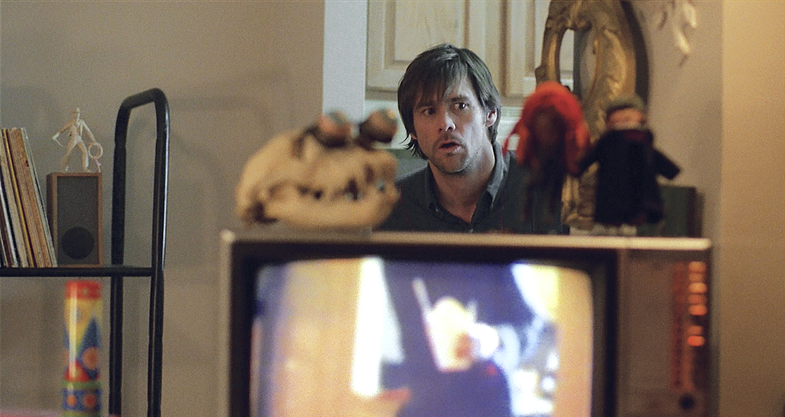

I think *Eternal Sunshine of the Spotless Mind* is probably my favourite film of all time. Certainly it's the non-kids film I've watched the most. The first time I saw it was probably was probably 2005 in my university dorm room one evening off a DVD borrowed from a friend, and I thought it was so great I watched it again the next morning before giving it back. And then for quite a while I used to watch it annually at about this time of year (the film has a long prologue set on Valentine's day, before flashing back to most of the action happening the night before), before deciding that was maybe a bit too much of a depressed-single-person thing to do. But last night I watched it for probably the first time in at least five years, and definitely for the first time in the cinema.

My Grand Unified Theory of *Eternal Sunshine* goes something like this: Jim Carrey, Michel Gondry and Charlie Kaufman are respectively a generationally talented actor, director and writer, but they all have so many ideas gushing out of them that they really struggle to keep everything under control for two hours. Carrey is a supremely gifted physical comedian, but it gets tiresome after a few minutes. Gondry is the most galaxy-brained mad inventor working in film today, but all his best works (except this) are at music video length, and the feature films don't really hang together. Kaufman builds these zany worlds and wild concepts, but – although others will argue this – he has never really stuck the landing, for me. So combining the three ought to leave us with an unruly mess punctured by moments of brilliance. Yet, somehow, miraculously, they all keep it super-restrained here; the wackiness is still there, and is still excellent, but it's *just* poking through from under the surface rather than overwhelming everything.

How much does *Eternal Sunshine* benefit from being on the big screen? Well, I do think is a film that looks beautiful, but it's not visually stunning or astoundingly cinematic, so I didn't feel I was watching a dramatically different film from the one I've seen so many times on the TV. But what does work much better is the sound. There are lots of in-Joel's-memory scenes where the real-world conversations of the mind-erasers start bleeding in, and this is much clearer in full surround-sound. (Also, I don't recall noticing before that the very first noise in the film is the scientists driving away in the morning.)

Various other thoughts on this rewatch (or, Random thoughts for a-few-days-before-Valentine's day 2025):

* Kate Winslet's performance is still – still! – underrated in this.
* They are all superstars with pretty small parts, but I think I can argue with a straight face that these are life-time best performances from Tom Wilkinson, Mark Ruffalo, Elijah Wood and Kirsten Dunst. (Ruffalo breaks your heart just by taking his glasses off.)
* David Cross's delivery of "I'm making! A birdhouse!" and Tom Wilkinson's of "Paaaatrick, baaaaby-boy" are both legendary, as far as I'm concerned.
* Jon Brion's score is excellent, but the bit where "Row, row, row your boat" fades into the piano is particularly gorgeous.
* I love the visual effect where Joel is eating the Chinese food while standing behind the TV, a TV that is showing him eat the food, as if it's see-through. If you see what I mean?
* "Technically speaking, it *is* brain damage" is a very sharp line of dialogue.
* I reckon it's between this and *Casablanca* for the film with the most quotable lines of dialogue: "Random thoughts for Valentine's day 2004..." "Sand is overrated: it's just tiny little rocks." "'Blessed are the forgetful, for they get the better even of their blunders.'" "Pope Alexander." "Are we the dining dead?" The "I'm just a fucked-up girl..." speech.
* I'm not sure I believe Joel's art would be quite as avant-garde, quite as *interesting*, as it is shown to be here.
* I've read quite a lot about this film, but I still don't have a good handle on how the ending actually came about. I know that Kaufman originally wrote an ending where Joel and Clementine continually erase each other for their whole lives – which strikes me as the sort of ingenious but somewhat sour depressive note that has prevented me from fully enjoying his post-*Eternal Sunshine* writing. But the actual ending we have is just beautiful in its (let's call it) realistic optimism. Whose idea was this? Who wrote "OK." "OK?", the greatest last lines of any film?

I don't know whether I was worried that I would cry at the film or that I wouldn't. (Is it worse to appear embarrassingly vulnerable in public, or is it worse if a piece of art that has been very important to you no longer has the same emotional punch it once did?) But, for the record, my cry count was 3: "Row, row, row your boat," as mentioned above; the ending, of course; and, most of all, the scene towards the end in the beachhouse – the key scene of the whole film.

<iframe width="560" height="315" src="https://www.youtube.com/embed/HrGZsdczSBs?si=za7K4ythFJ5veSFt" title="YouTube video player" frameborder="0" allow="accelerometer; autoplay; clipboard-write; encrypted-media; gyroscope; picture-in-picture; web-share" referrerpolicy="strict-origin-when-cross-origin" allowfullscreen></iframe>

