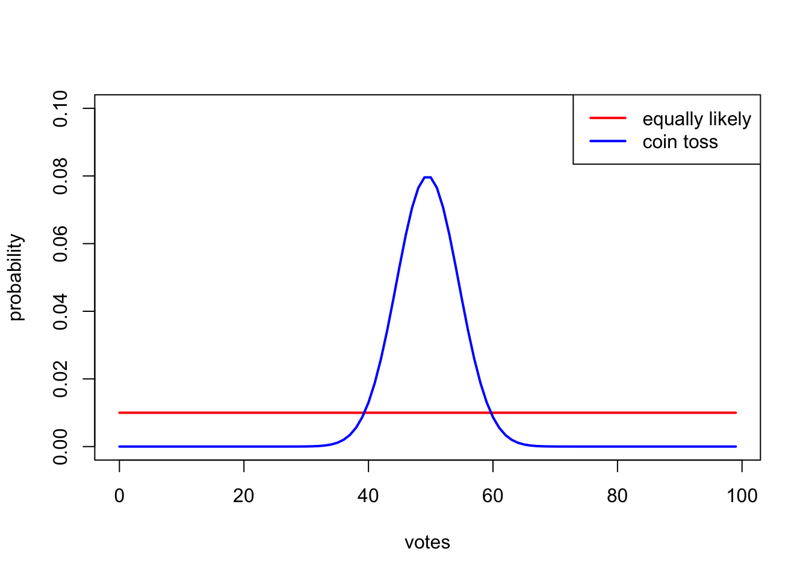

Last night, there was a very close byelection in Runcorn and Helsby. The result was

| *Reform* | *Labour* |
|:-:|:-:|
| 12,645 | 12,639 |

Very close! (In this and all results, I'll only look at the top two candidates, and ignore any other votes.)

But was this closer than the most famous close election of recent times: the 2000 US presidential election in Florida? The result there was:

| Bush | Gore |
|:-:|:-:|
| 2,912,790 | 2,912,253 |

So which was closer? Well, that depends. How do we measure the closeness of elections?

The simplest way would be just to look at the **absolute difference** or the "winning margin" *d*: that is, the number *d* of extra votes the winning candidate got over the losing candidate. Smaller differences are more impressively tight elections: a small absolute difference means a very close election, while a big absolute difference is not a close election. So how does that work out here?

| Reform | Labour | abs. diff. |
|:-:|:-:|:-:|
| 12,645 | 12,639 | 6 |

| Bush | Gore | abs. diff. |
|:-:|:-:|:-:|
| 2,912,790 | 2,912,253 | 537 |

Well, that solves it! The Runcorn byelection was decided by 6 votes, while Florida 2000 was decided by 537 votes. So Runcorn was much, much closer!

But, wait. These two elections were of very different sizes. There were about 25,000 voters in Runcorn, between the two biggest parties, but almost 6 million voters in Florida! Surely that needs be taken into account? Otherwise, we could say that Manchester United's 3–0 thrashing of Athletico Madrid last night (absolute difference: 3) was even closer than the byelection.

So perhaps it makes more sense to look at the **relative difference** – that is, by what *percentage* one candidate beat the other one, or the absolute difference *d* divided by the total number of votes *n*. (Again, *n* will still just be the total of number of votes among the two best candidates.)

| Reform | Labour | abs. diff. | rel. diff. |
|:-:|:-:|:-:|:-:|
| 12,645 | 12,639 | 6 | 0.024% |

| Bush | Gore | abs. diff. | rel. diff. |
|:-:|:-:|:-:|:-:|
| 2,912,790 | 2,912,253 | 537 | 0.009% |

So, both very close elections. But smaller results are better, still, so this time, it's Flordia 2000 that wins: it's reduced by a factor of two-and-a-bit compared to Runcorn, on this measure. Florida was closer!

## Looking again at relative difference

I think this is the result that most people would accept: closeness of elections is decided by relative (or percentage) difference between the top two candidates, so Flordia 2000 was closer.

But I want to think a bit more carefully about the relative difference: What does it mean, and what justification can we give for its use?

I propose that one way to think about the relative difference is the following.

Suppose we have 99 voters. Then there are 100 possible numerical results, from a 99–0 wipe-out for Red over Blue, to a 98–1 trouncing for Red over Blue, then 97–2, all the way through to a 0–99 wipe-out for Blue over Red. Suppose further that all 100 of those results are equally likely, coming up with 1% probability each. We could then come up with a kind of [p-value](https://en.wikipedia.org/wiki/P-value): *What is the probability (under this model) that the election result was as close as this or closer?*

Suppose in our example that the Red party wins 51-48. Then, out of the 100 possible outcomes, there were four outcomes that would have been as close as this or closer: 51–48 itself, plus 50–49, 49–50, and 48–51. (In the latter two, Blue beat Red.) So the "p-value" (or "somewhat p-value-like quantity") is 4/100 or 0.04.

So now consider an election with *n* voters and a difference of *d*. What's the p-value here? The answer is that there are *d* + 1 outcomes as close as this or closer, and *n* + 1 possible outcomes. So the answer is (*d* + 1) / (*n* + 1).

[*Optional proof:* To see this, we need to count up all the results between "this result" and "the opposite result", where the other candidate wins by the same amount. To count up these we can imagine distributing the winner's votes to the loser: we could distribute 0 (current result) or 1 (two votes closer in the margin – unless there was only one vote in it to start with), or 2 votes, or 3, up to *d* votes; at the point we distribute *d* votes, we get the "opposite" result, the equal "closeness" as the original result, and any further distribution gives a less-close result with a bigger victory for the originally-losing candidate.]

This p-value we have justified, (*d* + 1) / (*n* + 1), is very nearly the absolute difference *d*/*n*; there's just an extra "plus 1" on the top and bottom. So, my first proposal is not to look at the relative difference *d*/*n*, but rather the **adjusted relative difference** (*d* + 1) / (*n* + 1).

For all but the tiniest electorates, replacing *n* by *n* + 1 makes almost no difference. For extremely close elections, though, replacing *d* by *d* + 1 can effect things: this is a slight extra penalty for the smaller election. (Like Runcorn!)

| Reform | Labour | rel. diff. | adj. rel. diff. |
|:-:|:-:|:-:|:-:|
| 12,645 | 12,639 | 0.024% | 0.028% |

| Bush | Gore | rel. diff. | adj. rel. diff. |
|:-:|:-:|:-:|:-:|
| 2,912,790 | 2,912,253 | 0.00922% | 0.00924% |

Here, our adjustment slightly increased the score of the smaller Runcorn byelection, but barely changed the much bigger Florida election. Now, the Florida 2000 score is reduced by about a factor of 3 compared to Runcorn.

To put it another way, under this "each result equally likely" model:

* a result like the Runcorn byelection would happen once every 3,600 elections;
* a result like Florida 2000 would happen once every 11,000 elections.

So the Runcorn byelection result is (under this model) about 3 times as likely as the Florida 2000 result.

Before we move on, one last argument for the adjusted relative difference, with the "plus 1"s, over the standard relative difference. Consider two elections: in the first, there are four voters, and it's a 2–2; in the second, there are four million voters, and, astonishingly, it's an *exact* 2 million – 2 million tie! I guess you could say that these are both "perfectly close" results, as verified by their ideal relative differences of 0. But I think most people would regard the 2 million – 2 million tie as way more impressive. And that is indeed what shows up with the adjusted relative difference: the first score is (0 + 1)/(4 + 1) = 0.2, while the second is 1/4,000,001 = 0.00000025, an enormous reduction by a factor of almost a million.

## A modest proposal

It was nice that the mathematical justification we gave above recovered (a slight adjustment of) the relative difference statistic that everyone uses anyway. But was that mathematical justification *actually* convincing, or was I pulling the wool over your eyes?

Well, I wasn't being deceptive, but there is part of the argument I find unconvincing. It's where I said that we could consider all 100 results from 99–0 to 0–99 equally likely. Is that a reasonable assumption? If I tossed 99 coins, getting 99 heads and 0 tails would be extraordinarily unlikely – about a one in 600 billion billion billion chance – but getting a 50–49 victory for heads over tails happens quite regularly – about one in every 13 goes.

(This is because there's only one way for 99 coins to land all heads, but there are many ways for 99 coins to land with a 50/49 split. See [the Wikipedia page on the "binomial distribution"](https://en.wikipedia.org/wiki/Binomial_distribution) for more on this.)

So we should take this into account when calculating our p-value. That is, we should instead caculate the probability of getting a result as close as this or closer with this "coin-tossing" model, rather than the previous "equally likely scores" model. I propose to call the p-value calculated with the coin-toss model the "[Frodsham](https://www.theguardian.com/politics/2024/oct/27/labour-mp-mike-amesbury-filmed-punching-man-to-the-ground-in-cheshire) score" (although the "[chad](https://www.americaexplained.org/what-is-a-hanging-chad.htm) score" would also work).

The bad news is that, while there is a formula to calculate the Frodsham score, it's not a very pleasant one: if the loser gets *a* votes and the winner *b* votes, for a total of *n* = *a* + *b* votes, then the Fordsham score is

$$ F = 2^{-n} \sum_{k=a}^b \binom{n}{k} $$

where that thing in brackets is the "[binomial coefficient](https://en.wikipedia.org/wiki/Binomial_coefficient)" (read "*n* choose *k*", and famous from [Pascal's triangle](https://en.wikipedia.org/wiki/Pascal%27s_triangle)). Pleasantness as a formula aside, though, the Frodsham score is easily calculated on a computer. We get:

| Reform | Labour | adj. rel. diff. | Frodsham |
|:-:|:-:|:-:|:-:|
| 12,645 | 12,639 | 0.028% | 3.5% |

| Bush | Gore | adj. rel. diff. | Frodsham |
|:-:|:-:|:-:|:-:|
| 2,912,790 | 2,912,253 | 0.00922% | 18% |

To put it another way, under this "coin tossing" model:

* a result like the Runcorn byelection would happen once every 28 elections;
* a result like Florida 2000 would happen once every 6 elections.

Runcorn wins again! The Florida 2000 result occurs about 5 times as often.

A final mathematical aside: while the exact formula for the Frodsham score is unpleasant, when the absolute difference *d* is small and the number of voters *n* is large, the approximation

$$ F \approx \sqrt{\frac{2}{\pi}} \, \frac{d+1}{\sqrt{n}} \approx 0.798 \, \frac{d+1}{\sqrt{n}}  $$

is pretty accurate:

| Reform | Labour | Frodsham | approx. Frodsham |
|:-:|:-:|:-:|:-:|
| 12,645 | 12,639 | 3.511% | 3.512% |

| Bush | Gore | Frodsham | approx. Frodsham |
|:-:|:-:|:-:|:-:|
| 2,912,790 | 2,912,253 | 17.6% | 17.8% |

And, of course, if you just want to compare elections with each other, you can ignore the common factor of 0.798 in the approximation. So my suggestion is this: Don't take the percentage difference, by taking the difference (or, better, the difference plus 1) divided by n. Rather, divide by *the square root of n* instead!
