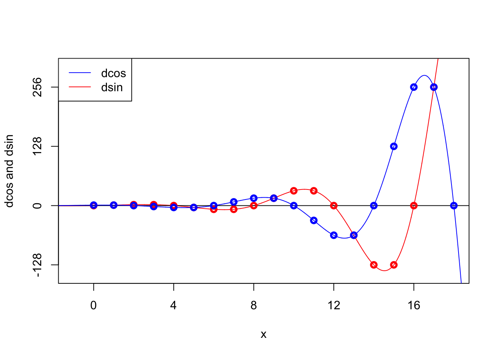

---
title: "4 is discrete pi"
author: "MATH5003/5004"
date: "2026-02-01"
output: html_document
---

## Recap

[In my last blogpost](2e.html), I looked for a discrete version of the exponential function

$$ \exp(x) = \frac{x^0}{0!} + \frac{x^1}{1!} + \frac{x^2}{2!} + \frac{x^3}{3!} + \cdots . $$

By swapping the standard power $x^n$ for the falling factorial power $x^\underline{n} = x(x-1)\cdots(x-n+1)$, we got the "discrete exponential"

$$ \begin{align} \operatorname{dexp}(x) &= \frac{x^\underline{0}}{0!} + \frac{x^\underline{1}}{1!} + \frac{x^\underline{2}}{2!} + \frac{x^\underline{3}}{3!} + \cdots \\
&= \binom x0 + \binom x1 + \binom x2 + \binom x3 + \cdots , \end{align} $$

which is just $\operatorname{dexp}(x) = 2^x$.

Pleasingly, just as $\frac{\mathrm{d}}{\mathrm dx} \exp(x) = \exp(x)$, so we have a "discrete equivalent result" $\Delta \operatorname{dexp}(x) = \operatorname{dexp}(x)$, where $\Delta$ is the discrete difference $\Delta f(x) = f(x+1)-f(x)$.

We also found that, more generally, the discrete equivalent of $\exp(\alpha x)$ (considered as a function of $x$) is $(1+\alpha)^x$.

## Discrete cos and sin (non-negative integer *x*)

So, for the next step, how about discrete sine and discrete cosine? Can we define discrete versions of sin and cos that end up having similar properties to their standard trigonometric counterparts?

The standard Taylor series definitions are

$$ \begin{align} \cos(x) &= \frac{x^0}{0!} - \frac{x^2}{2!} + \frac{x^4}{4!} - \cdots \\
                 \sin(x) &= \frac{x^1}{1!} - \frac{x^3}{3!} + \frac{x^5}{5!} - \cdots \end{align} $$

By our now-standard procedure of swapping powers for falling factorials then recognising $x^\underline{n}/n!$ as a binomial coefficient, we should take the following definitions:

$$ \begin{align} \operatorname{dcos}(x) &= \binom x0 - \binom x2 + \binom x4 - \cdots \\
                 \operatorname{dsin}(x) &= \binom x1 - \binom x3 + \binom x5 - \cdots \end{align} $$

For the moment, let's stick to non-negative integer $x = 0, 1, 2, \dots$. The discrete cos sequence is [A146559](https://oeis.org/A146559)

$$ 1, 1, 0, -2, -4, -4, 0, 8, 16, 16, 0, -32, -64, -64, 0, 128, 256, 256, \dots $$

and the discrete sin series is [A009545](https://oeis.org/A009545)

$$ 0, 1, 2, 2, 0, -4, -8, -8, 0, 16, 32, 32, 0, -64, -128, -128, 0, 256, \dots $$

Pleasingly, we can see the sequences a related by the difference operator:

$$ \begin{align}
\Delta \operatorname{dcos}(x) &= - \operatorname{dsin}(x) \\
\Delta \operatorname{dsin}(x) &= \operatorname{dcos}(x) ;
\end{align} $$

which is exactly the same structure as the derivatives of usual sin and cos:

$$ \begin{align}
\frac{\mathrm{d}}{\mathrm{d}x} \operatorname{cos}(x) &= - \operatorname{sin}(x) \\
\frac{\mathrm{d}}{\mathrm{d}x}\operatorname{sin}(x) &= \operatorname{cos}(x) .
\end{align} $$

Further, just by looking at the two sequences, we can tell that we have sort-of-periodic behaviour modulo 8.

| *x* | dcos | dsin |
|:--------------------:|:-----------------------:|:-----------------------:|
| $0 \bmod 8$ | $\operatorname{dcos}(x) = 2^{x/2}$ | $\operatorname{dsin}(x) = 0$ |
| $1 \bmod 8$ | $\operatorname{dcos}(x) = 2^{(x-1)/2}$ | $\operatorname{dsin}(x) = 2^{(x-1)/2}$ |
| $2 \bmod 8$ | $\operatorname{dcos}(x) = 0$ | $\operatorname{dsin}(x) = 2^{x/2}$ |
| $3 \bmod 8$ | $\operatorname{dcos}(x) = -2^{(x-1)/2}$ | $\operatorname{dsin}(x) = 2^{(x-1)/2}$ |
| $4 \bmod 8$ | $\operatorname{dcos}(x) = -2^{x/2}$ | $\operatorname{dsin}(x) = 0$ |
| $5 \bmod 8$ | $\operatorname{dcos}(x) = -2^{(x-1)/2}$ | $\operatorname{dsin}(x) = -2^{(x-1)/2}$ |
| $6 \bmod 8$ | $\operatorname{dcos}(x) = 0$ | $\operatorname{dsin}(x) = 2^{x/2}$ |
| $7 \bmod 8$ | $\operatorname{dcos}(x) = 2^{x/2}$ | $\operatorname{dsin}(x) = -2^{(x-1)/2}$ |

These look very reminiscent of how the usual cos and sin behave: we have periodic zeros, with the functions alternately positive and negative in the intervals between those zeros. More specifically, we have for the usual trigonometric functions:

-   sin has zeros at $0, \pi, 2\pi, 3\pi, \dots$
-   cos has zeros at $\frac{\pi}{2}, \frac{3\pi}{2}, \frac{5\pi}{2}, \dots$
-   cos and sin both have period $2\pi$

and for our discrete equivalents:

-   dsin has zeros at $0, 4, 8, \dots, = 0, 4, 2\times 4, 3 \times 4, \dots$
-   dcos has zeros at $2, 6, 10, \dots = \frac{4}{2}, \frac{3 \times 4}{2}, \frac{5 \times 4}{2}, \dots$
-   dcos and dsin both have sort-of-periodic behaviour with "period" $8 = 2\times 4$

It seems clear from these that for our new discrete trigonometric operations, 4 is playing the role that $\pi$ plays for the normal trigonometric operations: whence this blogpost's title.

On the other hand, the usual sin and cos are bounded between -1 and +1, which is not true of the discrete sin and cos, which seem to growing over time (between the periodic zeros). For example, the standard sin and cos have

-   $\cos(x)^2 + \sin(x)^2 = 1$
-   $\sin(x) = \cos\big(x - \frac{\pi}{2}\big)$

while the discrete sin and cos have

-   $\operatorname{dcos}(x)^2 + \operatorname{dsin}(x)^2 = 2^x$
-   $\operatorname{dsin}(x) = 2\operatorname{dcos}(x - 2)$

In fact, if we really wanted to coerce the discrete sin and cos into the usual versions, we could do so: it is the case that

$$ \begin{align} \operatorname{dcos}(x) &= 2^{x/2} \cos \left(\frac{\pi x}{4} \right) \\
\operatorname{dsin}(x) &= 2^{x/2} \sin \left(\frac{\pi x}{4} \right) , \end{align} $$

at least for non-negative integer $x$, thanks to the convenient expression $\sin (\frac{\pi}{4}) = \cos (\frac{\pi}{4}) = 1/\sqrt{2}$. Can I prove these formulas for dcos in terms of cos and dsin in terms of sin? Might they even be true for non-integer $x$?

## Discrete cos and sin (general *x*)

As is probably clear from the disorganised nature of this post, I'm writing as I work things out. And, at this point, it's just occurred to me that I may have been going about things the wrong way.

I had started with the Taylor series definitions of cos and sin. But maybe I should have started with these definitions instead:

$$ \begin{align}
      \cos(x) &= \frac{\mathrm{e}^{\mathrm{i}x} + \mathrm{e}^{-\mathrm{i}x}}{2} \\
      \sin(x) &= \frac{\mathrm{e}^{\mathrm{i}x} - \mathrm{e}^{-\mathrm{i}x}}{2\mathrm{i}} .
\end{align} $$

I argued last time that the discrete equivalent of $\mathrm{e}^{\alpha x}$ is $(1 + \alpha)^x$, so this suggests we should take the definitions

$$ \begin{align}
      \operatorname{dcos}(x) &= \frac{(1+\mathrm{i})^x + (1-\mathrm{i})^x}{2} \\
      \operatorname{dsin}(x) &= \frac{(1+\mathrm{i})^x - (1-\mathrm{i})^x}{2\mathrm{i}} .
\end{align} $$

Are these the same as the binomial coefficient definitions from before? Yes they are: use the binomial theorem

$$ \begin{align} (1 + i)^x &= \sum_{n=0}^\infty \binom{x}{n} \mathrm{i}^n \\
  (1 - i)^x &= \sum_{n=0}^\infty \binom{x}{n} (-\mathrm{i})^n , \end{align} $$

and check where you get constructive or destructive interference in the sums.

This generalises much more easily to real values of $x$. And, more importantly, allows me easily to draw some pictures. Below, discrete cos is in blue and discrete sin in red; the points are the integer values.

Is it true that for all real $x$ we have

$$ \begin{align} \operatorname{dcos}(x) &= 2^{x/2} \cos \left(\frac{\pi x}{4} \right) \\
\operatorname{dsin}(x) &= 2^{x/2} \sin \left(\frac{\pi x}{4} \right) , \end{align} , $$

as I suggested earlier? Yes it is. To see this, we want to put our complex numbers into modulus--argument form: that is, $1 + i = \sqrt{2} \mathrm{e}^{\mathrm i \pi/4}$ and $1 + i = \sqrt{2} \mathrm{e}^{-\mathrm i \pi/4}$. Then we have

$$ \operatorname{dcos}(x) = \frac{\big(\sqrt{2} \mathrm{e}^{\mathrm i \pi/4}\big)^x + \big(\sqrt{2} \mathrm{e}^{\mathrm i \pi/4}\big)^x}{2} = (\sqrt{2})^x \, \frac{\mathrm{e}^{\mathrm i \pi x/4} + \mathrm{e}^{\mathrm i \pi x/4}}{2}  = 2^{x/2} \cos \left(\frac{\pi x}{4} \right) , $$

and similarly for dsin. This proves the result.
