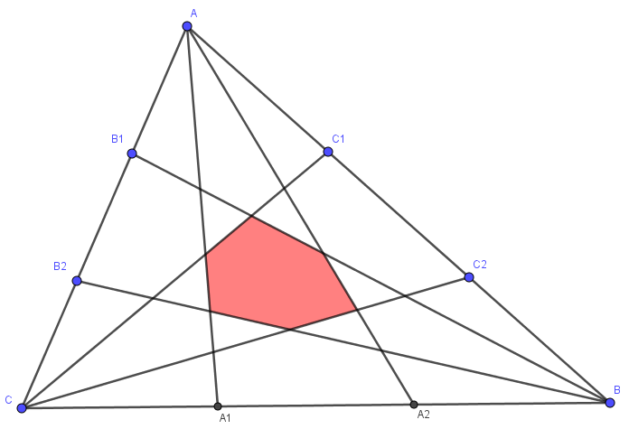

Here’s a cute little paper: it’s called [“Generalization of Marion's theorem: volumes of central polytopes obtained by trisecting the edges of simplices”](https://arxiv.org/abs/2606.02087) by Yu. V. Kazakov.

Marion’s theorem is a simple geometric theorem about triangles. For each side of the triangle, trisect the side and connect the two trisection points to the opposite corner. This gives you a hexagon in the middle of the triangle, as shown in [this picture](https://commons.wikimedia.org/wiki/File:Théorème_de_Marion.png):

Marion’s theorem (after [Marion Walter](https://mathshistory.st-andrews.ac.uk/Biographies/Walter/)) states that the area of this central hexagon is one-tenth the area of the original triangle.

Kazakov’s result is a multidimensional generalisation of this. You can read the paper itself for details of the construction, but the result is that, in $n$ dimensions, the central polytope has volume $1/\binom{2n+1}{n}$ the volume of the original simplex. Marion’s theorem is the $n = 2$ case, for which $\binom{5}{2}$ does indeed equal 10.

But this paper interested me because it reduces the problem to a purely probabilistic one. Again, see the paper for details of why the reduction holds, but the probabilistic setup is this: Let $Y_0, Y_1, \dots, Y_n$ be $n+1$ IID exponentially distributed random variables. What is the probability that the ratio of the largest of the $Y_k$s to the smallest of the $Y_k$s is at most 2? That is, what’s the probability the largest is no more than twice as big as the smallest? The answer to this question is, Kazakov explains, the same as the ratio of the volumes of the two shapes.

The paper calculates this probability “by hand”: it writes down the relevant integral, calculates it as a sum involving binomial coefficients, and cites some combinatorial result that expresses that sum as $1/\binom{2n+1}{n}$. This is fine – but, speaking as a probabilist, I felt like I wanted a more “genuinely probabilistic” argument, that better explains *why* the answer is $\binom{2n+1}{n}$. The purpose of this blogpost is to record such a proof.

We start off with $n+1$ exponential alarm clocks $Y_0, Y_1, \dots, Y_n$. Eventually one of the alarm clocks rings – let’s say it’s at time $Y^*$ – and that’s the first alarm clock.

At this point, we can take advantage of the memoryless property of the exponential distribution. So, after this first ring, the remaining $n$ alarm clocks can reset themselves to $n$ new exponential distributions $Z_1, \dots, Z_n$. For the ratio of the last alarm clock time to the first alarm clock time to be at most 2, all these new alarm clocks must ring before another $Y^*$ seconds are up.

So in order to “succeed”, the $n$ new reset alarm clocks $Z_1, \dots, Z_n$ must be shorter than the shortest of the $n+1$ original alarm clocks; that is, shorter than all $n+1$ of those original alarm clocks $Y_0, Y_1, \dots, Y_n$. In other words, of the $2n + 1$ alarm clocks,

$$ Y_0, Y_1, \dots, Y_n, Z_1, \dots, Z_n $$

we need the longest $n+1$ of them to be in the first $n+1$ places and the shortest $n$ of them to be in the last $n$ places. Of the $2n+1$ positions, the shortest $n$ will occupy a subset of $n$ of those positions; 1 of the $\binom{2n+1}{n}$ such subsets is the last $n$ positions, so the probability is $1/\binom{2n+1}{n}$.
