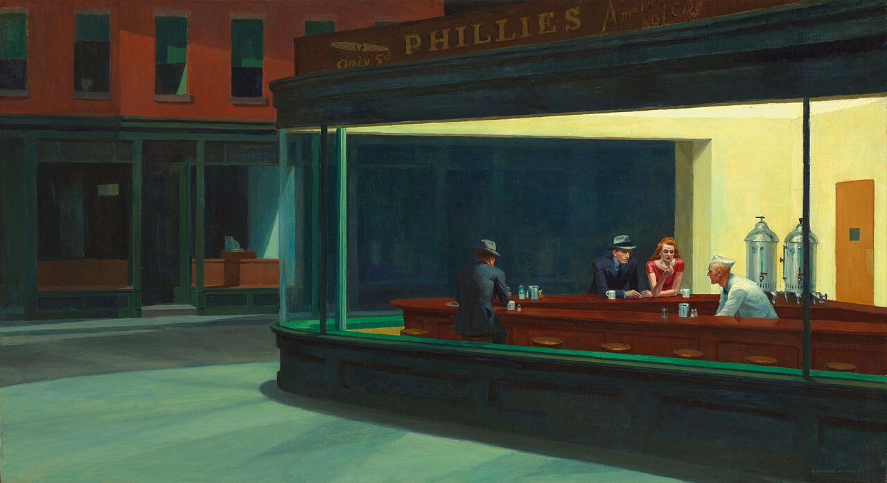

* “A Change Is Gonna Come”
* the Apollo program
* Barbara Stanwyck
* Bob Dylan
* Calvin Trillin
* Claude Shannon and information theory
* *Different Trains*
* *Do The Right Thing*
* Dwight Garner’s book reviews
* eggs Benedict
* Ernest Hemingway’s novels and short stories
* Francis Ford Coppola’s run of films in the 1970s
* *The Great Gatsby*
* hip-hop
* heavier-than-air flight
* the Hollywood career of Alfred Hitchcock
* *Joe Gould’s Secret*
* kottke.org
* the LaTeX typesetting system
* the MacBook Pro, circa 2013
* [*Nighthawks*](https://en.wikipedia.org/wiki/File:Nighthawks_by_Edward_Hopper_1942.jpg)
* “One Art”
* *Partita for 8 Voices*
* the old Penn station
* *The New Yorker*
* Nina Simone
* “Pine Barrens” (*Sopranos* episode)
* Richard Avedon’s photographs
* RSS feeds
* the screwball comedy; the comedy of remarriage; film noir
* the simplex algorithm
* Sufjan Stevens (especially *Illinois* and the Christmas albums)
* *This American Life*
* Tiger Woods’s shot at the 16th hole of the 2005 Masters
* the view of Manhattan from the Staten Island ferry at dusk
* *The West Wing*, seasons 1–4
* “We hold these truths to be self-evident, that all men are created equal, that they are endowed by their Creator with certain unalienable Rights…”

Happy 250th! Sorry for spelling "favourite" with a U.

<iframe width="560" height="315" src="https://www.youtube.com/embed/wEBlaMOmKV4?si=LiGp5QDsaCnnMY98" title="YouTube video player" frameborder="0" allow="accelerometer; autoplay; clipboard-write; encrypted-media; gyroscope; picture-in-picture; web-share" referrerpolicy="strict-origin-when-cross-origin" allowfullscreen></iframe>

