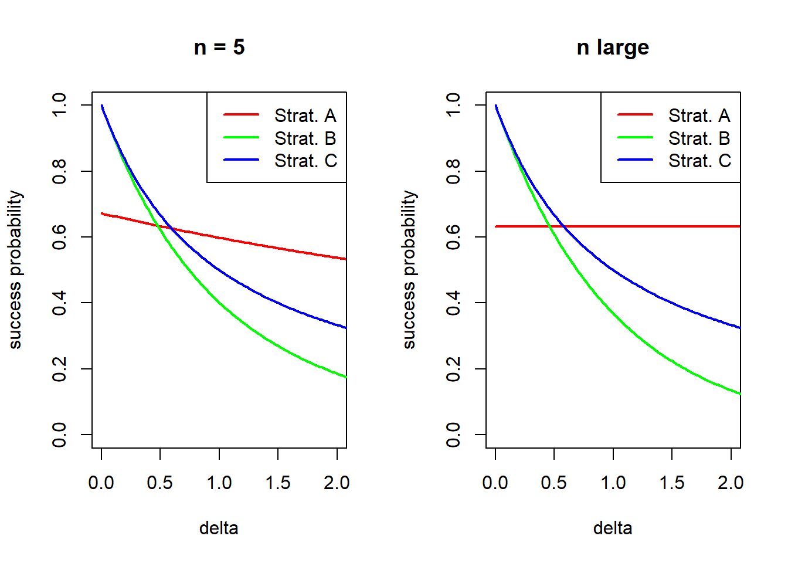
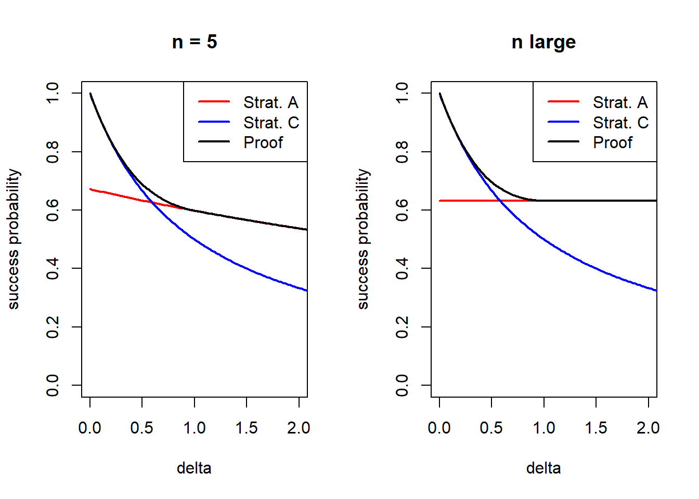

Let $X_1, X_2, \dots, X_n$ be independent random variables, each with mean at most 1. We want to maximise the probability that their sum $S = \sum_{i=1}^n X_i$ is at least $n + \delta$ for some $\delta > 0$. How do we do this?

(The most famous case of this problem is $\delta = 1$, so you want the sum to be at least $n+1$, but I prefer to think about the more general version.)

It's easy to get the sum to $n$: we just let each of the random variables equal 1 with certainty. But to push the sum above $n$ to $n + \delta$ requires taking some risks. After thinking about this for a while, the following three strategies seem like they might be in the running to be the best way.

**Strategy A** is *"Everyone takes a big risk, and we hope one of them comes good."* We let all the $X_i$s be $n + \delta$ with probability $1/(n + \delta)$ and 0 otherwise. (This choice of probability makes the means exactly 1.) This will succeed in getting the sum up to $n + \delta$ as long as at least one of the random variables hits its "jackpot" value $n + \delta$ and fails if all of them hit the 0. The probability this happens is

$$ A(n, \delta) = 1 - \left(1 - \frac{1}{n+\delta}\right)^n \approx 1 - \mathrm{e}^{-1} . $$

**Strategy B** is *"Everyone takes a small risk, and we hope* all *of them come good."* We let all the $X_i$s be $1 + \delta/n$ with probability $1/(1 + \delta/n)$ and 0 otherwise. This will succeed in getting the sum up to $n(1 + \delta/n) = n + \delta$ if *all* of the random variables hit their jackpots and fails if any of them hits 0. The probability this happens is

$$ B(n, \delta) = \left(\frac{1}{1 + \frac{\delta}{n}}\right)^n \approx \mathrm{e}^{-\delta} . $$

**Strategy C** is *"One person takes a big risk, and everyone else plays it conservatively."* We let $X_1$ be $1 + \delta$ with probability $1/(1 + \delta)$ and 0 otherwise, and let all the other $X_i$s be 1 with certainty. This will succeed in getting the sum up to $(1 + \delta) + (n-1) = n + \delta$ if that special random variable hits its jackpot. The probability this happens is

$$ C(n, \delta) = \frac{1}{1+\delta} . $$

So which of these is better? Let's draw a picture: the x-axis is $\delta$ and the $y$ axis is the success probability of each of these three strategies. The left-hand picture is $n = 5$, the right-hand picture is the limit as $n$ gets very big.

We see that which strategy is best depends whether $\delta$ is above or below a crossover point; for $n = 5$ it's about 0.67, and asymptotically it's $1/(\mathrm{e} - 1) \approx. 0.58$.

* For $\delta$ above this threshold, the best of these three strategies is Strategy A.
* For $\delta$ below this threshold, the best of these three strategies is Strategy C.
* Strategy B is never the best strategy.

**Feige's conjecture**, [posed by Uriel Feige in 2005](https://epubs.siam.org/doi/10.1137/S0097539704447304), is that you can't do better than these:

$$ \mathbb P(S \geq n + \delta) \leq \max \big\{ A(n, \delta), C(n, \delta) \big\} \approx \max \left\{1 - \mathrm{e}^{-1}, \frac{1}{1+\delta} \right\} . $$

I first heard of this problem about a year ago, and spent a couple hours thinking about it that afternoon, and occasionally think about it if I'm bored in a seminar or standing in a queue. All in all, I've thought about this problem for maybe half a day -- and made no progress at all. I did learn that the following progress had been made:

* You can assume that each random variable is $x_i$ with probability $1/x_i$ and is 0 otherwise. (In particular, Strategy A is $x_i = n + \delta$ for all $i$, Strategy B is $x_i = 1 + \delta/n$ for all $i$, and Strategy C is $x_1 = 1 + \delta$ and $x_i = 1$ otherwise.)
* The conjecture has been checked "by hand" for $n$ equal to 1 (which is obvious), 2, 3, and 4.

But other than that, there's not much to say about Feige's conjecture for the 21 years it's been open. Until two days ago.

On Monday, [not one](https://arxiv.org/abs/2607.23980) [but two](https://arxiv.org/abs/2607.24528) *[see update below]* papers appeared, both proving Feige's conjecture for $\delta \geq 1$ -- that is, to show that Strategy A is the best strategy in this regime. In news that would have surprised me a lot six months ago and did not surprise me at all today, it seems most of the hard work was done by ChatGPT. ([Fu et al](https://arxiv.org/abs/2607.23980) write: "The initial proof is found by ChatGPT 5.6 Pro. The authors subsequently checked, revised, and rewrote the argument, and take full responsibility for the final content." [Nie and Wei](https://arxiv.org/abs/2607.24528) write: "The authors acknowledge the use of GPT-5.6 Sol in the discovery and exploration of the proof. All arguments were independently verified by the authors. The manuscript was written entirely by the authors, who take full responsibility for its content.")

The two proofs are identical -- like, really identical-identical. What is needed is to combine two (human-proved) results: one about Dirichlet's uniform distribution on the simplex, due to [Vlassis and Thomas](https://arxiv.org/abs/2607.08415) from just a couple of weeks ago, and the other an old result from the 50s/60s in convex geometry called "Grünbaum’s centroid theorem". Fu et al even include an (AI-assisted) formalisation of the result, so we can be fully confident it is true.

In fact the result proven by the two papers is this: if we let

$$ D(n, \delta) = 1 - \delta B(n, \delta) = 1 - \delta \left(\frac{1}{1 + \frac{\delta}{n}}\right)^n \approx 1 - \delta \mathrm{e}^{-\delta} , $$

then

$$ \mathbb P(S \geq n + \delta) \leq \max \big\{ A(n, \delta), D(n, \delta) \big\} \approx \max \left\{1 - \mathrm{e}^{-1}, 1 - \delta \mathrm{e}^{-\delta} \right\} . $$

If we compare this result with the full Feige's conjecture, we see the exact match for $\delta \geq 1$, thereby proving the conjecture in that regime, and it's a pretty good bound for $\delta < 1$ too.

I don't know enough about convex geometry to be able to speculate on whether the full conjecture is likely to fall soon or not.

**Update:** *Correction; it was proved by* three *papers on Monday: [here's the third, by Stander](https://zenodo.org/records/21626794). That paper phrases it as "conditional" on the Vlassis and Thomas result -- that's appropriately cautious for a new not-yet-peer-reviewed result if the author doesn't understand its proof; but since that result is now formalised, there's no need to fret. This third proof is identical to the other two in its method. The paper does not say AI was used to assist in finding the proof (although doesn't say it* wasn't *either, I suppose).*
