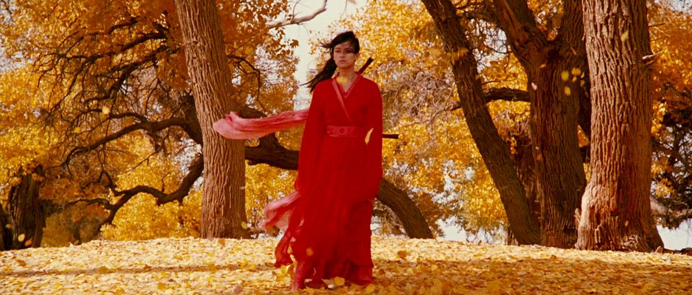

*(Updated 29 December 2019)*

### Top 10 films

I had difficulty narrowing this down, so it's actually a top 12 films.

**28 Days Later** (Danny Boyle)  
Probaby Danny Boyle's best film. (I prefer the original "what if..." ending)

**Amélie** / *Le Fabuleux Destin d'Amélie Poulain* (Jean-Pierre Jeunet)  
I feel I have an "*Amélie* is not as straightforwardly sugary-sweet as you think it is" take brewing, but I need to think up some better evidence than "Mathieu Kassovitz wrote and directed *La Haine*, you know" before I can write it.

**Before Sunset** (Richard Linklater)  
I've never gasped as loudly when I realised a film was about to finish.

**Dancer in the Dark** (Lars von Trier)  
When I, a non-film-crier, saw this for the first time, I was in tears for essentially the whole second half of the film, and for a couple of years I'd have said this was my favourite film of all time. Now, later, I wonder if it's not actually somewhat emotionally manipulative, rather cruel, a bit *cheap*. But no film I watched this decade had such an effect on me, so it has to go on the list.

**The Edukators** / *Die fetten Jahre sind vorbei* (Hans Weingarten)  
Why aren't the UK and US willing to make films that, yes, have young people falling in love and whatever but also have political stuff in too?

**Eternal Sunshine of the Spotless Mind** (Michel Gondry)  
A friend let me borrow their DVD of this to watch one evening, and it was so great I re-watched the next morning before returning it. This list is no ordered (other than alphabetically), but *Eternal Sunshine* would be number 1 if it was.

**Frost/Nixon** (Ron Howard)  
I get annoyed when a film is dismissed as "stagey", because I love films with small casts, using limited locations, and that prioritise character and dialogue over flashy visuals.

**Hero** / 英雄 (Zhang Yimou)  
I don't know how I feel about the message of this film (a friend described it as "almost fascist"), but it's by some distance the most beautiful-looking film of the decade. *[picture above]*

**Memento** (Christopher Nolan)  
A perfect cuckoo-clock of a film, with every scene constructed in exactly the right place. I like all Nolan's other films, some very much, but their heaviness sometimes miss the deftness of touch *Mememnto* has.

**Mulholland Drive** (David Lynch)  
In the end, I think it does mostly make sense (except the cowboy; that remains baffling), but you watch this for the freaky atmosphere, not the plot.

**Punch-Drunk Love** (Paul Thomas Anderson)  
*Magnolia* and *Boogie Nights* are of course good films, but it turns out I just wanted PTA to make a romcom with Adam Sandler in it.

**Zodiac** (David Fincher)  
Scarier than any horror film I saw this decade.

***Reflections, 10 years later:** I'm baffled to read I couldn't get this down to 10, because it seems very obvious to me now that two of these --* The Edukators *and* Frost/Nixon *-- while perfectly fine films, are comfortably weaker than the other 10. But those 10 are very solid choices. Would I pick exactly the same 10 now? I could try to find space for* In the Loop *or* Lost in Translation, *say, but I could just stick with past-me.*

### Top 10 albums

<iframe style="border-radius:12px" src="https://open.spotify.com/embed/playlist/6SCkhvYYgOixyiFHv9X9KU?utm_source=generator" width="100%" height="380" frameBorder="0" allowfullscreen="" allow="autoplay; clipboard-write; encrypted-media; fullscreen; picture-in-picture"></iframe>

**Bat for Lashes -- Two Suns**  
*Fur and Gold* was good, but this improves on it with more interesting electronics, deeper production values, and fewer lyrics about wizards.

**Björk -- Vespertine**  
Not just the best album of this decade, but the best album of any decade. Every sound is in exactly the right place. Perfect.

**Fever Ray -- Fever Ray**  
Dark and spooky.

**Imogen Heap -- Speak for Yourself**  
There's an argument here that goes something like "this is just bland singer--songwriter pap with the merest sprinkling of electronics over the top to trick you, Mattm into thinking it's interesting". I'm not sure I have an intellectual counterargument, but I just really like this albums.

**The Knife -- Deep Cuts**  
The hipsters are putting *Silent Shout* on their lists, but I slightly prefer the slightly poppier bounciness of their previous album.

**Lamb -- What Sound**  
Lou Rhodes's solo material is way too twee and hippyish for my taste, and Andy Barlow's seems kind of an annoying clubbing bro, so I'm not sure how they ended up a a duo together, but the combination works really well.

**Émilie Simon -- Végétal**  
I can't work out how I got into Émilie Simon, who's pretty obscure even by "singer--songwriter who works mainly in French" standards. Her previous album to this (self-titled) is a bit too weird, the album after (*The Big Machine*) is too poppy and nondescript, but this one is the ideal midpoint.

**Portishead -- Third**  
It's so good to have them back, and they're darker and grungier than before.

**Radiohead -- Kid A**  
The best album by the best band.

**Thom Yorke -- The Eraser**  
I feared that Thom's solo album might be inscrutable electronic dance-adjacent instrumentals or something, but this has real songs and real instruments (alongside laptoppy percussion) and is excellent. Underrated.

***Reflections, 10 years later:** Pretty proud of this list -- these are all excellent albums I still listen to. If I were making the list now, though, I would absolutely insist on including* In Rainbows *(maybe I was limiting myself to one album per artist?) and Sufjan Stevens'* Illinois *(maybe I hadn't listened to it much?), and probably* Le Fil *by Camille too. But what could I delete to make room?*
