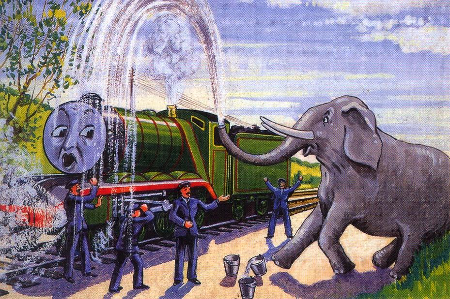

[**Kim Kardashian photographed by Jean-Paul Goude for *Paper* magazine**](http://www.papermag.com/2014/11/kim_kardashian.php)

> My final illustration comes from a children's book, and I give it as an example of a picture that I find distinctly lacking in beauty. A surprised elephant is squirting water out of its trunk and over a train. I hope you will agree with me that the shape of the jet of water looks wrong. Indeed, it is wrong -- it should be a parabola, which it clearly isn't, but at a more basic level, if the water comes out of the elephant's trunk almost vertically, then it should continue more or less vertically, rather than miraculously going a short horizontal distance and then dropping vertically again. However, the point I wish to make is not so much that the artist was ignorant of physics as that one's first reaction against the picture is an aesthetic one. It just looks wrong, and unsatisfying, an initial impression that can easily be backed up with elementary physics later.

**W Timothy Gowers, "The Importance of Mathematics"** ([PDF, p23](https://www.dpmms.cam.ac.uk/~wtg10/importance.pdf) \| [Video, 56:12](http://www.youtube.com/watch?v=mEkXsPnIC8E))
