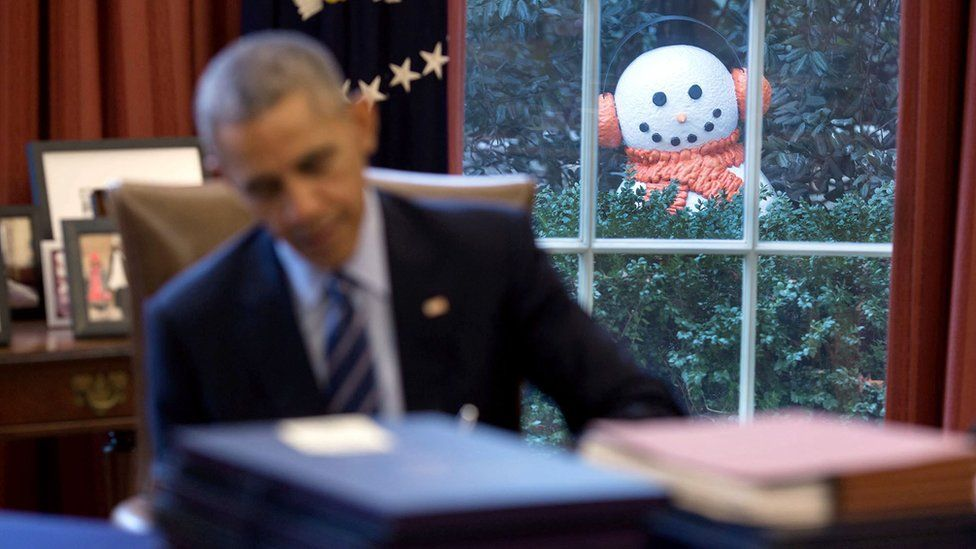

**[Mark O'Connell reviews a book of Gerry Adams's tweets](http://www.newyorker.com/books/page-turner/gerry-adamss-baffling-book-of-tweets)**

**[Janet Malcolm profiles the pianist Yuja Wang](http://www.newyorker.com/magazine/2016/09/05/yuja-wang-and-the-art-of-performance)**

FILMS: The best things I saw in the cinema this year were old. [**Shoah**](http://www.newyorker.com/magazine/2011/01/10/look-again), Claude Lanzmann's nine-hour documentary about Holocaust is imperfect but essential. Four scenes that will stay with me for a very long time: the bartender pouring drinks ("Mr Oberhauser, do you remember Belzec?"); the letter about the trucks ("the following technical changes are needed"); the scene in the barber shop ("We must go on"); the final scene ("I'm the last Jew"). Alfred Hitchcock's **The Birds** is underrated, if it's possible for a Hitchcock film to be underrated. I like [Geoff Dyer's take](https://www.theguardian.com/film/2012/jun/17/my-favourite-hitchcock-film-the-birds-geoff-dyer) on the film – I don't believe it for a moment, but I don't think he does either. But more than these two films specifically, this should be taken as a general recommendation of watching old films in the cinema. \| Of new stuff, I'd pick **Arrival** or **Mustang** or **The Neon Demon** or the one-shot [**Victoria**](http://www.salon.com/2015/10/08/victoria_this_exciting_german_thriller_shot_straight_through_in_one_take_is_much_more_than_a_novelty/)

**[Citizen Khan](http://www.newyorker.com/magazine/2016/06/06/zarif-khans-tamales-and-the-muslims-of-sheridan-wyoming)** is the best piece about a murdered Afghan Muslim tamale vendor in mid-century Wyoming I read all year

TV: [**O.J.: Made in America**](http://www.nytimes.com/2016/05/20/movies/oj-made-in-america-review.html) is about two things: OJ Simpson, and everything else. Here, "everything else" includes sport, economic inequality, law enforcement, television, celebrity, capitalism, politics, misogyny (although perhaps insufficiently so), drugs, journalism, the legal system, and, of course, race. It's seven-and-a-half hours long, and it's barely long enough. \| By being the funniest thing I saw all year, [**Fleabag**](http://www.newyorker.com/magazine/2016/09/26/fleabag-an-original-bad-girl-comedy) tricked me into thinking it wouldn't also be the most tragic. \| The "San Junipero" episode of **Black Mirror** | [The last ever episode](https://embedy.cc/movies/bTZqZ1pSWUNHWmJITWlwaTAwcy94b2kycmVIYkZCczR0djRQQU1wdUw3WT0) of **Stewart Lee's Comedy Vehicle** was also the best. \| [The **SNL** "Black Jeopardy" sketch](http://www.slate.com/articles/news_and_politics/politics/2016/10/snl_s_black_jeopardy_sketch_was_the_most_astute_analysis_of_american_politics.html)

I made **[this](https://www.buzzfeed.com/mpaldridge/9-clouds-that-dont-look-like-uk-cabinet-ministers-2hqzs)** because I thought it was funny, although no one else did.

[**David's Ankles**](http://www.nytimes.com/2016/08/21/magazine/davids-ankles-how-imperfections-could-bring-down-the-worlds-most-perfect-statue.html) ("The first thing to hit the floor is his bent left elbow, the arm that holds the heroic sling, and it bursts along the lines of its previous breaks, old scars left over from an incident in the 16th century involving an unruly mob and a bench. Then the rest of the marble will meet the floor, and the physics from there will be fast and simple: force, resistance, the brittleness of calcite crystals, the shearing of microscopic grains along the axes on which they align. Michelangelo’s David will explode.")

<iframe width="560" height="315" src="https://www.youtube.com/embed/yI2oS2hoL0k" frameborder="0" allowfullscreen></iframe>

MUSIC: Best album: Predictably, I choose Radiohead's hyphenlessly-titled [**A Moon Shaped Pool**](http://prettymuchamazing.com/reviews/radiohead-a-moon-shaped-pool) (runners-up: Bon Iver's **22, A Million** and PJ Harvey's under-praised **The Hope Six Demolition Project**) Joint award for best single/best video: six-way tie between **Burn the Witch** _[above]_, [**Lazarus**](https://www.youtube.com/watch?v=y-JqH1M4Ya8), [**Drone Bomb Me**](https://vimeo.com/152637866), [**Fuck with Myself**](https://www.youtube.com/watch?v=-99e4geCm2w), [**Voodoo in My Blood**](https://www.youtube.com/watch?v=ElvLZMsYXlo), [**Nobody Speak**](https://www.youtube.com/watch?v=NUC2EQvdzmY) \| Best [thematically related (?)](http://pitchfork.com/thepitch/703-the-uncool-connection-between-sufjan-stevens-and-tori-amos/) reissued albums: [**Illinois**](https://open.spotify.com/album/7j8lfKDdL7vE8OAM4cA3W3) by Sufjan Stevens and [**Boys for Pele**](https://open.spotify.com/album/7vuSTl6tuWg0CQdmfphkFQ) by Tori Amos \| Best Eurovision song contest-winning song [about the historical geopolitics](https://en.wikipedia.org/wiki/1944_(song)#Background_and_lyrics) (and obliquely about the current geopolitics) of the Crimea: [**1944**](https://www.youtube.com/watch?v=B-rnM-MwRHY) by Jamala \| Best musical sung in the style of (and by the cast of) a different musical: [**Hamilton/Sweeney Todd**](https://www.youtube.com/watch?v=bruTOQoNtO4) \| [a playlist](https://open.spotify.com/user/mpaldridge/playlist/1KxSEaY5xvXYxV093nIDYX)

BOOKS: **The Lonely City** by Olivia Laing ([excerpt](https://www.theguardian.com/books/2016/feb/28/the-lonely-city-olivia-laing-edward-hopper-andy-warhol)) \| **When in French** by Lauren Collins ([excerpt](https://www.newyorker.com/magazine/2016/08/08/lauren-collins-learns-to-love-in-french))

**["Your Honor, if it is all right, for the majority of this statement I would like to address the defendant directly."](https://www.buzzfeed.com/katiejmbaker/heres-the-powerful-letter-the-stanford-victim-read-to-her-ra)**

<iframe src='https://gfycat.com/ifr/DimpledShrillCanadagoose' frameborder='0' scrolling='no' width='100%' height='100%' style='position:absolute;top:0;left:0;' allowfullscreen></iframe>

PODCASTS: **This American Life** [at a Greek refugee camp](https://www.thisamericanlife.org/greece/) ([part 1](http://www.thisamericanlife.org/radio-archives/episode/592/are-we-there-yet), [part 2](http://www.thisamericanlife.org/radio-archives/episode/593/dont-have-to-live-like-a-refugee)) \| The **Reply-All** [phone-in show](https://gimletmedia.com/episode/82-hello/) \| Short clips from **The New Yorker Radio Hour**: at a high-school mock election ([part 1](http://www.wnyc.org/story/high-school-mock-election-keeps-it-real/), [part 2](http://www.wnyc.org/story/trumped-high-school-election/)); [meeting a bee-stylist](http://www.wnyc.org/story/how-beautify-bee/) \| Malcolm Gladwell's **Revisionist History** [on the Toyota acceleration scandal](http://revisionisthistory.com/episodes/08-blame-game) \| **[The Slate Culture Gabfest](http://www.slate.com/articles/podcasts/culturegabfest.html)**: for example, [this discussion of names (from 33:30)](http://www.slate.com/articles/podcasts/culturegabfest/2016/03/slate_s_culture_gabfest_on_10_cloverfield_lane_dark_territory_the_secret.html), or [Dana's Bob Ross endorsement (from 57:00)](http://www.slate.com/articles/podcasts/culturegabfest/2016/09/atlanta_whether_smiling_can_make_you_happier_and_walking_and_talking_on.html)

**[Christine Who Fed the Hungry](http://www.newyorker.com/books/page-turner/christine-who-fed-the-hungry)**: Emily Gould on volunteering in a New York soup kitchen, and the woman who ran it

**["I Cooked Jeremy Corbyn’s Marrow Recipe And Had Some Thoughts About The Labour Party"](https://www.buzzfeed.com/jimwaterson/a-marrow-victory)**

> We didn't start the fire  
> It was always burning since the world's been turning
> 
> — #JAMWAH2017 (@JAM_WAH) [December 18, 2016](https://twitter.com/JAM_WAH/status/810487015523422208) 

_New Yorker_ writers' **[encounters with Shakespeare](http://www.newyorker.com/books/page-turner/encounters-with-shakespeare-anniversary)**. (I think I've put too many _New Yorker_ links in this list, but it's too late now...)

OLD THINGS I CAME ACROSS THIS YEAR: **Homage to Catalonia** by George Orwell (Some unrequested advice: read Appendix I in its original place, and don't bother with Appendix II) \| **["Scorpio sphinx in a calico dress"](https://open.spotify.com/track/4WbP5AjT2RFb3paBBD2BRM)** \| **"Golden age" Hollywood films**, which I"m arbitrarily defining to be sound films before 1965. Some favourites in approximate light-to-dark order: _It Happened One Night_ (feather-light), _The Philadelphia Story_ (James Stewart is funny drunk), everything by Howard Hawks, _The Wizard of Oz_ (perfect), _Casablanca_ (almost as good as _To Have and Have Not_), everything by Alfred Hitchcock, _Double Indemnity_ ("There was no way in all this world I could have known that murder sometimes can smell like honeysuckle"), [_All About Eve_](http://www.rogerebert.com/reviews/great-movie-all-about-eve-1950) (better than _Sunset Blvd_), [_On the Waterfront_](http://www.rogerebert.com/reviews/great-movie-on-the-waterfront-1954) (Marlon Brando and Eva Marie Saint are excellent), [_In a Lonely Place_](http://www.rogerebert.com/reviews/in-a-lonely-place-1950) (super-depressing ending).  \| [**A Manifesto from People Reluctant To Kill for an Abstraction**](http://www.slate.com/articles/news_and_politics/low_concept/2004/08/manifesto.html)

**[Notes on dancers](https://www.theguardian.com/books/2016/oct/29/zadie-smith-what-beyonce-taught-me)** by Zadie Smith

[**Found Sonnet: The Wig**](http://www.newyorker.com/magazine/2016/05/09/found-sonnet-the-wig) by Rita Dove \| **[Elegy for Pedals](https://twitter.com/bananakarenina/status/788048202708779008)** (the walking bear) by Michael Robbins

_**Previously:** Things I liked in [2015](http://aldridge.tumblr.com/post/154739067697/things-i-liked-in-2015), [2014](http://aldridge.tumblr.com/post/112037214082/things-i-liked-in-2014)_
