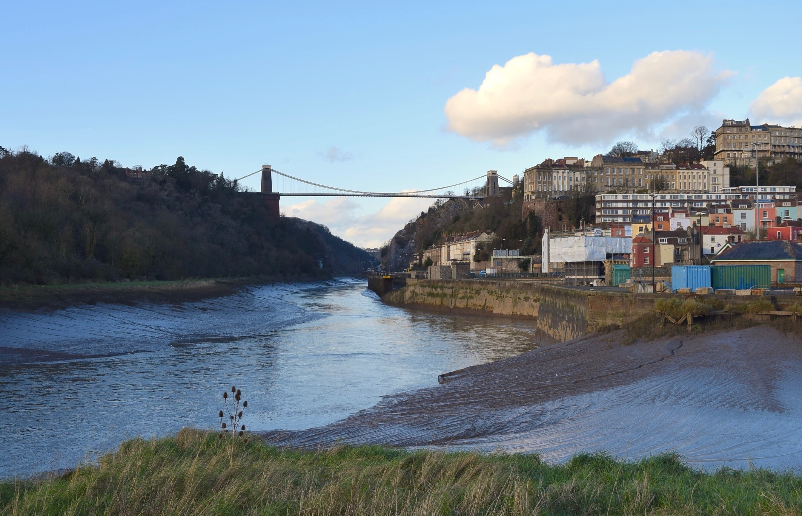

> The Voyager Golden Records are two phonograph records that were included aboard both Voyager spacecraft launched in 1977. The records contain sounds and images selected to portray the diversity of life and culture on Earth, and are intended for any intelligent extraterrestrial life form, or for future humans, who may find them. The records are a sort of time capsule.

[---*Wikipedia*, Voyager Golden Record](https://en.wikipedia.org/wiki/Voyager_Golden_Record)

> My favourite tidbit from [the Voyager Golden Records] (which I mentioned in _Thing Explainer_) was that they didn’t include a lot of photos of buildings. And the reasons were they figured it wouldn’t be obvious the difference between buildings or coral reefs or rock formations. If you look at a building, how do you know it’s not a crystal? How do you know it’s not a zoomed-in photo of a sponge? How do you know you’re not looking at weird geological formations or a coral structure that builds naturally with holes in the side that are square because of the material they grow from? So they didn’t include a lot of buildings because they figured it wouldn’t be clear what they were.

> But one that they did include was a suspension bridge. And the reason they gave (and Carl Sagan has talked about this) is that a suspension bridge is one of the structures that humans build, they’ve been built artificially, they don’t really occur naturally, but their structure is so completely constrained by physics that if you look at the twenty largest bridges in the world, they’re all suspension bridges and they all look the same. And the reason is as you scale them up, you converge on that one design – there’s no other way to do that. So the idea was this is a structure that, if aliens pick this up on some other planet, if they have to cross gaps in the same way we do with rivers and canyons, and if they are working with kind of the same constraints we are – they have metals or they have materials with similar properties – and if they work on making these bridges big enough, they are going to converge on a suspension bridge that looks just like ours.

> I really like this idea. Now, whenever I see a suspension bridge, I think about that: that this is the thing that, if there are alien worlds and if they build structures, this is the one thing that we’ve both tried to build. This is the thing that we have in common and that we would recognise when the other one built it.

[---Randall Munroe on *The Ezra Klein Show*](https://www.stitcher.com/podcast/vox/the-ezra-klein-show/e/63923402)

