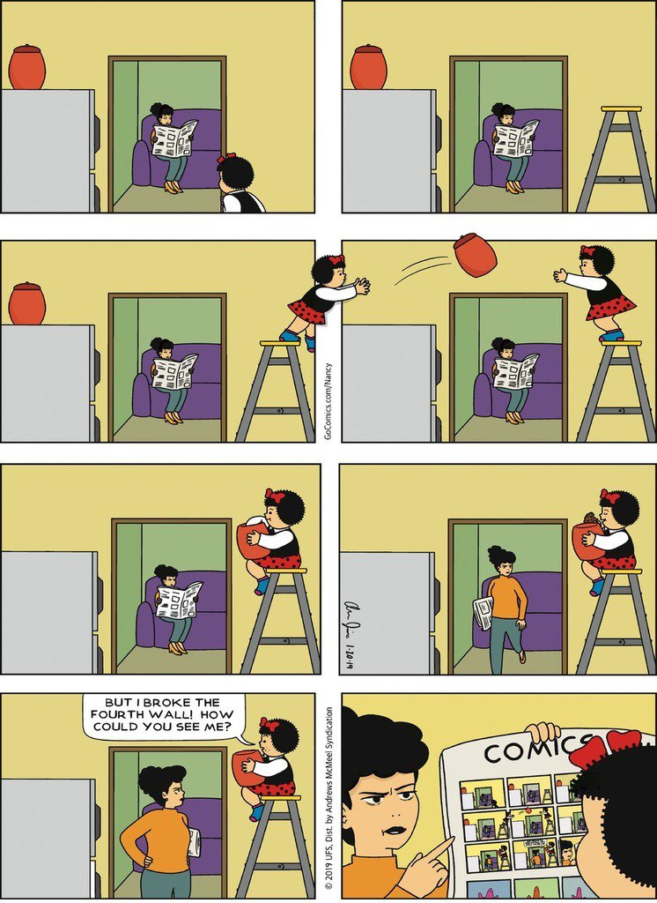

**["In 1998, I helped convict two men of murder. I’ve regretted it ever since."](https://slate.com/news-and-politics/2019/03/juror-revisits-murder-trial-20-years-later.html)** (This piece is surely indebted to the classic – but not very available on the internet – ["Doubt"](https://www.newyorker.com/magazine/1994/01/31/doubt-3) by William Finnegan.)

**[A crazy story](https://www.newyorker.com/magazine/2019/02/11/a-suspense-novelists-trail-of-deceptions)** about the thriller writer Dan Mallory aka AJ Finn

<iframe width="560" height="315" src="https://www.youtube.com/embed/gKA76AdN1Ko" title="YouTube video player" frameborder="0" allow="accelerometer; autoplay; clipboard-write; encrypted-media; gyroscope; picture-in-picture" allowfullscreen></iframe>

MUSIC: My favourite album was **Father of the Bride** by Vampire Weekend, even though this is treading dangerously close to middle-aged Radio-2 music. (Do I detect a Fleetwood Mac influence?) I also liked **Magdalene** by FKA twigs, **Anima** by Thom Yorke, and **i,i** by Bon Iver. Am I crazy to think that **Homecoming** is the best Beyoncé album? \| I think **Dawn Chorus** by Thom Yorke is probably the most beautiful song ever written, and I'm totally unable to explain why. (Is it even a *song*?) Possibly the live version is even better? (I certainly cried even more.) Or when it appears at the end of the [*Anima* short film](https://www.netflix.com/title/81110498). \| In what I think we call "modern classical", I like [Caroline Shaw's **Oranges**](https://pitchfork.com/reviews/albums/caroline-shaw-attacca-quartet-orange/) \| [a playlist](https://open.spotify.com/playlist/6aJ295J6sqIAEUjVhuSnDA)

**[This essay](https://deadspin.com/the-night-the-lights-went-out-1834298070)** about nearly dying from a brain injury and the long recovery from it was somehow maybe the funniest thing I read this year

**[Patricia Lockwood I](https://www.lrb.co.uk/the-paper/v41/n04/patricia-lockwood/the-communal-mind)**: "In contrast with her generation, which had spent most of its time online learning to code so that it could add crude butterfly animations to the backgrounds of its weblogs, the generation immediately following had spent most of its time online making incredibly bigoted jokes in order to laugh at the idiots who were stupid enough to think they meant it. Except after a while they did mean it, and then somehow at the end of it they were white supremacists." 

**[A long *New Yorker* piece about a Guantánamo detainee and his guard](https://www.newyorker.com/magazine/2019/04/22/guantanamos-darkest-secret)**

TV: Too many excellent short one-off TV series end up being brought back because they were too popular not to, but are never as good second time round, so I was against the concept of **Fleabag** series 2 on principle – and then it was, of course, brilliant. The first episode might be the best episode of television there has ever been. (Not enough of the reviews discussed *Léon Morin, prêtre*.) \| **State of the Union** deserved much more attention than it got. (Rosamund Pike! Chris O'Dowd! Nick Hornby! Stephen Frears!) \| [The lighthouse episode of **Grand Designs**](https://www.channel4.com/programmes/grand-designs/on-demand/62456-002), surely the closest thing to a classical tragedy ever shown on UK television 

**[Lauren Collins "on the roof of Notre-Dame, before it burned"](https://www.newyorker.com/news/dispatch/on-the-roof-of-notre-dame-before-it-burned)**

**[Janet Malcolm on Susan Sontag](https://www.newyorker.com/magazine/2019/09/23/susan-sontag-and-the-unholy-practice-of-biography)**: "How many of us, who did not start out with Sontag’s disadvantages, have taken the opportunity that she pounced on to engage with the world’s best art and thought? While we watch reruns of 'Law & Order,' Sontag seemingly read every great book ever written.

On a blazingly sunny Easter Sunday, I somehow found myself in Bristol on (allegedly) England's steepest street for their annual **Easter egg roll**. And, honestly: maybe the most fun I had all year!

<blockquote class="twitter-tweet" data-conversation="none">
This one became “a yolker” quite a long way down the hill, much to its advantage. <a href="https://t.co/ICN8RJKfVD">pic.twitter.com/ICN8RJKfVD</a>
&mdash; Matthew Aldridge (@mpaldridge) <a href="https://twitter.com/mpaldridge/status/1119940293585985536?ref_src=twsrc%5Etfw">April 21, 2019</a></blockquote> 

**Things-that-look-like-other-things interlude!** [League One football teams that look like David Bowie](https://twitter.com/HannahAlOthman/status/1122954195324342273) \| [Nudibranchs that look like Janelle Monae](https://twitter.com/thomaspoptart/status/1121068374526574592) \| [Nottingham nightclubs that look like Theresa May](https://twitter.com/LilyAdlingt0n/status/1134210523472564246) \| [Logos for Change UK TIG The Independent Group For Change that look like Taylor Swift](https://twitter.com/flashboy/status/1120648812538793985) \| [Pages of the Mueller report that look like Taylor Swift](https://twitter.com/ohcauseshesdead/status/1119050035474264065)

**[Jeremy's Vine's Boris Johnson story](https://www.facebook.com/1691455784407633/posts/2449074521979085/)**

PODCASTS: [**Conversations with Tyler**](https://conversationswithtyler.com/) makes every other interview podcast seem flabby and information-sparse. Start wherever you like, but my favourite this year was [with Odyssey translator Emily Wilson](https://conversationswithtyler.com/episodes/emily-wilson/). \| A phone-in episode is usually a lazy-but-sort-of-fun way to fill a podcast hour, but the [**Replay All phone-in episode**](https://gimletmedia.com/shows/reply-all/5whgo2) is just beautifully constructed \| [Thom Yorke on **Desert Island Discs**](https://www.bbc.co.uk/programmes/m0008qg3) \|Jon Ronson's [**The Last Days of August**](https://play.acast.com/s/thebutterflyeffectwithjonronson) \| [**Decoder Ring** do doo do-doo do-doo](https://slate.com/culture/2019/02/decoder-ring-explores-the-multidecade-history-of-the-song-baby-shark-and-the-youtube-economy-that-made-it-a-hit.html)

The brilliance of **[this Slate list of the 25 best characters from the past 25 years](https://slate.com/culture/2019/08/most-important-characters-movies-tv-books-21st-century.html)** is how finely balanced it is between great insightfulness and outright trolling

I did a good tweet this year! ("Didn’t get the love it deserved" —[Pete](https://twitter.com/PeteNewbon/status/1212166263826518016))

<blockquote class="twitter-tweet">
I heard there was a secret chord Craig David played and it pleased the Lord: A week to hit the musical trifecta. And it goes right through: Day One, Day Two, Then making love for the next few, Then chilling out on Sunday. Bo selecta!
&mdash; Matthew Aldridge (@mpaldridge) <a href="https://twitter.com/mpaldridge/status/1196522547527012352?ref_src=twsrc%5Etfw">November 18, 2019</a></blockquote> 

FILMS: **For Sama** is a documentary about hospital workers in Aleppo, Syria, so it is, of course, horrifying and sad. Everything is not going to be OK there – yet it's somehow, I think, a deeply, profoundly optimistic film. There's one scene that looks like it's going to be so unimaginably bleak that one can't believe it's been put into the film – and then it becomes the nearest thing I've seen to an actual miracle on the screen. \| **Marriage Story** is excellent: Scarlett Johansson is super-famous yet still underrated; my favourite bit is Adam Driver singing "Being Alive" \| Also good: [**All Is Well**](https://www.netflix.com/title/81030855), **Apollo 11**, **Birds of Passage**, **The Farewell**, **If Beale Street Could Talk**, **Little Women**, **Transit** \| **Apocalypse Now: The Final Cut** is the best version of one of the very best films – an all-time top-10 cinema experience \| The indisputable cinematic triumph of the year was the **Mother Cutter** strand at [**Leeds International Film Festival**](https://www.leedsfilm.com/media/7055/liff-2019-guide-low-res.pdf) of films edited by women. In two weeks, I got to see, in the cinema: *All About Eve* (edited by Barbara McLean), *Army of Shadows* (Françoise Bonnot), *Bonnie and Clyde* (Dede Allen), *Breathless* (Cécile Decugis), *Lawrence of Arabia* (Anne V Coates; greatest match-cut in cinema [yes, better than the bone in *2001*]), *Ordet* (Edith Schlüssel), *Raging Bull* (Thelma Schoonmaker), *Rome – Open City* (Jolanda Benvenuti, although a man was given the credit instead), and *The Wizard of Oz* (Blanche Sewell). These are all (except *Ordet*, which I disliked) top-100 films for me. Plus, only scheduling meant I missed *Beau Travail* (Nelly Quelttier), *Dancer in the Dark* (Molly Malene Stensgaard), *Fanny and Alexander* (Sylvia Ingemarsson), *Mad Max: Fury Road* (Margaret Sixel), *Man with a Movie Camera* (Yelizaveta Svilova), *Mirror* (Lyudmila Feignova), and *Shoah* (Ziva Postec). Wow!

The [**"letter to the future"** on Ok glacier](https://en.wikipedia.org/wiki/Okj%C3%B6kull)

{:width="75%"}

**[Patricia Lockwood II](https://www.lrb.co.uk/the-paper/v41/n19/patricia-lockwood/malfunctioning-sex-robot)**: "I was hired as an assassin. You don’t bring in a 37-year-old woman to review John Updike in the year of our Lord 2019 unless you’re hoping to see blood on the ceiling." (Too many good lines to be able to quote them all!)

SPORT: The afternoon where [England won the **Cricket World Cup** (by countback after tying the super-over)](https://www.youtube.com/watch?v=Kwu1yIC-ssg) at virtually the same time as [Djokovic won Wimbledon (by beating Federer in a final set tie-break from 12–12)](https://www.youtube.com/watch?v=mnLdAeSXZv0) was mad and extraordinary \| [**England v Scotland** in the Six Nations rugby](https://www.youtube.com/watch?v=KRx3KrQ83mc) \| [**The 3rd Ashes test**](https://www.youtube.com/watch?v=wamtTEVFDiA) had the craziest finish to an England cricket match since ... well, since the World Cup final the month before \| Do [Magnus Carlsen's **"Banter Blitz"** videos](https://www.youtube.com/playlist?list=PLPPwfZWUJmsWV0Z-QtYDbmdfaDjknaqN2) count?

Yes, **[the Caroline Calloway piece](https://www.thecut.com/2019/09/the-story-of-caroline-calloway-and-her-ghostwriter-natalie.html)**

<!--
Rosner Trump McDs
Stephen Bush Corbyn book review
-->
