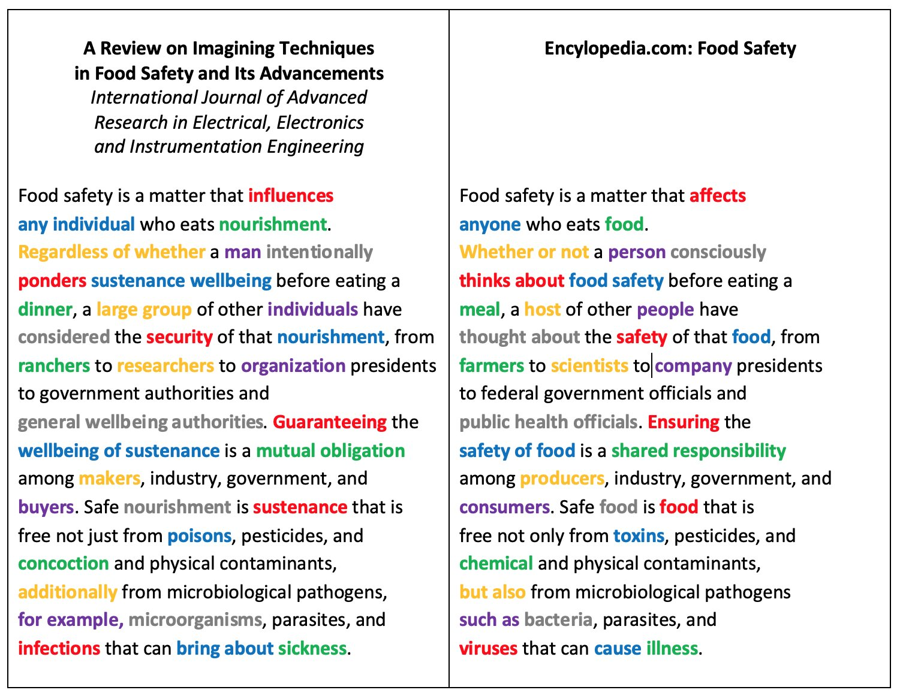

A student copied their essay off the internet, but replaced quite a lot of the words by thesaurus synonyms in an attempt defeat the automated plagiarism detector. I think my favourite was “public health officials” becoming “general wellbeing authorities”.

OK, so [“general wellbeing authorities” has 3000 hits on Google](https://google.com/search?q=%22general+wellbeing+authorities%22), and after checking a few, I find it totally plausible that all 3000 of them (including some journal articles in skeevy-looking journals) are plagiarised the same way.

An example from ["Coronavirus: Trump Sticks By Discredited Hydroxychloroquine" (25 Hour New)](https://25hournews.com/news/coronavirus-trump-sticks-by-discredited-hydroxychloroquine-2819):

> Trump has again guarded the utilization of hydroxychloroquine to avoid coronavirus, negating his own general wellbeing authorities.

Convince me this wasn't:
-  defended → guarded
-  use → utilization
-  treat?? → avoid
-  contradicting → negating

Yep! Plagiarised [from the BBC](https://bbc.co.uk/news/world-us-canada-53575964)! (It was “ward off” that was changed to “avoid”.)

> Trump has again defended the use of hydroxychloroquine to ward off coronavirus, contradicting his own public health officials.

Another. [This article in the *Journal of Biochemical Toxicology*](https://www.researchgate.net/publication/319879278_Prevalence_and_distribution_of_E_coli_and_its_virulence_genes_from_different_water_sources_in_Alborz_province_Iran)...

> The event of pathogenic microorganisms in ecological waters is a progressing worry for general wellbeing authorities and those in the water administration territory around the world.

...is surely plagiarised from [this article in *Applied and Environmental Microbiology*](https://www.ncbi.nlm.nih.gov/pmc/articles/PMC3406122/):

> The occurrence of pathogenic microorganisms in environmental waters is an ongoing concern for public health officials and those in the water management area worldwide.

Can you guess the thesaurus-substitutions in this news story?

> General wellbeing authorities changed their tune when it became evident that the infection could spread among individuals indicating no manifestations.

[I can’t link, because Twitter identifies it as ”harmful”.] Answer, [from the AP](https://apnews.com/article/virus-outbreak-ap-top-news-understanding-the-outbreak-health-media-86f61f3ffb6173c29bc7db201c10f141):

> Public health officials changed their tune when it became apparent that the virus could spread among people showing no symptoms.

This seems like much more effort than just not plagiarising:

(And if you’re writing an article about food safety, you probably shouldn’t start referring to it as “sustenance wellbeing” halfway through.)

Anyway, in conclusion: Anyone who‘s ever used the phrase “general wellbeing authorities” is a plagiarist*, and not a very good one. The end.

(*except me, here)

---

**Addendum:** [Here’s an article in Slate]() about the phenomenon of thesaurus substitutions (that also explains why [@BristOliver](https://twitter.com/BristOliver) tweeted “#SinisterButtocks” at me earlier).

