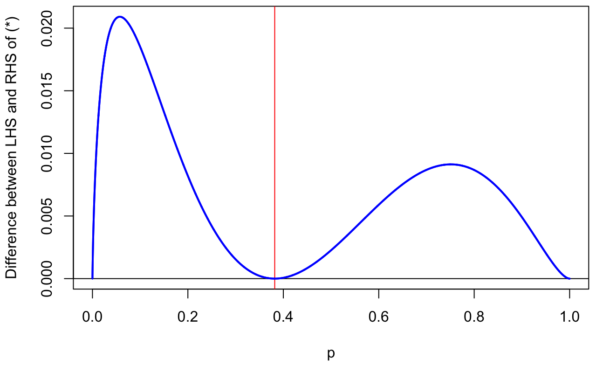

## Introduction

There has recently been a big breakthrough on a result called the union-closed conjecture, thanks to a new paper by Justin Gilmer and some follow-up work by others. It was interesting to me because it used information theory ideas on a non-information-theoretic problem, and also because the breakthrough was surprisingly straightforward for such a famous unsolved problem.

We work with a finite base set $[n] = \lbrace 1,2,\dots, n\rbrace$. A family $\mathcal F$ of subsets of $[n]$ is called **union-closed** if for any sets $A$ and $B$ in $\mathcal F$ their union $A \cup B$ is in $\mathcal F$ also.

Then consider the following conjecture:

**Conjecture 1.** *Let $\mathcal F$ be a union-closed family of subsets of $[n]$. Then there exists an $i \in [n]$ in at least $\alpha \lvert\mathcal F\rvert$ of the sets in $\mathcal F$.*

Frankl's **union-closed conjecture** is Conjecture 1 with $\alpha = \frac12$. Note that this is the best possible: take, for example, $\mathcal F$ to be the powerset of $[n]$, or $\mathcal F = \lbrace\varnothing, \lbrace 1 \rbrace \rbrace$.

Until a few days ago, the union-closed conjecture had been proved in a few special cases, but the best general value of $\alpha$ for Conjecture 1 was roughly $1/\log{\lvert\mathcal F\rvert}$. (See [this survey paper of Bruhn and Schaudt from 2015](https://doi.org/10.1007/s00373-014-1515-0) for more.) Then on 16 November, [Gilmer posted a paper on the arXiv](https://arxiv.org/abs/2211.09055) that proves Conjecture 1 with a constant value of $\alpha$. Gilmer gave $\alpha = 0.01$, but this wasn't optimised, and it looked like the argument ought to be able to be pushed to $\alpha = \psi = (3 - \sqrt{5})/2 \approx 0.38$. Sure enough, once the word had got around, on 21 November, [Alweiss, Huang and Sellke](https://arxiv.org/abs/2211.11731), [Chase and Lovett](https://arxiv.org/abs/2211.11689), and [Sawin](https://arxiv.org/abs/2211.11504) all posted improvments on Gilmer's method to reach $\alpha = \psi$.

The purpose of this blogpost is to try to explain the argument to myself. This will require some -- but not very much! -- knowledge of information theory. I found [Chase and Lovett](https://arxiv.org/abs/2211.11689) the easiest paper to read, so this is based on that.

## The result

The key of Gilmer's approach is to take $A$ and $B$ as *random* subsets of $[n]$, independent and identically distributed according to some distribution, then to look for a lower bound on the entropy $H(A \cup B)$ in terms of $H(A)$. Specifically, Chase and Lovett show the following (with similar or identical results in the other two papers).

**Theorem 2.** *Let $A$ and $B$ be IID subsets of $[n]$ drawn according to some distribution with $\mathbb P(i \in A) \leq p$ for all $i \in [n]$. Then*

$$ H(A \cup B) \geq \frac{1-p}{1-\psi} \, H(A) , $$

*where $\psi = (3 - \sqrt{5})/2$.*

First, let's see how Theorem 2 proves Conjecture 1 with $\alpha = \psi$. Let $\mathcal F$ be a union-closed family, and let $A$ and $B$ be drawn independently uniformaly at random from $\mathcal F$. Now assume, seeking a contradiction, that $\mathbb P(i \in A) \leq p$ for all $i$ for some $p < \psi$; that is, assume there is no $i$ in at least $\psi \lvert\mathcal F\rvert$ of the sets in $\mathcal F$. Then we can apply Theorem 2. This gives

$$ H(A \cup B) \geq \frac{1-p}{1-\psi} \, H(A) > H(A) = \log{\lvert\mathcal F\rvert} . $$

But on the other hand, since $\mathcal F$ is union-closed, it follows that the distribution of $A \cup B$ is also a distribution on $\mathcal F$ (although maybe not uniform), so we have

$$ H(A \cup B) \leq \log{\lvert\mathcal F\rvert} . $$

This is a contradiction -- so our assumption that $\mathbb P(i \in A) < \psi$ for all $i$ must have been wrong, and there must be some $i$ in at least $\psi\lvert\mathcal F\rvert$ of the sets in $\mathcal F$.

Let us note that it will require some new ideas to push past $\alpha = \psi$. If the distribution is "pick each $i$ independently with probabiltiy $p$", then when $p > \psi$, we have that $H(A \cup B) = n\,h\big((1-p)^2\big)$ is actually smaller than $H(A) = n\,h(p)$, so this argument won't work in its current form.

It remains to prove Theorem 2.

## A lemma

There's an important technical lemma in this work. That's this:

**Lemma 3.** *For $0\leq p,q \leq 1$, we have*

$$ h\big((1-p)(1-q)\big) \geq \frac{1}{2(1-\psi)} \big((1-q)h(p) + (1-p)h(q) \big) , $$

*where $h(p) = -p\log p + (1-p)\log(1-p)$ is the binary entropy and $\psi = (3 - \sqrt{5})/2$.*

(Note that there is equality at $p = q = \psi$, as $(1-\psi)^2 = \psi$.)

Lemma 3 seems to be rather fiddly to prove. Chase and Lovett show that it follows from the one-variable version

$$ h\big((1-p)^2\big) \geq \frac{1-p}{1-\psi} h(p) , \qquad (*) $$

Chase and Lovett leave $(\ast)$ to a computer verification, although claim that Alweiss, Huang and Sellke have a rigorous proof in a "forthcoming paper". The paper of Alweiss, Huang and Sellke, which has the same lemma, seems to use computer verificiation too, although they say it can be made rigorous using interval arithmetic. Sawin has something that looks more like a rigorous proof by calculating the derivative of the ratio of the two sides of $(\ast)$; it's rather involved and I haven't read it all, although it seems to involve checking the roots of certain equations aren't in certain intervals, which was presumably computer-aided too. I would like to see a a proper information-theoretic proof of the inequality $(\ast)$. (It seems pretty innocuous at first look -- and if you rewrite it as 

$$ h(q^2) = \frac{q}{\phi} h(q) $$

where $\phi = 1 - \psi = (\sqrt{5} - 1)/2$ is the golden ratio reciprocal, it looks more innocuous still -- but I've just interupted writing this post to have a go and have made zero progress.)

Here's a graph of

$$ h\big((1-p)^2\big) - \frac{1-p}{1-\psi} h(p) $$

-- that is, the difference between the two sides of $(\ast)$ -- which may be enough to convince you. The red line is at $p = \psi$.

{:style="display:block; margin-left:auto; margin-right:auto; width: 600px"}

## Proof

OK, so the proof of Theorem 2. 
It is convenient to adopt some notation. Let $A_i$ be 1 if $i \in A$ and 0 otherwise, and let $A_{< i} = (A_1, A_2, \dots, A_{i-1})$.

We start by writing

$$ \begin{align*} H(A \cup B) &= \sum_{i=1}^n H\big((A \cup B)_i \mid (A \cup B)_{< i} \big) \\
& \geq \sum_{i=1}^n H\big((A \cup B)_i \mid A_{< i}, B_{< i} \big) , \end{align*} $$

where the equality on the first line is the chain rule and the inequality on the second line is the data processing inequality. Let's look at one of the terms from the sum. We have, by definition,

$$ H\big((A \cup B)_i \mid A_{< i}, B_{< i} \big) = \mathbb E_{a,b}\, H\big((A \cup B)_i \mid A_{< i} = a, B_{< i} = b\big) , $$

where $\mathbb E_{a,b}$ is an expectation over $A_{<i}$ and $B_{<i}$. If we let $p_a = \mathbb P(i \in A \mid A_{<i} = a)$ and $p_b = \mathbb P(i \in B \mid B_{<i} = b)$, then

$$ H\big((A \cup B)_i \mid A_{< i} = a, B_{< i} = b\big) = h\big((1-p_a)(1-p_b)\big) , $$

because $(A \cup B)_i$ is 0 if and only if $i$ is in neither $A$ nor $B$, and these are independent. But then, by Lemma 3,

$$ h\big((1-p_a)(1-p_b)\big) \geq \frac{1}{2(1-\psi)} \big((1-p_b)h(p_a) + (1-p_a)h(p_b) \big) . $$

So

$$ \begin{align*}
H\big((A \cup B)_i \mid A_{< i}, B_{< i} \big)
&= \mathbb E_{a,b} \,H(A_i \cup B_i \mid A_{< i} = a, B_{< i} = b) \\
&\geq \mathbb E_{a,b} \frac{1}{2(1-\psi)} \big((1-q_b)h(q_a) + (1-q_a)h(q_b) \big) \\
&= \frac{1}{2(1-\psi)} \Big( \mathbb E_a \,h(q_a) \,\mathbb E_b (1 - q_b) +  \mathbb E_b \,h(q_b) \, \mathbb E_a (1 - q_a) \Big) \end{align*} $$

Now, $\mathbb E_b (1 - q_b)$ is exactly the marginal probability that $i$ is not in $B$, which is at most $1-p$, by hypothesis. Also 

$$ \mathbb E_a \,h(q_a) = \mathbb E_a \,H(A_i \mid A_{<i} = a) = H(A_i \mid A_{<i}) . $$

So we have

$$ \begin{align*}
H\big((A \cup B)_i \mid A_{< i}, B_{< i} \big)
&\geq \frac{1-p}{2(1-\psi)} \big( H(A_i \mid A_{<i}) + H(B_i \mid B_{<i}) \big) \\
&= \frac{1-p}{1-\psi} H(A_i \mid A_{<i}) , \end{align*} $$

since $A$ and $B$ are identically distributed.

Finally, putting this all together,

$$ \begin{align*}
H(A \cup B) &\geq \sum_{i=1}^n H\big((A \cup B)_i \mid A_{< i}, B_{< i} \big) \\
&\geq \sum_{i=1}^n \frac{1-p}{1-\psi}  H(A_i \mid A_{<i}) \\
&= \frac{1-p}{1-\psi}  \sum_{i=1}^n  H(A_i \mid A_{<i}) \\
&= \frac{1-p}{1-\psi} H(A) , \end{align*} $$

where the last step is the chain rule again. Thus Theorem 2 is proved.

