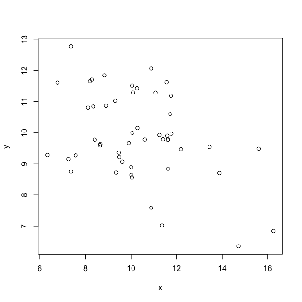
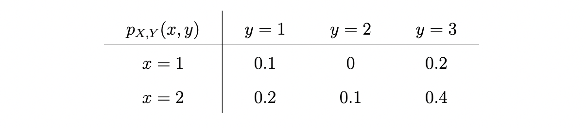

Last semester, I taught the module [MATH1710 Probability and Statistics 1](https://mpaldridge.github.io/math1710/), which is our first-year undergraduate introduction to (mostly) probability. Students took the exam in January, and the marking team and I have recently finished marking it. The median mark for the students was 47 out of 80, or 59%. A first-class mark was 56 out of 80, or 70%, which just under a third of students achieved.

I decided to give the exam to [ChatGPT](https://chat.openai.com/chat/d6c15d78-597c-4fb6-aab1-1c836c35be4f), the AI chatbot thing: I copy-pasted in the questions, one at a time, then marked ChatGPT's first response. Chat GPT scored 56 out of 80, or 70%. That means ChatGPT just sneaks a first-class mark, and would be in the top third of the class.

The exam was taken under traditionally proctored exam conditions, so I'm not concerned that students could have cheated on this particular exam. But I'm curious about how Chat GPT would do, and I'm thinking about whether I need to make changes to non-proctored take-home coursework in the furture. My opinion is that ChatGPT did pretty well -- I'd have found this difficult to believe 18 months ago -- but there still seems some low-hanging fruit I would expect it to get better at in fairly short order. (Maybe I'll try again next year, and see how much it's improved.)

Some further notes on ChatGPT's performance below, for those who are interested:

(Note: I input more complicated equations in LaTeX format, and ChatGPT often responded in LaTeX format too. For ease of reading, I've converted both of these to proper mathematical equations here. A student looking to cheat using ChatGPT, though, would be well advised to learn some basic LaTeX formatting.)

**1.** One question was a visual question:

> **Me:** What is a plausible value for the correlation $r_{xy}$ between the two datasets illustrated in the scatterplot below?
>
> A: -0.8,  B: -0.4,  C: 0,  D: 0.3,  E: 0.8.



I couldn't work out how to enter this question into ChatGPT, so gave it 0 out of 2. Maybe coursework, especially in statistics, should make more use of "interpret this graph" type questions, as these seem much harder to cheat on using AI at the moment.
	
**2.** Despite the recent claim that ["We’ve upgraded the ChatGPT model with improved […] mathematical capabilities,"](https://help.openai.com/en/articles/6825453-chatgpt-release-notes), ChatGPT still makes fairly regular slips in basic arithmetic that, had a human made them, I would call "careless". Careless arithmetic slips cost ChatGPT 4 marks in total over four different questions.

The most obvious of these was this:

<blockquote>
<b>ChatGPT:</b> [...] So we have

$$p_{Y \mid X}(3 \mid 2) = \frac{p_{X,Y}(2,3)}{p_X(2)} = \frac{0.4}{0.7} = \frac{2}{3}$$

So the conditional probability of $Y=3$ given that $X=2$ is $\frac{2}{3}$.
</blockquote>
	
The correct answer was indeed $\frac{0.4}{0.7}$, but that is, of course, $\frac{4}{7}$, not $\frac{2}{3}$.

ChatGPT failed to correctly perform a fairly basic definite integral:

<blockquote>
<b>Me:</b> A continuous random variable $X$ has probability density function $f$ given by

$$ f(x) = \begin{cases} \frac{2}{3} x & 0 \leq x < 1 , \\
1 - \frac{1}{3} x & 1 \leq x \leq 3 , \end{cases} $$

and $f(x) = 0$ otherwise. Calculate the expectation $EX$ of $X$.
</blockquote>
						    
<blockquote>
<b>ChatGPT:</b> The expectation of a continuous random variable $X$ is given by
	
$$EX = \int_{-\infty}^\infty x f(x) dx.$$
	
Therefore,
	
$$ \begin{align}
EX &= \int_0^1 \frac{2}{3} x^2 dx + \int_1^3 (1 - \frac{1}{3} x) x dx \\
&= \left[\frac{1}{3} x^3 \right]_0^1 + \left[\frac{3}{2}x - \frac{1}{3}x^2\right]_1^3 \\
&= \frac{1}{3} - \frac{0}{3} + \left(\frac{3}{2} \cdot 3 - \frac{1}{3} \cdot 9\right) - \left(\frac{3}{2} - \frac{1}{3} \right) \\
&= \frac{1}{3} + \frac{9}{2} - \frac{9}{3} - \frac{1}{2} \\
&= \frac{9}{6} \\
\end{align} $$
	
So, the expectation $EX$ of $X$ is $\frac{9}{6}$.
</blockquote>

This is again in error -- I'm not sure what's happened between the antepenultimate and penulitmate lines, but some terms have gone missing or something.

It seems there are plenty of questions where optimal cheating would be letting ChatGPT convert a wordy question into an equation, but then letting something like Wolfram Alpha actually solve (or at least check the solution of) that equation. Wolfram Alpha would breeze through the integral in the above question, no problems at all, and the user could be *confident* in its correctness.

**3.** I was surprised to see ChatGPT lose 3 marks on two straightforward bookwork questions 

> **Me:** Using only the probability axioms, prove that that $P(\emptyset) = 0$ 
	
> **Me:** State and prove Bayes' theorem.

These were particularly surprising, because I've seen ChatGPT answer both of these questions before correctly before. Perhaps I was just unlucky this time? Although in the second case ChatGPT seemed "distracted" by information given in the previous question that wasn't relevant to this one: the previous two questions had been about the law of total probability, and ChatGPT seemed to be straining to crowbar the law of total probability into its proof of Bayes' theorem, which got it in all sorts of a mess:
	
<blockquote>
<b>ChatGPT:</b> To prove Bayes' theorem, we use the law of total probability. Consider event $B$ and the partition of the sample space $\Omega$ into disjoint events $A_1, A_2, \dots, A_n$ such that their union is $\Omega$ and $A_i \cap A_j = \emptyset$ for all $i \neq j$. Then,

$$ P(B) = \sum_{i=1}^n P(B \cap A_i) $$

Using the definition of conditional probability, we have $P(B \cap A_i) = P(B \mid A_i) P(A_i)$, so

$$ P(B) = \sum_{i=1}^n P(B \mid A_i) P(A_i) $$

For a specific $i$, we can rearrange the equation to obtain

$$ P(A_i \mid B) = \frac{P(B \mid A_i) P(A_i)}{P(B)} $$

which is the statement of Bayes' theorem.
</blockquote>

(To my surprise, even very weak human-students who were struggling elsewhere on the exam very often managed to prove Bayes' theorem.)
	
**4.** The exam had two "Discuss the modelling assumptions"-type questions -- we're often encouraged to use such questions when setting take-home work as they are supposedly difficult for students to cheat on and encourage students not to rely on notes, textbooks, calculators, etc.  For one of the modelling questions, ChatGPT gave a rather waffley, vague answer and lost 2 marks:

> **Me:** Part (f). The airline decides to update its model to take into account that some members may book multiple flights. Discuss how – if at all – you might expect the answers to parts (c) and (e) to change under a new model.
	
> **ChatGPT:* The answer to parts (c) and (e) would depend on how the airline updates its model to take into account multiple flights. The estimates for the proportions of members who will book a flight would likely change, and Bayes' theorem would have to be re-applied using the updated information.[...] This may or may not affect the probability that a randomly selected member is in the Gold membership level (part (e)). The exact impact would depend on how the updated model estimates the different proportions of members in each membership level who will book multiple flights.
	
But for the other it gave a pretty good answer:
	
> **Me.** Part (f). In this question, we modelled the lifetimes of the lightbulbs as being IID $\text{Exp}(\frac{1}{2})$ distributions. Explain two ways in which the model could be improved.
	
> **ChatGPT:** In practice, the lifetimes of lightbulbs are often not perfectly described by an exponential distribution with a constant rate. There are several ways that the model could be improved:
>
> Heterogeneous Rates: The rate at which lightbulbs break may not be constant for all lightbulbs, but rather may vary from bulb to bulb. For example, the rate could be influenced by factors such as the manufacturer, the wattage of the bulb, or the conditions under which it is used. To better model these effects, one could use a mixture model with several different exponential distributions, each with its own rate.
>
> Non-Exponential Distributions: In some cases, the lifetimes of lightbulbs may not be well described by an exponential distribution at all. For example, the lifetimes may be influenced by factors such as the initial quality of the bulb, or the frequency of use. To better model these effects, one could use alternative lifetime models, such as Weibull or lognormal distributions.
	
This isn't perfect (it could have addressed the "independence" part of IID too). But I marked this question myself, and would put this in the top 5% of answers I saw from students. So it doesn't seem that "Put in some wordy discussion questions" is a reliable way to outfox an AI-using cheater.
	
**5.** One question involved information presented in a table, which I thought might out-fox ChatGPT. On the exam paper, it appeared like this:
	
> *Consider the discrete random variables $X$ and $Y$ with joint probability mass function $p_{X,Y}$ as given in the table below.*
>
> 
>
> *What is the marginal probability $p_X(2)$?*
	
I wasn't even sure how to enter that information into ChatGPT. I decided on a crude ASCII table like this:
	
```
| $p_{X,Y}(x, y)$ | $y = 1$ | $y = 2$ | $y = 3$ |
-------------------------------------------------
| $x = 1$         | $0.1$   | $0$     | $0.2$   |
| $x = 2$         | $0.2$   | $0.1$   | $0.4$   |	
```
	
I was impressed to see that ChatGPT got the answer perfectly correct:
	
> **ChatGPT:** The marginal probability $p_X(2)$ is the sum of all joint probabilities where $x = 2$. In other words, it's the sum of $p_{X,Y}(2, y)$ for all values of $y$. In this case, it's $p_{X,Y}(2, 1) + p_{X,Y}(2, 2) + p_{X,Y}(2, 3) = 0.2 + 0.1 + 0.4 = 0.7$. So $p_X(2) = 0.7$.
	
**6.** A couple of questions required as an answer a short snippet of code in the R programming language. ChatGPT coped with this fine.
	
**7.** I though ChatGPT might struggle with "cross-referencing" -- like the "Discuss how – you might expect the answers to parts (c) and (e) to change" question above. But it seemed to undestand this perfectly well.

**8.** The most curious error that ChatGPT made was the following. The question gave five statements about a random variable following a Poisson$(\lambda)$ distribution, and asked which statement was false. ChatGPT chose the statement "B: The expectation and variance of $X$ are equal to each other." That statement is in fact true, so ChatGPT was wrong. But it's full answer was curious:
	
> **ChatGPT:** The statement that is not true of a random variable $X$ following a Poisson distribution with rate parameter $\lambda$ is:
>
> B: The expectation and variance of $X$ are equal to each other.
>
> While the expectation of a Poisson distributed random variable is equal to its rate parameter $\lambda$, its variance is $\lambda$, so the expectation and variance are not equal to each other.
	
I don't have a good explanation as to what's going on there.
	
**9.** One interesting question is "Had this text been submitted in human handwriting in an answer booklet, would I have recognised it as not being student work?" The answer to that question is *very definitely yes!* And the reason is that ChatGPT gives far, far more explanation, justification and steps of working than any other student ever would. My biggest struggle is to get students to write full English language sentences to explain their work, and I occasionally, with much reluctance from the students, convince them to do it a bit. But no student I've ever taught has given nearly as much as ChatGPT.
	

